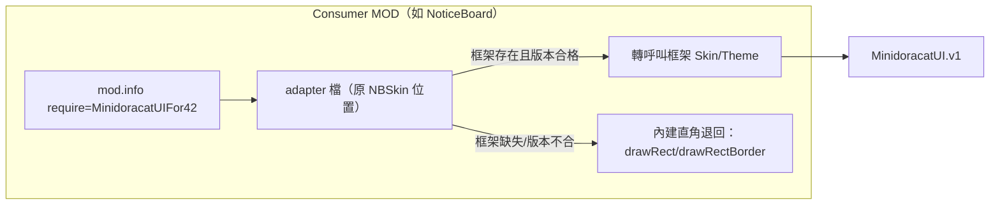

# MinidoracatUI 架構設計契約

> 定稿於 2026-08-25，基於 Claude × Codex × Grok 三方對 NeatUI Framework（Workshop 3508537032，
> modversion 1.0.8）的原始碼分析與家族 MOD（NoticeBoard／MiniMap）現況盤點。
> 本文件是實作的**權威依據**；與本文件衝突的實作即是 bug。引擎行為主張的出處以
> AGENTS.md「API 出處對照」為準（快照 42.20.3-20260817）。

## 0. 設計目標與非目標

**目標**
1. 消滅家族三類重複實作：Skin（NBSkin ↔ MiniMap_Skin 已分岔）、浮動按鈕（NBFloatButton ↔ MiniMap_FloatIcon 兩份獨立實作）、Toast（即將出現第二份）。
2. 讓未來家族 MOD 的 UI 起點是「掛依賴＋建 theme」，不是「複製貼上 300 行再改」。
3. 框架更新**永不**無聲破壞下游（版本化 API＋下游聯測閘門）。

**非目標**
- 不做通用 widget 大全（NeatUI 的 scope 滑坡教訓）；每個元件都要有 ≥1 個真實 consumer 才收。
- 不重造 vanilla 已堪用的東西（`ISButton`＋skin 就夠的不另做 Button class）。
- 不 monkeypatch vanilla class。
- v1 不做 grid／變動列高清單／貼圖數字字型。

## 1. 依賴與解耦模型（使用者要求：盡量模組化解耦）

三層防線，任何一層失效都不得讓 consumer 的 UI 開不了：



1. **引擎層（硬依賴）**：consumer 的 mod.info 掛 `require=MinidoracatUIFor42`——引擎保證框架先載入（`ZomboidFileSystem.java:807-833`），**框架 MOD 未安裝／PZ build 落在框架 versionMin 之外時，consumer 整個 MOD 會被引擎拒載**（`ChooseGameInfo.java:647-666`）。「玩家漏裝框架」由這一層以「缺少必要 MOD」明確擋下（Steam 訂閱會自動拉 Required Items），**不是**由退回層吸收。
2. **API 層**：consumer 檢查 `API_MAJOR`／`API_REVISION`；不合格＝**當框架不存在處理**，不得帶半套狀態運行。
3. **繪製層（退回紅線）**：consumer 的 adapter 保留最小直角退回路徑（`drawRect`／`drawRectBorder`）。它保護的情境是：**框架版本不合（API 檢查不過）、框架 Lua 初始化失敗（半初始化＝facade 未發布）、離線測試 harness**——這些情境下 UI 照開、只失去圓角。

> 解耦的代價聲明：adapter 模式意味著每個 consumer 保留 ~30 行退回碼。這是刻意的
> ——它讓 consumer 可以獨立測試、且框架壞版時不帶病運行；但注意這**不是**「不裝
> 框架也能玩」的軟依賴（引擎層是硬依賴），文件早期版本的「軟依賴」措辭以本節為準。

## 2. API 契約（v1）

唯一全域 `MinidoracatUI`。facade 形狀：

```lua
MinidoracatUI.v1 = {
    VERSION      = "0.1.0",   -- 發布字串，僅供顯示
    API_MAJOR    = 1,          -- 不相容變更 → 開新 MOD ID，此值永不 +1
    API_REVISION = 1,          -- additive 變更單調遞增；consumer 宣告最低需求
    CAPABILITIES = {           -- 功能探測（分期發布的相容手段）
        theme        = true,
        skin         = true,
        floatButton  = false,  -- v0.2
        toast        = false,  -- v0.2
        virtualList  = false,  -- v0.3
    },
    Theme = <module>,
    Skin  = <module>,          -- 正式繪製 API（fill/border/dot/fits），adapter 直接取用（§3.3）
}
```

**規則**
- `MinidoracatUI.v1` 在**全部模組初始化成功後最後賦值**（Kahlua 半初始化風險，AGENTS.md 鐵則）。
- 同 major 只 additive；刪除／改簽章／改語意＝breaking＝開 `MinidoracatUIV2For42` 新 MOD ID。
- consumer 樣板：

```lua
-- PZ 的 require 不保證回傳值（原版 Lua 全樹零取值用例）——一律走全域取用：
if not (MinidoracatUI and MinidoracatUI.v1) then
    pcall(require, "MinidoracatUI/V1")  -- 防禦：正式環境靠 mod.info require= 已先載
end
local UI = MinidoracatUI and MinidoracatUI.v1
local ok = UI ~= nil and UI.API_MAJOR == 1 and UI.API_REVISION >= 1
-- ok == false → 走 adapter 的直角退回，不帶半套狀態運行
```

## 3. 模組設計

### 3.1 檔案佈局（`42/media/lua/client/MinidoracatUI/`）

| 檔案 | 期 | 職責 |
|---|---|---|
| `V1.lua` | v0.1 | **單檔**：Theme＋Skin＋facade 三個 section（詳見檔頭「單檔設計」註解——PZ require 不保證回傳值、跨檔共享只能靠全域，分檔會重演 NeatUI 的隱藏載入順序依賴；單檔讓「中段 error＝facade 從未發布」自然成立） |
| `Widgets/FloatButton.lua` | v0.2 | 常駐浮鈕：拖曳、位移門檻點擊判定、位置持久化回調、clamp 回螢幕；獨立檔、單向依賴 V1 全域，載入失敗只影響 `CAPABILITIES.floatButton` |
| `Widgets/Toast.lua` | v0.2 | 通知堆疊：佇列、淡入淡出、alwaysOnTop；同上 |
| `VirtualList.lua` | v0.3 | 垂直固定列高虛擬清單（§5） |

載入順序防雷：v0.1 核心單檔（無內部順序問題）；v0.2 起的 Widget 檔開頭自行檢查
`MinidoracatUI.v1` 存在、缺席時不掛能力——不重演 NeatUI「scrollview 用
`NIScrollBar` 卻不 require」的隱藏順序依賴。

### 3.2 Theme（含深/淺雙色系，v0.1 內建）

```lua
local theme = UI.Theme.create({
    variant = "dark",              -- "dark"（預設）| "light"
    colors  = {                    -- 只寫要覆蓋的 token
        accent = { r=1, g=0.85, b=0.4, a=1 },
    },
})
```

- **token 分層**：框架 default 只放跨 MOD token，**v1 共 12 個**（`surface`／`surfaceTitle`／`well`／`border`／`text`／`textMuted`／`textFaint`／`accent`／`hover`／`selected`／`errorSurface`／`errorText`——與 `V1.lua` 的 `DARK`/`LIGHT` 表逐字一致，該表是唯一權威）；MOD 自有 token（如 NoticeBoard 的 `unread`、MiniMap 的 `rowHover`）由 create 時自帶，框架不認識也不管。**未知 token 的 theme 便捷方法呼叫是靜默不畫**（fail-soft），拼錯 token＝元素消失無診斷——寫 consumer 時以 V1.lua 的表為準，勿憑記憶。
- **雙色系**：`variant` 選 default palette 起點；兩套數值都在 `V1.lua` 的 Theme section（`DARK`／`LIGHT` 表）內維護。繪製邏輯與資產完全 variant 無關（白圖×頂點染色）。深色為預設（PZ 本體與家族現有 UI 全深色）；淺色首發標 experimental。variant 由 MOD 開發者決定；玩家層級即時切換是未來項目（牽涉全 consumer token 完整性）。
- **隔離**：`create()` 深拷貝，禁止 mutate 共享 default——現有 NBSkin↔MiniMap drift 的根源就是「共用色票、各自複製」。
- **已知取捨（色票三份現況）**：兩個既有 adapter 刻意保留字面 `COLORS`（框架缺席時色票也要在、退回路徑不依賴框架），因此共通數值目前存在三份（NBSkin／MiniMap Skin／框架 DARK）。v0.1 接受此取捨——「消滅重複」在繪製碼與 PNG 已達成，色票的單一權威化留待既有 consumer 改用 `Theme.create`（自然時機：某 MOD 需要 light variant 或玩家換色時）。

### 3.3 Skin（NinePatch 生命週期全封裝）

`Skin` 的無狀態繪製函式是**正式公開 API**（受同 major additive 承諾保護），
thin adapter 直接取用；theme 實例方法是其上的便捷薄層（token 字串解析）：

```lua
-- 正式 API（adapter 用法；color 是 {r,g,b,a} table）：
UI.Skin.fill(element, x, y, w, h, color, shape, alphaScale)
UI.Skin.border(element, x, y, w, h, color, shape, alphaScale)
UI.Skin.dot(element, x, y, size, color, outline)
UI.Skin.fits(w, h, shape)
-- theme 便捷層（新 MOD 用法；color 可為 token 字串或 table）：
theme:fill(element, x, y, w, h, colorOrToken, shape, alphaScale)
-- shape: nil/false="round"（四角圓）| true/"roundTop"（上圓下直）| "rect"（強制直角）
--        boolean 形式與家族既有 topOnly 呼叫慣例逐位相容
```

**內建規則（caller 不必知道的事）**
- 首呼叫連呼兩次＋pcall；兩次 nil → cache `false` 永不重試 → 直角退回（`NinePatchTexture.java:42-63`）。
- `fits` 檢查內建於 shape：`round` 最小 12×12、`roundTop` 最小 12×6；不足自動退直角（角落重疊會疊 alpha，寧可誠實直角）。
- 座標：`getAbsoluteX/Y` ＋（在 scrolling 容器內）自身 scroll offset，再 `math.floor`——MiniMap 實戰教訓直接內建，consumer 不再各自修。
- pcall 用具名頂層函式傳參，**零 per-frame closure 配置**（MiniMap 的 GC 改良收編為標準）。
- 貼圖目錄：`42/media/ui/MinidoracatUI/`，程序化生成（§6），全主題共用同一套白圖。

### 3.4 Widgets（v0.2）

從兩份既有實作（NBFloatButton 260 行級、MiniMap_FloatIcon 260 行）提煉**行為契約**重新實作，不搬碼：

- `FloatButton`：拖曳位移門檻（≦4px＝點擊）、位置持久化（回調由 consumer 接 ModOptions／ini，框架不綁存檔機制——解耦）、每幀 clamp 回螢幕、hover 提示回調。
- `Toast`：佇列＋堆疊上限、淡入淡出（`getTimestampMs` 計時）、alwaysOnTop、點擊消失；**stencil 絕不外漏**（set/clear/repaint 成對，harness 計數器釘住）。

### 3.5 VirtualList（v0.3）——對 NeatUI 的修正表

| NeatUI 實證問題 | 本框架設計 |
|---|---|
| `setDataSource(data, forceRefresh)` 靠 caller 記得 force（`nivirtualscrollview.lua:69-79`） | `setItems(items)` 內建 revision，可見綁定自動失效 |
| 同範圍原地變更不重繪（`:220-245`） | cell 記 bound revision＋index，任一變即重綁 |
| 回收 cell 殘留 hover/pressed | `bindCell`/`unbindCell` 契約，回收時框架清基礎狀態 |
| 內容高度從已移動 child 量測（`niscrollview.lua:103-117`） | `contentHeight = count × stride + padding`，純計算 |
| stencil 只 set→clear（`:354-362`） | set→draw→clear→repaint 成對 |
| selection 散在 cell | selection/focus 存 list，cell 是投影 |
| grid 塞同 class＋熱路徑 print（`nigridvirtualscrollview.lua:316`） | 不做 grid；框架預設零 log |

## 4. NeatUI 教訓總表（設計依據，證據見 AGENTS.md 與三方報告）

| # | NeatUI 事實 | 本框架對應決策 |
|---|---|---|
| 1 | 6 個裸全域、零版本化 | 唯一全域＋`API_MAJOR/REVISION/CAPABILITIES` |
| 2 | `_NUI_hasNinePatchTextures` 死碼，缺圖直接 crash | 所有繪製 fail-soft＋直角退回紅線 |
| 3 | scrollbar 壞貼圖 `nil:render()` 永久 crash；versionMin 42.0.2 與 B42.9 才有的 NinePatch 矛盾 | versionMin 只寫**查證過**的下限（42.20.1：API 存在性與首呼叫語意已對 42.20.1-20260805 快照逐項核對，見 AGENTS.md API 表）；能力探測不假裝相容 |
| 4 | 手拼 9-slice（B42.9 前遺產） | 一律引擎原生 NinePatchTexture |
| 5 | monkeypatch `ISUIElement` | 禁止；墊片走自有 util |
| 6 | 「別直接用」的成員公開在 API | 公開面全部可依賴；測試鉤子 `_resetForTests` |
| 7 | 隱藏載入順序依賴 | v0.1 核心單檔（無內部順序）；v0.2 起 Widget 檔開頭自檢 `MinidoracatUI.v1`，缺席不掛能力 |
| 8 | 熱路徑殘留 print | 預設零 log，debug 旗標才輸出 |

## 5. 分期與完成定義

| 期 | 內容 | 完成定義（可驗證） |
|---|---|---|
| v0.1 Core | V1＋Theme（雙色系）＋Skin＋貼圖資產＋harness | NoticeBoard 與 MiniMap 皮膚改 thin adapter，刪除重複繪製碼與重複 PNG；兩 repo verify 全綠；遊戲內實測無視覺回歸 |
| v0.2 Widgets（**已完成**） | FloatButton＋Toast | 家族三份浮鈕/Toast 實作全部改用框架版 ✅（NBFloatButton／NBToast／MiniMap _FloatIcon 皆為 thin wrapper） |
| v0.3 VirtualList（**已完成**） | 垂直固定列高 | 初版隨 v0.2 同時交付（使用者定案：交易面板／拍賣場等未來 MOD 的既定需求）；首個 consumer 出現時回填實戰驗證 |

首發 Workshop 在 v0.1 完成即可（照 AGENTS.md 發布流程）；每期 `API_REVISION` +1 並更新 `CAPABILITIES`。

## 6. 資產管線

- **UI 貼圖（9-slice 圓角、圓點等）**：`scripts/gen_ui_textures.py` 程序化生成（移植 NoticeBoard 現有做法）——9-slice 切線像素要求位元級精確，不走 AI 生圖；`verify_mod.py` 比對尺寸／純白／切線當閘門。
- **美術資產（poster.png、preview.png、Workshop 圖）**：AI 生成（codex／grok imagegen）到 `scripts/poster/` 再由 `finish_poster.py` 部署——首發前才做，沿用家族貓娘 mascot 流程。
- 貼圖一律純白可染色；新增貼圖＝新增 `verify_mod.py` 檢查項。

## 7. 測試策略

- `scripts/smoke_harness.lua`（標準 Lua，假 PZ 全域；由 `verify_mod.py` 第 13 項自動執行）情境：
  1. facade 半初始化（模擬中途 error → `MinidoracatUI.v1` 必須不存在）
  2. NinePatch 三態＋element 契約破損（無全域／正常／壞路徑／缺存取器）× fill/border/dot 不拋錯、退回旗標正確、element 壞不標壞貼圖
  3. theme 隔離（兩實例互不污染、default 不被 mutate、light variant、token 解析）
  4. fits 邊界與 shape 相容（boolean topOnly ≡ "roundTop"、"rect" 強制退回）
  - 條數守門 `EXPECTED_ASSERTIONS`（家族慣例：防整段被註解仍全綠）
  -（v0.2 起）stencil 計數器成對＋repaint（Toast/Widget 才觸碰 stencil）、FloatButton 拖曳門檻／clamp、Toast 佇列上限
- `scripts/verify_mod.py`：13 項閘門＝家族十一項靜態掃描＋UI 貼圖驗證（第 12 項）＋Lua 煙霧測試（第 13 項）。
- 下游 consumer 的測試以同層 repo 相對路徑（或 `MUI_LUA`）載入本框架 V1.lua；缺框架時一律 SKIP-not-PASS。
- 實機：每期完成定義都含遊戲內實測；MP 路徑在 dedicated（`getTexture` 回 null 環境）至少驗一次退回。
