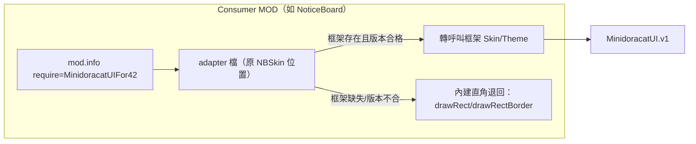

# MinidoracatUI 架構設計契約

> 定稿於 2026-08-25，基於 Claude × Codex × Grok 三方對 NeatUI Framework（Workshop 3508537032，
> modversion 1.0.8）的原始碼分析與家族 MOD（NoticeBoard／MiniMap）現況盤點。
> 本文件是實作的**權威依據**；與本文件衝突的實作即是 bug。引擎行為主張的出處以
> AGENTS.md「API 出處對照」為準（快照 42.20.3-20260817）。

## 0. 設計目標與非目標

**目標**
1. 消滅家族三類重複實作：Skin（NBSkin ↔ MiniMap_Skin 已分岔）、浮動按鈕（NBFloatButton ↔ MiniMap_FloatIcon 兩份獨立實作）、Toast（即將出現第二份）。
2. 讓未來家族 MOD 的 UI 起點是「掛依賴＋建 theme」，不是「複製貼上 300 行再改」。
3. 框架更新**永不**無聲破壞下游（版本化 API＋下游聯測閘門）。

**非目標**
- 不做通用 widget 大全（NeatUI 的 scope 滑坡教訓）；每個元件都要有 ≥1 個真實 consumer 才收。
- 控制元件的**外觀**不沿用 vanilla（2026-09-26 使用者決定：家族 UI 一律用框架的現代元素，不用官方原生的樣子）：rev 7 起 Button／TextField／Checkbox／Tabs／Window／Dialog 由框架提供現代外觀；vanilla 只作**輸入與事件基底**（`ISButton` 的點擊／搖桿語意、`ISTextEntryBox` 的 IME／游標、`ISLayoutManager` 的存讀），不重寫這些原生行為。
- 不 monkeypatch vanilla class。
- v1 不做 grid／變動列高清單／貼圖數字字型。

## 1. 依賴與解耦模型（使用者要求：盡量模組化解耦）

三層防線，任何一層失效都不得讓 consumer 的 UI 開不了：


```mermaid
graph LR
    subgraph consumer["Consumer MOD（如 NoticeBoard）"]
        A[mod.info require=MinidoracatUIFor42] --> B["adapter 檔（原 NBSkin 位置）"]
        B -->|框架存在且版本合格| C[轉呼叫框架 Skin/Theme]
        B -->|框架缺失/版本不合| D[內建直角退回：drawRect/drawRectBorder]
    end
    C --> E[MinidoracatUI.v1]
```

1. **引擎層（硬依賴）**：consumer 的 mod.info 掛 `require=MinidoracatUIFor42`——引擎保證框架先載入（`ZomboidFileSystem.java:807-833`），**框架 MOD 未安裝／PZ build 落在框架 versionMin 之外時，consumer 整個 MOD 會被引擎拒載**（`ChooseGameInfo.java:647-666`）。「玩家漏裝框架」由這一層以「缺少必要 MOD」明確擋下（Steam 訂閱會自動拉 Required Items），**不是**由退回層吸收。
2. **API 層**：consumer 檢查 `API_MAJOR`／`API_REVISION`；不合格＝**當框架不存在處理**，不得帶半套狀態運行。
3. **繪製層（退回紅線）**：consumer 的 adapter 保留最小直角退回路徑（`drawRect`／`drawRectBorder`）。它保護的情境是：**框架版本不合（API 檢查不過）、框架 Lua 初始化失敗（半初始化＝facade 未發布）、離線測試 harness**——這些情境下 UI 照開、只失去圓角。

> 解耦的代價聲明：adapter 模式意味著每個 consumer 保留 ~30 行退回碼。這是刻意的
> ——它讓 consumer 可以獨立測試、且框架壞版時不帶病運行；但注意這**不是**「不裝
> 框架也能玩」的軟依賴（引擎層是硬依賴），文件早期版本的「軟依賴」措辭以本節為準。

## 2. API 契約（v1）

唯一全域 `MinidoracatUI`。facade 形狀：

```lua
MinidoracatUI.v1 = {
    VERSION      = "0.5.0",   -- 發布字串，僅供顯示（定版 commit 時才與 modversion 同步）
    API_MAJOR    = 1,          -- 不相容變更 → 開新 MOD ID，此值永不 +1
    API_REVISION = 18,         -- additive 變更單調遞增；consumer 宣告最低需求
                               -- rev 1：首發｜rev 2：Icons｜rev 3：painters/assets｜rev 4：art icons｜rev 5：Toast maxLines｜rev 6：導覽圖示｜rev 7：現代控制元件｜rev 8：車輛／標記圖示＋ColorPicker｜rev 9：Slider（ColorPicker 的 R/G/B 改滑桿）｜rev 10：Focus 鍵盤＋手把焦點｜rev 11：收編 Economy 的日期／表格／篩選列／物品挑選／候選輸入＋共用基礎（Text.fit、Skin.arrow、chip Button、TextField 尺寸與 clearButton、theme.alpha）｜rev 12：textDisabled 停用對比、Tabs 停用、焦點說明位置 captionSide、FilterBar 的 dateToggle／kindsDropdown／sortInHeader｜rev 13：家族工具列 Dock（§3.16）｜rev 14：Dropdown（§3.17）、12 個幾何圖示（§3.6）、onAccent／titleText／titleMuted token（§3.2）、Button／Window 的 Texture 圖示與 Button:setIcon（§3.7）｜rev 15：可選圓角（Skin 半徑形狀 round3／6／10／20、Skin.shapeOf、theme 的 radius／controlRadius／buttonShape／font，§3.2、§3.3）｜rev 16：ScrollPanel 捲動容器（§3.18）、UI.Text.wrap（§3.4）、TextField:setInvalid（§3.7）、control:focusLabel() 與 Focus 的捲動容器接線（§3.10）｜rev 17：NavList 分組側欄導覽（§3.19）、SliderRow 標籤＋滑桿＋數值列（§3.20）、Preview 效果預覽框（§3.21）、Checkbox／Slider 的 tooltip（§3.7）、斷行禁則補全形 ％ ～ 與日文小寫假名、長音（§3.4）、watch／zone 圖示（§3.6）、scrollTo 與焦點框可見判定看 focusRect（§3.10、§3.18）｜rev 18：warning token（§3.2）、斷行禁則補法文標點前後的空白（§3.4）、Window／Dialog 的 opaque 不透明本體（§3.7）
    CAPABILITIES = {           -- 功能探測（分期發布的相容手段）
        theme        = true,
        skin         = true,
        icons        = true,   -- rev 2
        floatButton  = false,  -- 對應 widget 載入成功後才翻 true
        toast        = false,
        virtualList  = false,
        controls     = false,  -- rev 7：Button／TextField／Checkbox／Tabs（Widgets/Controls.lua）
        window       = false,  -- rev 7：Window（Widgets/Window.lua）
        dialog       = false,  -- rev 7：Dialog（Widgets/Window.lua，另需 controls 載入成功）
        colorPicker  = false,  -- rev 8：ColorPicker（Widgets/Controls.lua，與 controls 同檔）
        slider       = false,  -- rev 9：Slider（Widgets/Controls.lua，與 controls 同檔）
        focus        = false,  -- rev 10：Focus（Focus.lua；Window／Dialog 缺它時照常，只是沒有鍵盤導覽與手把）
        datePicker   = false,  -- rev 11：Date／DateField／DatePicker（Widgets/DatePicker.lua，另需 controls）
        table        = false,  -- rev 11：Table／TableHeader（Widgets/Table.lua，另需 virtualList）
        filterBar    = false,  -- rev 11：FilterBar（Widgets/FilterBar.lua，另需 controls＋datePicker）
        itemPicker   = false,  -- rev 11：ItemPicker（Widgets/ItemPicker.lua，另需 controls＋table）
        autocomplete = false,  -- rev 11：Autocomplete（Widgets/Autocomplete.lua，另需 controls）
        tabsEnabled  = false,  -- rev 12：Tabs:setEnabled／setItemEnabled（Widgets/Controls.lua，與 controls 同檔）
        focusCaption = false,  -- rev 12：描述 captionSide／drawCaption 的 side（Focus.lua，與 focus 同檔）
        filterBarModes = false, -- rev 12：FilterBar 的 dateToggle／kindsDropdown／sortInHeader（Widgets/FilterBar.lua）
        tableHeaderFocus = false, -- rev 12：TableHeader 鍵盤焦點（Widgets/Table.lua，與 table 同檔）
        toastAvoid   = false,  -- rev 12：Toast.setAvoid(owner, fn) 避開區（Widgets/Toast.lua，與 toast 同檔）
        dock         = false,  -- rev 13：UI.Dock 家族工具列（Widgets/Dock.lua；Focus 選用、Toast 避開區選用）
        dropdown     = false,  -- rev 14：UI.Dropdown 下拉選單（Widgets/Dropdown.lua，基底原生 ISButton；Focus 選用）
        scrollPanel  = false,  -- rev 16：UI.ScrollPanel 捲動容器（Widgets/ScrollPanel.lua，基底原生 ISPanel）
        textWrap     = false,  -- rev 16：UI.Text.wrap（TextWrap.lua 載入成功後掛上）
        textFieldInvalid = false, -- rev 16：TextField:setInvalid／isInvalid（Widgets/Controls.lua，與 controls 同檔）
        focusLabel   = false,  -- rev 16：control:focusLabel() 每幀說明＋捲動容器接線（Focus.lua，與 focus 同檔）
        navList      = false,  -- rev 17：UI.NavList 分組側欄導覽（Widgets/NavList.lua，基底原生 ISPanel；Focus 選用）
        sliderRow    = false,  -- rev 17：UI.SliderRow 標籤＋滑桿＋數值列（Widgets/Controls.lua，與 controls 同檔）
        preview      = false,  -- rev 17：UI.Preview 效果預覽框（Widgets/Preview.lua，基底原生 ISPanel）
        controlTooltips = false, -- rev 17：Checkbox／Slider 的 opts.tooltip 與 setTooltip（Widgets/Controls.lua，與 controls 同檔）
        buttonIconColor = false, -- rev 17：Button 的 opts.iconColor 與 setIconColor（Widgets/Controls.lua，與 controls 同檔）
        opaqueWindow = false,  -- rev 18：Window.new／Dialog.show 的 opts.opaque（Widgets/Window.lua，與 window 同檔）
    },
    Theme = <module>,
    Skin  = <module>,          -- 正式繪製 API（fill/border/dot/fits/toggle/slider/arrow），adapter 直接取用（§3.3）
    Icons = <module>,          -- 共用單色圖示（get/draw），rev 2 起新增（§3.6）
    Text  = <module>,          -- 文字量測（fit：依寬度截字＋省略號），rev 11 起新增（§3.3）；rev 16 的 wrap 由 TextWrap.lua 掛上（§3.4）
    -- 以下由 widget 檔在載入成功後掛上（對應 CAPABILITIES 旗標同時翻 true）：
    -- FloatButton／Toast／VirtualList（v0.2／v0.3）
    -- Button／TextField／Checkbox／Tabs（rev 7，controls）、Window（rev 7，window）、Dialog（rev 7，dialog）、
    -- ColorPicker（rev 8，colorPicker）、Slider（rev 9，slider）、Focus（rev 10，focus）、
    -- Date／DateField／DatePicker（rev 11，datePicker）、Table／TableHeader（rev 11，table）、
    -- FilterBar（rev 11，filterBar）、ItemPicker（rev 11，itemPicker）、Autocomplete（rev 11，autocomplete）、
    -- Dock（rev 13，dock）、Dropdown（rev 14，dropdown）、ScrollPanel（rev 16，scrollPanel）、
    -- NavList（rev 17，navList）、SliderRow（rev 17，sliderRow）、Preview（rev 17，preview）
}
```

**規則**
- `MinidoracatUI.v1` 在**全部模組初始化成功後最後賦值**（Kahlua 半初始化風險，AGENTS.md 鐵則）。
- 同 major 只 additive；刪除／改簽章／改語意＝breaking＝開 `MinidoracatUIV2For42` 新 MOD ID。新增模組／新增 `CAPABILITIES` 旗標屬 additive：`API_REVISION` +1，既有呼叫面一字不動（rev 2 的 Icons 即是此形狀）。
- consumer 樣板：

```lua
-- PZ 的 require 不保證回傳值（原版 Lua 全樹零取值用例）——一律走全域取用：
if not (MinidoracatUI and MinidoracatUI.v1) then
    pcall(require, "MinidoracatUI/V1")  -- 防禦：正式環境靠 mod.info require= 已先載
end
local UI = MinidoracatUI and MinidoracatUI.v1
local ok = UI ~= nil and UI.API_MAJOR == 1 and UI.API_REVISION >= 1
-- 要用 rev 2 才有的能力就把門檻寫成該能力的 revision，並一併探 CAPABILITIES：
--   local canIcon = ok and UI.API_REVISION >= 2 and UI.CAPABILITIES.icons and UI.Icons ~= nil
-- rev 3 painter 沿用 skin capability，逐函式探測：
--   local canPainters = ok and UI.API_REVISION >= 3
--       and type(UI.Skin.toggle) == "function" and type(UI.Skin.slider) == "function"
-- rev 7 控制元件逐旗標探測（Dialog 需要 dialog，不只 window）：
--   local canControls = ok and UI.API_REVISION >= 7 and UI.CAPABILITIES.controls
--   local canDialog = ok and UI.API_REVISION >= 7 and UI.CAPABILITIES.dialog
-- rev 8 車輛／標記圖示與取色器：
--   local canVehicleIcons = ok and UI.API_REVISION >= 8 and UI.CAPABILITIES.icons
--   local canColorPicker = ok and UI.API_REVISION >= 8 and UI.CAPABILITIES.colorPicker
-- rev 9 滑桿：
--   local canSlider = ok and UI.API_REVISION >= 9 and UI.CAPABILITIES.slider
-- rev 11 元件逐旗標探測（缺相依的檔不翻旗標，只探自己要的那一個即可）；共用基礎逐函式探：
--   local canTable = ok and UI.API_REVISION >= 11 and UI.CAPABILITIES.table
--   local canFit = ok and UI.API_REVISION >= 11 and UI.Text ~= nil and type(UI.Text.fit) == "function"
-- rev 12 逐旗標探測；textDisabled 是 Theme token（核心），以 rev 判斷即可：
--   local canCompactFilter = ok and UI.API_REVISION >= 12 and UI.CAPABILITIES.filterBarModes
--   local canCaptionSide = ok and UI.API_REVISION >= 12 and UI.CAPABILITIES.focusCaption
--   local canHeaderFocus = ok and UI.API_REVISION >= 12 and UI.CAPABILITIES.tableHeaderFocus
--   local canToastAvoid = ok and UI.API_REVISION >= 12 and UI.CAPABILITIES.toastAvoid
-- rev 13 家族工具列：登記成功（回 true）就不建立自己的 FloatButton；旗標不在或回 false 時走原本的 FloatButton：
--   local docked = ok and UI.API_REVISION >= 13 and UI.CAPABILITIES.dock and UI.Dock ~= nil
--       and UI.Dock.register({ id = "minimap", order = 10, label = function() return getText("…") end,
--           icon = "media/ui/…png", bind = "…", onClick = function(entry) … end })
--   if not docked then --[[ 原本的 FloatButton 路徑 ]] end
-- rev 14：圖示 key、theme token、Texture 圖示以 rev 判斷（核心與 controls 同檔）；下拉逐旗標探測：
--   local canRev14 = ok and UI.API_REVISION >= 14
--   local canDropdown = canRev14 and UI.CAPABILITIES.dropdown and UI.Dropdown ~= nil
--   舊框架拿到 Texture 圖示時 Icons.get 對非字串回 nil：按鈕與視窗只畫文字，不炸（不必另寫退回）
-- rev 15 圓角與 theme 字型以 rev 判斷（核心與元件同檔）；舊框架忽略 theme 上的 radius／font 欄位，照 6px 圓角與 opts.font：
--   local canRadius = ok and UI.API_REVISION >= 15 and type(UI.Skin.shapeOf) == "function"
-- rev 16 逐旗標探測；缺哪個就走該項的退回（自己的斷行、不捲動的長面板、只靠 tooltip 的錯誤提示、固定說明）：
--   local canScroll = ok and UI.API_REVISION >= 16 and UI.CAPABILITIES.scrollPanel and UI.ScrollPanel ~= nil
--   local canWrap = ok and UI.API_REVISION >= 16 and UI.CAPABILITIES.textWrap and type(UI.Text.wrap) == "function"
--   local canInvalid = ok and UI.API_REVISION >= 16 and UI.CAPABILITIES.textFieldInvalid
--   local canLiveLabel = ok and UI.API_REVISION >= 16 and UI.CAPABILITIES.focusLabel
--   舊框架不呼叫 focusLabel()：同一份 consumer 碼另設 _focusLabel 當固定說明即可，不必分支
-- rev 17 逐旗標探測（MiniMap 設定視窗四個都要，缺任一就不開新視窗）；斷行禁則與 watch／zone 以 rev 判斷：
--   local canNav = ok and UI.API_REVISION >= 17 and UI.CAPABILITIES.navList and UI.NavList ~= nil
--   local canSliderRow = ok and UI.API_REVISION >= 17 and UI.CAPABILITIES.sliderRow and UI.SliderRow ~= nil
--   local canPreview = ok and UI.API_REVISION >= 17 and UI.CAPABILITIES.preview and UI.Preview ~= nil
--   local canTips = ok and UI.API_REVISION >= 17 and UI.CAPABILITIES.controlTooltips
--   舊框架的 Checkbox／Slider 收到 opts.tooltip 只是忽略（不炸）；setTooltip 要先探 controlTooltips
--   local canTint = ok and UI.API_REVISION >= 17 and UI.CAPABILITIES.buttonIconColor
--   舊框架的 Button 收到 opts.iconColor 只是忽略（Texture 原色）；setIconColor 要先探 buttonIconColor
-- rev 18 warning token 以 rev 判斷（核心）；舊框架沒有這顆 token，theme 便捷方法會靜默不畫——
-- 自己在 Theme.create 的 colors 補上（consumer token 原樣保留），新框架就用內建值：
--   local hasWarning = ok and UI.API_REVISION >= 18
--   local theme = UI.Theme.create({ colors = (not hasWarning) and { warning = { r = 1, g = 0.55, b = 0.2, a = 1 } } or nil })
-- rev 18 不透明視窗逐旗標探測；舊框架收到 opts.opaque 只是忽略（照舊半透明，不炸）：
--   local win = UI.Window.new({ …, opaque = ok and UI.API_REVISION >= 18 and UI.CAPABILITIES.opaqueWindow == true })
-- ok == false → 走 adapter 的直角退回，不帶半套狀態運行
```

## 3. 模組設計

### 3.1 檔案佈局（`42/media/lua/client/MinidoracatUI/`）

| 檔案 | 期 | 職責 |
|---|---|---|
| `V1.lua` | v0.1（rev 2／3／11 擴充） | **單檔**：Theme＋Skin＋Icons＋Text＋facade 五個 section（詳見檔頭「單檔設計」註解——分檔就得靠全域存在檢查串接，會重演 NeatUI 的隱藏載入順序依賴；單檔讓「中段 error＝facade 從未發布」自然成立） |
| `TextWrap.lua` | rev 11 修正（rev 16 擴充） | 斷行模組（§3.4「斷行」）：不設全域，`return` 一張表（`cut`、`lines`）。Toast／Window 以 `pcall(require, "MinidoracatUI/TextWrap")` 取回傳值：`LuaManager.RunLuaInternal` 把第一次執行的回傳值存在 `loadedReturn`，之後的 require 直接回它（42.20.1 起相同；原版 `shared/Sandbox/SandboxVars.lua:1` 也這樣取值）。rev 16 起檔尾把帶快取的 `UI.Text.wrap` 掛上 facade 並翻 `CAPABILITIES.textWrap`（檔頭自行 pcall require V1，不靠檔名排序）。缺席或載入失敗時 Toast 多行退回單行截字、`dialog` 與 `textWrap` 維持 false |
| `Widgets/FloatButton.lua` | v0.2 | 常駐浮鈕：拖曳、位移門檻點擊判定、位置持久化回調、clamp 回螢幕；獨立檔、單向依賴 V1 全域，載入失敗只影響 `CAPABILITIES.floatButton` |
| `Widgets/Toast.lua` | v0.2 | 通知堆疊：佇列、淡入淡出、alwaysOnTop；同上 |
| `VirtualList.lua` | v0.3 | 垂直固定列高虛擬清單（§3.5） |
| `Widgets/Controls.lua` | rev 7（rev 8／9／11／14／17 擴充） | Button／TextField／Checkbox／Tabs（§3.7）＋ColorPicker（§3.8）＋Slider（§3.9）＋SliderRow（§3.20）；載入失敗只影響 `CAPABILITIES.controls`／`colorPicker`／`slider`／`sliderRow`／`controlTooltips`／`buttonIconColor` |
| `Widgets/Window.lua` | rev 7（rev 10／11 擴充） | Window／Dialog（§3.7）；開頭自行 `pcall(require, …)` 取 `"MinidoracatUI/Widgets/Controls"`、`"MinidoracatUI/Focus"` 與 `"MinidoracatUI/TextWrap"`，Controls 或 TextWrap 缺席時只提供 Window、`dialog` 維持 false；Focus 缺席時沒有鍵盤導覽與手把 |
| `Focus.lua` | rev 10 | 鍵盤＋手把焦點引擎（§3.10）；需要原生 `Keyboard`，缺席時 `CAPABILITIES.focus` 維持 false |
| `Widgets/DatePicker.lua` | rev 11 | `UI.Date`／`UI.DateField`／`UI.DatePicker`（§3.11）；自行 pcall require Controls（缺席即 return）與 Focus（選用），`CAPABILITIES.datePicker` |
| `Widgets/Table.lua` | rev 11 | `UI.Table`／`UI.TableHeader`（§3.12）；需要 `UI.Text` 與 `Skin.arrow`，自行 pcall require VirtualList（缺席即 return），`CAPABILITIES.table` |
| `Widgets/FilterBar.lua` | rev 11 | `UI.FilterBar`（§3.13）；自行 pcall require Controls、DatePicker（任一缺席即 return）與 Focus（選用），`CAPABILITIES.filterBar` |
| `Widgets/ItemPicker.lua` | rev 11 | `UI.ItemPicker`（§3.14）；自行 pcall require Controls、Table（任一缺席即 return）與 Focus（選用），`CAPABILITIES.itemPicker` |
| `Widgets/Autocomplete.lua` | rev 11 | `UI.Autocomplete`（§3.15）；自行 pcall require Controls（缺席即 return）與 Focus（選用），`CAPABILITIES.autocomplete` |
| `Widgets/Dock.lua` | rev 13 | `UI.Dock` 家族工具列（§3.16）；需要原生 `ISPanel`／`ISButton`，自行 pcall require Focus（選用：缺席時快捷鍵只切換收合），`CAPABILITIES.dock` |
| `Widgets/Dropdown.lua` | rev 14 | `UI.Dropdown` 下拉選單（§3.17）；基底只用原生 `ISButton`（不需要 Controls），自行 pcall require Focus（選用：缺席時只能用滑鼠），`CAPABILITIES.dropdown` |
| `Widgets/ScrollPanel.lua` | rev 16 | `UI.ScrollPanel` 捲動容器（§3.18）；只需要原生 `ISPanel`，不 require Focus（Focus 以 `_scrollPanel` 標記認它），`CAPABILITIES.scrollPanel` |
| `Widgets/NavList.lua` | rev 17 | `UI.NavList` 分組側欄導覽（§3.19）；只需要原生 `ISPanel`，不 require Focus（實作 `onFocusKey`／`focusRect`／`focusLabel` 接點），`CAPABILITIES.navList` |
| `Widgets/Preview.lua` | rev 17 | `UI.Preview` 效果預覽框（§3.21）；只需要原生 `ISPanel`，`CAPABILITIES.preview` |

載入順序防雷：v0.1 核心單檔（無內部順序問題）；v0.2 起的 Widget 檔開頭自行檢查
`MinidoracatUI.v1` 存在、缺席時不掛能力——不重演 NeatUI「scrollview 用
`NIScrollBar` 卻不 require」的隱藏順序依賴。

### 3.2 Theme（含深/淺雙色系，v0.1 內建）

```lua
local theme = UI.Theme.create({
    variant = "dark",              -- "dark"（預設）| "light"
    colors  = {                    -- 只寫要覆蓋的 token
        accent = { r=1, g=0.85, b=0.4, a=1 },
    },
})
```

- **token 分層**：框架 default 只放跨 MOD token，**v1 共 17 個**（`surface`／`surfaceTitle`／`well`／`border`／`text`／`textMuted`／`textFaint`／`textDisabled`（rev 12）／`accent`／`hover`／`selected`／`errorSurface`／`errorText`／`onAccent`／`titleText`／`titleMuted`（rev 14）／`warning`（rev 18）——與 `V1.lua` 的 `DARK`/`LIGHT` 表逐字一致，該表是唯一權威）；MOD 自有 token（如 NoticeBoard 的 `unread`、MiniMap 的 `rowHover`）由 create 時自帶，框架不認識也不管。**未知 token 的 theme 便捷方法呼叫是靜默不畫**（fail-soft），拼錯 token＝元素消失無診斷——寫 consumer 時以 V1.lua 的表為準，勿憑記憶。
- **`textDisabled`（rev 12）**：停用控制項的標籤與圖樣。深色 `#666666`（0.40），淺色 `#858585`（0.52）。WCAG 相對亮度對比（`scripts/test_rev12.lua` 斷言）：深色在黑底 3.66:1、與閒置 `textMuted`（`#9E9E9E`）差 2.15:1——原本停用用的 `textFaint`（`#8C8C8C`）與 `textMuted` 只差 1.25:1；淺色在 `surface` 上 3.09:1、與 `textMuted` 差 1.88:1。停用時**字與圖樣不乘**停用淡化（0.45 只乘 chrome），否則 `#666` 會再淡成 `#2E2E2E`。框架元件讀 `colors.textDisabled or colors.textFaint`（theme 不是 `Theme.create` 建的也不 nil 炸）。
- **`onAccent`／`titleText`／`titleMuted`（rev 14）**：`onAccent`＝accent 底上的字與圖示（primary 按鈕；預設 `#1A1405`，即 rev 7 起的元件內常數）；`titleText`＝視窗標題列的標題、標題圖示與 hover 中的關閉鈕（預設＝`text`）；`titleMuted`＝閒置的關閉鈕（預設＝`textMuted`）。預設值與 rev 13 實際繪製色逐位相同，所以既有 consumer 外觀不變；用途是**換皮**：accent 是深色時（例：粉紅 `#B03A6A`）把 `onAccent` 設成白，標題列是淺色時（例：銀灰 `#C9CDD3`）把 `titleText`／`titleMuted` 設成深色。框架元件讀 `colors.onAccent or <常數>`、`colors.titleText or colors.text`、`colors.titleMuted or colors.textMuted`。
- **`warning`（rev 18）**：警示字與圖示——非錯誤的提醒（快到期、容量將滿、需要注意的狀態），與錯誤的 `errorText` 分開。深色 `#FF8C33`（1, 0.55, 0.2），淺色 `#B34500`（0.70, 0.27, 0）。門檻（`scripts/test_rev18.lua` 斷言，WCAG 相對亮度、surface 只看 rgb、色相取 HSV）：在 `surface` 上 ≥ 4.5:1——深色 9.07:1、淺色 4.66:1；色相離 `accent` ≥ 15°——深色 26.3° 對 45.0°（差 18.8°）、淺色 23.1° 對 41.5°（差 18.4°）；離 `errorText` 也 ≥ 15°（深色 21.3°、淺色 20.8°）。淺色原提案 `(0.72, 0.28, 0)` 只有 4.44:1，壓暗到現值。**框架元件不讀它**（既有外觀逐位不變；TextField 錯誤圖示、Dock 的 warn 狀態仍用 `errorText`），給 consumer 用。
- **換皮的邊界**：一款皮膚＝一個 `Theme.create{ variant, colors, radius?, controlRadius?, buttonShape?, font? }`（17 個 token 全可覆寫）＋consumer 自有 token（例：警示底色、等級色）。不做的：每款不同的字型檔（框架不載自訂字型，只選 `UIFont`）、皮膚裝飾（角框、貼紙、掃描線由 consumer 自己畫）。
- **圓角與字型（rev 15）**：`radius`＝視窗本體、標題列、彈出清單外框以外的「面板」圓角；`controlRadius`＝Button、TextField、Checkbox 方框退回、Tabs、Dropdown 與其清單、Slider 軌道、DatePicker／FilterBar／Autocomplete 的彈出清單（省略＝跟 `radius`）；`buttonShape = "pill"`＝Button（normal／primary／danger／ghost）畫成整顆膠囊。半徑吸附到最近的支援值 0（直角）／3／6／10／20（中點歸小：1.5→0、4.5→3、8→6、15→10），轉成 Skin 形狀見 §3.3 `Skin.shapeOf`。**都沒設＝rev 14 外觀逐位相同**（`radius` 設成 6 雖然看起來一樣，但小元件會往 3 退而不是直角）。`font`＝框架元件的預設字型，優先序 `opts.font` → `theme.font` → `UIFont.Small`（Button、TextField、Checkbox、Tabs、Slider、ColorPicker、Window、Dialog、Dropdown 讀它）。四個欄位放在 theme 上，可在 create 後直接改（同 `theme.alpha`）。
- **等寬字型（查證 42.21.0）**：`UIFont` 列舉有 `Code`／`CodeSmall`／`CodeMedium`／`CodeLarge`（`zombie/ui/UIFont.java`；`TextManager.java:274-277` 載入）。`media/fonts/EN/fonts.txt` 對應 `zomboidCode.fnt`（Courier New 14px，613 字）與 `codeSmall／codeMedium／codeLarge.fnt`（Noto Sans Mono，charset ANSI，219 字）；`CH`／`CN` 等語系的 `fonts.txt` 只重新指向同一個 `zomboidCode.fnt`，**沒有任何中日韓字形**。所以等寬字型只能用在純 ASCII 的字（數字、百分比、代號），不能當含中文標籤的 `theme.font`；CRT 類皮膚的中文標籤維持 `UIFont.Small`，數值讀數由 consumer 另以 `UIFont.Code` 畫。
- **雙色系**：`variant` 選 default palette 起點；兩套數值都在 `V1.lua` 的 Theme section（`DARK`／`LIGHT` 表）內維護。繪製邏輯與資產完全 variant 無關（白圖×頂點染色）。深色為預設（PZ 本體與家族現有 UI 全深色）；淺色首發標 experimental。variant 由 MOD 開發者決定；玩家層級即時切換是未來項目（牽涉全 consumer token 完整性）。
- **隔離**：`create()` 深拷貝，禁止 mutate 共享 default——現有 NBSkin↔MiniMap drift 的根源就是「共用色票、各自複製」。
- **已知取捨（色票三份現況）**：兩個既有 adapter 刻意保留字面 `COLORS`（框架缺席時色票也要在、退回路徑不依賴框架），因此共通數值目前存在三份（NBSkin／MiniMap Skin／框架 DARK）。v0.1 接受此取捨——「消滅重複」在繪製碼與 PNG 已達成，色票的單一權威化留待既有 consumer 改用 `Theme.create`（自然時機：某 MOD 需要 light variant 或玩家換色時）。

### 3.3 Skin（NinePatch 生命週期全封裝）

`Skin` 的無狀態繪製函式是**正式公開 API**（受同 major additive 承諾保護），
thin adapter 直接取用；theme 實例方法是其上的便捷薄層（token 字串解析）：

```lua
-- 正式 API（adapter 用法；color 是 {r,g,b,a} table）：
UI.Skin.fill(element, x, y, w, h, color, shape, alphaScale)
UI.Skin.border(element, x, y, w, h, color, shape, alphaScale)
UI.Skin.dot(element, x, y, size, color, outline)
UI.Skin.fits(w, h, shape)
UI.Skin.toggle(element, x, y, width, rowHeight, on, colors, alphaScale)
UI.Skin.slider(element, x, y, width, rowHeight, ratio, colors, alphaScale, shape?)   -- shape 為 rev 15 選用參數
UI.Skin.shapeOf(theme, part)                                 -- rev 15；part＝"panel"｜"title"｜"control"｜"button"
UI.Skin.arrow(element, x, y, up, color, alphaScale)          -- rev 11；UI.Skin.ARROW_W＝7、ARROW_H＝4
-- 文字量測（rev 11，同在 V1.lua）：
UI.Text.fit(str, maxW, font) -- 放得下回原字串，否則「最長前綴＋...」；font 省略＝UIFont.Small
-- theme 便捷層（新 MOD 用法；color 可為 token 字串或 table）：
theme:fill(element, x, y, w, h, colorOrToken, shape, alphaScale)
-- shape: nil/false="round"（四角圓）| true/"roundTop"（上圓下直）|
--        "pill"（10px cap）| "rect"（強制直角）
--        rev 15："round3"／"round6"／"round10"／"round20"、"roundTop3"／"roundTop6"／"roundTop10"／"roundTop20"
--        boolean 形式與家族既有 topOnly 呼叫慣例逐位相容
```

**內建規則（caller 不必知道的事）**
- 首呼叫連呼兩次＋pcall；兩次 nil → cache `false` 永不重試 → 直角退回（`NinePatchTexture.java:42-63`）。
- `fits` 檢查內建於 shape：`round` 最小 12×12、`roundTop` 最小 12×6、`pill` 最小 20×20；不足自動退直角（角落重疊會疊 alpha，寧可誠實直角）。pill 使用獨立 10/4/10 cap 資產；高度恰好 20px 才是精確膠囊，高於 20px 是半徑 10px 的圓角矩形。
- **半徑形狀（rev 15）**：`round<r>` 需要寬、高都 ≥ 2r，`roundTop<r>` 需要寬 ≥ 2r、高 ≥ r；放不下時**往下一級半徑退**（20→10→6→3），連 3 都放不下才直角——例如 `round20` 畫在 22px 高的按鈕上會用半徑 10，等於整顆膠囊。legacy 的 `round`／`roundTop`／`pill` 不退級（行為與 rev 14 相同）。資產：6 用既有 `mui_round_*`／`mui_roundtop_*`，`round10` 用既有 `mui_pill_*`，其餘見 §6。某一級的貼圖缺失時該次直接直角（不再往下試）。
- **`Skin.shapeOf(theme, part)`（rev 15）**：依 §3.2 的 `radius`／`controlRadius`／`buttonShape` 回形狀字串；兩個半徑都沒設（或 theme 不是 table）回 legacy：`"title"`＝`"roundTop"`，其他＝nil。`"button"` 在 `buttonShape == "pill"` 時回 `"round20"`。純查表與數值比較、不配置，元件每幀呼叫。
- `toggle` 不建立 widget：它是每幀可直接呼叫的無狀態 painter。track 固定高 20px、在 `rowHeight` 內垂直置中；knob 固定 16px、左右各留 2px。`colors={off,on,knob,border}` 可省略或缺項，缺色使用框架常數；貼圖缺失沿用 Skin 的直角／方點退回。幾何契約要求 `width >= 20`、`rowHeight >= 20`；較小輸入直接回 `false` 且不繪製，由 consumer 保留原文字／狀態退回。
- `slider` 同樣不建立 widget：只畫 4px track、比例填色與 12px 圓形 knob；`ratio` 夾在 0..1，`colors={track,fill,knob,border}`。拖曳、步進、上下限由呼叫端負責——要現成的可拖曳元件用 rev 9 的 `UI.Slider`（§3.9，內部即呼叫本 painter）。rev 15 的選用 `shape`：給了就把軌道連外框畫成 6px 高的圓角條（底、填色、外框都走該形狀，`round3` 剛好放得下，更大的半徑往下退），省略＝原本的直線軌道。
- `arrow`（rev 11）是排序方向箭頭：`ARROW_W`×`ARROW_H`（7×4）的階梯三角形，逐列 `drawRect`，`up=true` 為 ▲（升冪）。不用貼圖，所以沒有缺圖退回；Icons 沒有 `chevronUp`，這是刻意不加 icon key 的替代。移植自 Economy `drawArrow`。
- `UI.Text.fit`（rev 11）：`maxW <= 0` 或連 `"..."` 都放不下回 `""`；二分搜尋前綴長度（長字串只量 log2(n) 次），切點不切開 UTF-16 surrogate pair（Kahlua 字串以 UTF-16 code unit 為單位，`string.char` 是 `(char)num`，`StringLib.java:760-768`）或 UTF-8 continuation byte（標準 Lua harness）。量測一律走 `MeasureStringX`，呼叫端負責快取結果（框架元件只在文字或寬度變了才重算）。移植自 Economy `U.fitText`。
- 座標：`getAbsoluteX/Y` ＋（在 scrolling 容器內）自身 scroll offset，再 `math.floor`——MiniMap 實戰教訓直接內建，consumer 不再各自修。
- pcall 用具名頂層函式傳參，**零 per-frame closure 配置**（MiniMap 的 GC 改良收編為標準）。
- 貼圖目錄：`42/media/ui/MinidoracatUI/`，程序化生成（§6），全主題共用同一套白圖。

### 3.4 Widgets（v0.2）

從兩份既有實作（NBFloatButton 260 行級、MiniMap_FloatIcon 260 行）提煉**行為契約**重新實作，不搬碼：

- `FloatButton`：拖曳位移門檻（≦4px＝點擊）、位置持久化（回調由 consumer 接 ModOptions／ini，框架不綁存檔機制——解耦）、每幀 clamp 回螢幕、hover 提示回調。
- `Toast`：所有 MOD 共用佇列＋堆疊上限、淡入淡出（`getTimestampMs` 計時）、alwaysOnTop；逾時自動移除，也可呼叫 `Toast.dismiss(instance)`，沒有點擊消失功能。位置累加前面每則實際高度與間距，讓單行／多行通知混用時不重疊；移除與 pending 遞補後重新計算。**只顯示、不收滑鼠**：`wantMouseEvents=false`（左鍵與移動穿透），右鍵處理明確回 false（Lua 回 nil 時引擎一律當吃掉，`UIElement.java:1513-1515,1583-1585`），蓋到的介面照常可點。**避開原版速度鈕**：單人戴錶時速度鈕移到時鐘下方、落在通知欄內（`UIManager.java:446-456`）；它在 UI 清單裡、可見且與通知欄水平重疊時，堆疊改從它下緣＋間距起算，否則從固定上緣起算。**避開原版時鐘（自動，不需 opt-in）**：`UIManager.getClock()`（原版 `ISCharacterScreen.lua`、`ISButtonPrompt.lua` 同樣讀法）在 UI 清單裡（Last Stand 不加，`UIManager.java:229-231`）且 `isVisible()`（戴錶或手持鬧鐘才顯示，`Clock.java:328-404`）時，以它的 `getX/getY/getWidth/getHeight` 當第一個避開矩形，規則與下一條避開區相同（水平、垂直都重疊才移；先於 consumer 登記的矩形）。預設大時鐘 156×62 在 y=10（`UIManager.java:223-227`），MP 沒有速度鈕時通知從它下緣＋間距（y=80）起疊；小時鐘（81×32）與分割畫面置中的時鐘不重疊、位置不變。每幀零配置。Toast 不操作 stencil，巢狀裁切的成對性由 VirtualList 驗證。
- **Toast 避開區（rev 12，`CAPABILITIES.toastAvoid`，opt-in）**：`UI.Toast.setAvoid(owner, fn)` 登記一個要避開的矩形；`fn()` 被 pcall 呼叫（每幀可能多次，不要配置 table），回螢幕座標 `x, y, w, h`（例：consumer 的視窗，可見時），回 nil＝此刻不用避。同一個 owner 再登記會覆寫，`fn = nil` 取消登記。堆疊欄（右上、速度鈕下方）與每個矩形比對：水平、垂直都重疊時，整疊放得下就移到矩形下方（下緣＋間距），放不下就移到矩形左側；左側也放不下就留原位（無法避開）。`fn` 出錯或回非數字＝不避。**結果與登記順序無關**：整趟（時鐘＋全部避開區）反覆比對到位置不再改變，最多「區域數＋1」趟；單趟時先比到、當下不重疊的區域，被後面的推下去後會重新疊上（例：先登記的小地圖面板在 Dock 正下方）。仍不穩定（左右退路互相打架）就用最後一趟的位置。被移到左側時只短距離滑入，不從視窗上方掃過；沒有登記或都不重疊時位置與動畫和 rev 11 相同。**大視窗只登記要保護的帶狀區**：幾乎佔滿螢幕的視窗下方與左側都放不下通知，整個視窗當矩形等於沒避；Economy 經濟中心只回視窗頂端帶（標題列、餘額列、該頁第一列動作），通知改落在它下方（2026-10-05 實機）。
- **斷行（Toast `maxLines > 1` 與 Dialog 內文共用，模組 `TextWrap.lua`；rev 16 起以 `UI.Text.wrap` 公開）**：貪婪斷行，每行以 `MeasureStringX` 二分找最長放得下的前綴（量 O(log n) 次）。截點兩側任一是空白，或任一是中日韓字（CJK 表意字與符號、假名、注音、諺文音節、全形字、補充平面字），就在截點斷；否則往回找最近的斷點（空白或中日韓字交界），整段都沒有斷點（比行寬長的拉丁單字）才在截點硬切。禁則：行首不放收尾標點（UAX #14 的 CL／CP／EX／IS／NS 與 ’ ” …），行尾不放起始標點（OP 與 ‘ “），遇到就連同前一字移到下一行。截點不切開 surrogate pair（Kahlua UTF-16）或多位元組字（harness UTF-8）；行尾與下一行開頭的空白去掉；連一個字都放不下時仍放一個字。修正前一律退回前綴裡最後一個空白：中日文夾英文時在英文字後提早斷行，截點剛好在單字結尾時也多退一個單字；新規則下同一段文字的行數通常變少，禁則推字時可能多一行，Toast 與 Dialog 的高度都依實際行數計算。
- **`UI.Text.wrap(text, maxWidth, font?) → { line, ... }`（rev 16，`CAPABILITIES.textWrap`）**：同上規則，依 `"\n"` 分段、空段落是空行（Dialog 走同一個 `TextWrap.lines`，不重複實作）。`font` 省略＝`UIFont.Small`；`text` 為 nil 當空字串、其他非字串 `tostring`。**快取**：以 (font, maxWidth, text) 為鍵，命中時回**同一張表**、不配置，可每幀呼叫；回傳表唯讀（改了會污染其他呼叫端）。快取超過 256 筆整個清空重來（不做 LRU）。給 consumer 面板（例：地圖錶）取代各自的斷行與快取。
- **斷行禁則擴充（rev 17）**：行首禁則另含全形 ％（U+FF05）、～（U+FF5E）、〜（U+301C，rev 16 已有）、日文小寫假名ぁぃぅぇぉっゃゅょゎゕゖ／ァィゥェォッャュョヮヵヶ與長音ー；行尾禁則另含波浪號〜～（「10～20」這種範圍兩側都不斷）。與小地圖設定視窗原本的私有斷行逐字相同，小地圖改用 `UI.Text.wrap` 後刪掉自己那份。
- **斷行禁則擴充（rev 18）**：法文排版的空白不是斷點——空白（連續多個也算一段）後面緊接 `:` `;` `!` `?` `»`，或前面緊接 `«`，這段空白黏住兩側，截點落在它上面就往回找上一個斷點；冒號**後面**的空白照常可斷。修正前「Interférences : 0」會把「: 0」斷到下一行行首（Safehouse 法文實機截圖）。不換行空白 U+00A0 本來就不是斷點。整段只剩這種空白時照舊硬切。其他語言同一條規則（英文「a : b」少見）；中日韓禁則、補充平面字不變。行為修正，沒有新旗標。

**置頂契約**：`FloatButton` 的 `alwaysOnTop` 預設仍為 true；框架在 `addToUIManager()` 完成實例化後呼叫原生 setter，Toast 同樣如此。只寫 Lua 欄位不會改變引擎排序（`ISUIElement.lua:993-1008,1319-1322`；`UIManager.java:545-556`）。一般入口要明確傳 `false`，讓後開視窗能蓋在入口上；MiniMap、NoticeBoard、Economy、DevProfiler 已採此設定，不改各自原有 bringToTop 與生命週期。發布置頂修正前，先交付已上線 consumer 的這項相容設定，避免仍使用舊 consumer 的玩家突然改變浮鈕層級。

### 3.5 VirtualList（v0.3）——對 NeatUI 的修正表

| NeatUI 實證問題 | 本框架設計 |
|---|---|
| `setDataSource(data, forceRefresh)` 靠 caller 記得 force（`nivirtualscrollview.lua:69-79`） | `setItems(items)` 內建 revision，可見綁定自動失效 |
| 同範圍原地變更不重繪（`:220-245`） | cell 記 bound revision＋index，任一變即重綁 |
| 回收 cell 殘留 hover/pressed | `bindCell` 全量重設投影；`unbindCell` 清除 consumer 持有的狀態與外部資源，框架清綁定標記並隱藏 |
| 內容高度從已移動 child 量測（`niscrollview.lua:103-117`） | `contentHeight = count × stride + padding`，純計算 |
| stencil 只 set→clear（`:354-362`） | set→draw→clear→repaint 成對 |
| selection 散在 cell | selection/focus 存 list，cell 是投影 |
| grid 塞同 class＋熱路徑 print（`nigridvirtualscrollview.lua:316`） | 不做 grid；框架預設零 log |

**解除綁定時機**：已綁定 cell 因資料縮水而隱藏，或在 `rebuildPool`（包含 resize）移除前，呼叫一次 `unbindCell(list, cell)`；回呼執行時仍可讀取舊綁定。未綁定的空 cell 不呼叫。可見 cell 捲動／revision 更新仍直接呼叫 `bindCell` 覆蓋，不新增 unbind 通知；consumer 必須在 bind 中重設舊投影，以維持既有呼叫語意。tooltip 等獨立於 cell 的資源須由 consumer 清除，不能只依賴 child 被移除。

**綁定失敗**：`boundIndex` 在回呼前可讀，`boundRevision` 在綁定期間失效、成功後才確認。回呼錯誤原樣傳出，後續 `refreshCells()` 可以重試，不把半完成列當成最新內容；不新增背景重試或捲動時的 unbind。

### 3.6 Icons（API rev 2／3）——共用單色圖示

家族 MOD 各自畫 ASCII 符號（`+`／`-`／`>`）當展開箭頭與工具列標記，同一顆按鈕在兩個 MOD
長不一樣、也無法隨主題染色。Icons 收編這一層：一套白圖、運行時染色、缺資產就退回原本的
文字表示。**只收已同意的 reusable key**（rev 2 首批 8 個由 NoticeBoard 文件樹與工具列消費；
rev 3 additive 新增 12 個），不做圖示大全——這是 §0 非目標「不做通用 widget 大全」
的同一條線。

| key | 檔名（`42/media/ui/MinidoracatUI/`） | 首個用途 |
|---|---|---|
| `sidebar` | `mui_icon_sidebar.png` | 切換側邊文件樹 |
| `folder` | `mui_icon_folder.png` | 文件樹的目錄節點 |
| `document` | `mui_icon_document.png` | 文件樹的文件節點 |
| `chevronRight` | `mui_icon_chevron_right.png` | 目錄收合狀態 |
| `chevronDown` | `mui_icon_chevron_down.png` | 目錄展開狀態 |
| `language` | `mui_icon_language.png` | 切換語言 |
| `reload` | `mui_icon_reload.png` | 重新載入內容 |
| `resetSize` | `mui_icon_reset_size.png` | 重設視窗大小 |
| `search` | `mui_icon_search.png` | 搜尋 |
| `chevronLeft` | `mui_icon_chevron_left.png` | 返回／向左導覽 |
| `layers` | `mui_icon_layers.png` | 圖層 |
| `pin` | `mui_icon_pin.png` | 釘選位置 |
| `globe` | `mui_icon_globe.png` | 世界／全域範圍 |
| `sliders` | `mui_icon_sliders.png` | 篩選／調整 |
| `gauge` | `mui_icon_gauge.png` | 儀表／效能 |
| `lock` | `mui_icon_lock.png` | 視窗鎖定狀態 |
| `unlock` | `mui_icon_unlock.png` | 視窗解除鎖定狀態 |
| `close` | `mui_icon_close.png` | 視窗關閉 |
| `locate` | `mui_icon_locate.png` | 定位／回到玩家 |
| `copy` | `mui_icon_copy.png` | 複製座標 |

```lua
UI.Icons.get(name)                                     -- Texture 或 nil
UI.Icons.draw(element, name, x, y, size, color, alpha) -- boolean：true＝已畫
-- color 省略＝純白；alpha 省略＝color.a，再省略＝1；size 同時是寬與高
```

**規則**
- 資產規格：32×32 純白 RGBA、alpha 即形狀、外圍 1px 透明邊；幾何圖示由程序生成，art 圖示由 AI 原圖匯入（§6）。
  **32px 原稿供 14–20px 顯示**：16px 是乾淨的 2:1 縮小；rev 3 標題列狀態圖示可放大
  到 20px，仍由原始 32px 抗鋸齒圖縮放，不使用放大的 16px 點陣。
- 染色同皮膚：白圖 ×`drawTextureScaled` 頂點色，一套資產服務深／淺兩色系（AGENTS.md API 表）。
- **fail-soft 紅線**：未知 key／`getTexture` 不存在（dedicated）／貼圖缺失／繪製拋錯，
  `get` 回 `nil`、`draw` 回 `false` 且不拋錯——consumer 依回傳值退回自己的 ASCII 或純文字，
  絕不因為少一張 PNG 就讓按鈕消失或視窗開不了。
- 快取與 Skin 共用（同一份檔名表）：每張只探測一次，失敗記 `false` 不重試；
  測試用 `Skin._resetForTests()` 一併清除。
- 繪製拋錯**不**把貼圖標壞：`drawTextureScaled` 失敗也可能是 element 契約破損，
  element 壞不是貼圖的錯（同 §3.3 的 E3 準則）。
- 新增 key ＝ additive：加檔名對應＋資產（幾何或 art）＋`verify_mod.py` 探針＋`API_REVISION` +1；
  **既有 key 的語意與檔名永不更動**（consumer 只認 key）。

**rev 6 導覽圖示**：新增 `wallet`／`gift`／`shop`／`market`／`auction`／`mail`／`users`／`chart`／`coins`／`plug`／`shieldCheck`／`tag`／`transactions`／`clipboardCheck`／`server`／`settings`，對應 `mui_art_<key>.png`。沿用 art 的 32×32 純白 alpha 規格，導覽顯示尺寸為 20–24px；未知 key、缺圖與繪製失敗的回傳契約不變。

**rev 8 車輛／標記圖示**：新增 `carSedan`／`carHatchback`／`carSports`／`carSuv`／`carPickup`／`carVan`／`carStepVan`／`carTruck`／`carAmbulance`／`carPolice`／`carFiretruck`／`carTrailer`（側視、車頭朝右）與 `markerStar`／`markerHeart`／`markerFlag`／`markerCrown`，對應 `mui_art_<key>.png`。用途是地圖上的車輛／自訂標記，顯示尺寸 16–24px，搭配 `UI.ColorPicker` 選色以頂點染色；回傳契約同上。

**rev 14 幾何圖示**（首個 consumer：MiniMap Map Watch 地圖錶面板的按鈕、槽位狀態與橫幅）：新增 12 個 `mui_icon_<key>.png`，同 rev 2／3 由 `scripts/gen_ui_textures.py` 程序化生成（3px 圓頭描邊、位元級可重現、`ICON_SPECS` 探針把關）；幾何圖示共 32 張。

| key | 形狀 | 首個用途 |
|---|---|---|
| `battery` | 橫放電池外框＋右側正極凸頭，**內框留空**（32px 座標 x 6..23、y 12..20 可填電量，依 `size/32` 縮放） | 裝入／更換電池、電量 |
| `lightbulb` | 燈泡（下方開口的圓弧＋收窄的頸＋燈座線） | 開燈／關燈 |
| `card` | 圓角卡片＋磁條＋左下實心晶片 | 使用解鎖卡 |
| `screwdriver` | 左下實心握柄＋45° 桿（朝右上） | 拆下模組（需要螺絲起子） |
| `insert` | 開口朝上的托盤＋向下插入的箭頭 | 放入（安裝模組） |
| `eject` | 同一托盤＋向上離開的箭頭 | 取出 |
| `plus` | 十字 | 空槽、新增 |
| `check` | 勾 | 運作中、已完成 |
| `clock` | 圓＋時分針 | 租用中、期限 |
| `pause` | 兩條直線 | 已停用 |
| `warning` | 三角形＋驚嘆號 | 電量低、警示橫幅 |
| `infinity` | ∞（兩個 270° 圓弧＋中央 X） | 買斷、永久、不耗電 |

**rev 17 設定視窗的分類圖示**：新增 2 個 `mui_icon_<key>.png`（同一套程序化描邊與 `ICON_SPECS` 探針）；幾何圖示共 34 張。

| key | 形狀 | 首個用途 |
|---|---|---|
| `watch` | 手錶：圓形錶面＋上下兩截錶帶＋時分針（錶帶讓它和 `clock` 分得開） | 地圖錶分類 |
| `zone` | 虛線圓角方框（四角 L 形＋四邊中段）＋中心實心圓點 | 自訂區域分類 |

### 3.7 現代控制元件（API rev 7；rev 11、rev 12、rev 14、rev 15、rev 16、rev 17 擴充）

使用者決定家族 UI 不再用 vanilla 的 `ISCollapsableWindow`／`ISButton`／`ISModalDialog`／`ISTickBox`／`ISScrollingListBox` 外觀（§0）。rev 7 提供六個元件：外觀全由 theme token＋Skin 自繪（貼圖缺失退直角、icon 缺失退文字），vanilla 只負責輸入與事件。首個 consumer：VehicleManager 車隊視窗。

**共通**：`.new(opts)` 回傳**已 `initialise()`** 的元素，consumer 以 `parent:addChild(el)`（Window 用 `el:addToUIManager()`）加入；`opts.theme` 省略＝`UI.Theme.create()`、`opts.font` 省略＝`UIFont.Small`；元素上的 `internal` 欄位留給 consumer；所有 setter 對相同值是 no-op；prerender/render 零 table／closure 配置，並自行守 `isCollapsed`。額外顏色只從既有 token（§3.2）推導，不改 `DARK`／`LIGHT` 表。

| 元件 | 建構 | 公開方法 | 回呼 |
|---|---|---|---|
| `UI.Button` | `{ x, y, width?, height?, title, icon?, iconColor?, style?, active?, theme?, font?, target?, onClick?, tooltip? }` | `setTitle(s)`、`fitWidth()`、`setEnabled(b)`、`isEnabled()`、`setTooltip(s)`、`setStyle(style)`、`setActive(b)`／`isActive()`（rev 11）、`setIcon(icon)`（rev 14）、`setIconColor(c)`（rev 17） | `onClick(target, button)`；disabled 不觸發 |
| `UI.TextField` | `{ x, y, width, height?, text?, placeholder?, theme?, font?, onlyNumbers?, maxLength?, clearButton?, onChange? }` | `getText()`、`setText(s)`、`focus()`、`isFocused()`、`setEnabled(b)`、`setTooltip(s)`、`setWidth(w)`／`setHeight(h)`（rev 11 起重排內層） | `onChange(field, text)`；`setText` 不觸發 |
| `UI.Checkbox` | `{ x, y, width, height?, label, checked?, theme?, font?, target?, onChange?, tooltip? }` | `getChecked()`、`setChecked(b, silent)`、`setEnabled(b)`、`setLabel(s)`；rev 17：`setTooltip(s)` | `onChange(target, checked, box)` |
| `UI.Tabs` | `{ x, y, width?, height?, items = { {id, label}, ... }, selected?, theme?, font?, target?, onSelect? }` | `setSelected(id, silent)`、`getSelected()`、`setItemVisible(id, visible)`、`setItemLabel(id, s)`；rev 12：`setEnabled(b)`／`isEnabled()`、`setItemEnabled(id, b)`／`isItemEnabled(id)` | `onSelect(target, id, tabs)`；點已選中、停用項或整列停用時不觸發 |
| `UI.Window` | `{ x, y, width, height, title, icon?, theme?, font?, resizable?, minWidth?, minHeight?, closable?, onClose?, onResize?, opaque? }` | `close()`、`titleBarHeight()`、`contentTop()`、`setTitle(s)`、`SaveLayout(name, layout)`、`RestoreLayout(name, layout)` | `onClose(win)`、`onResize(win, w, h)` |
| `UI.Dialog` | `UI.Dialog.show{ title, text, confirmText, cancelText?, danger?, input?, width?, theme?, font?, onResult?, opaque? }` → dialog（Window 實例） | `UI.Dialog.close(dialog, ok)` | `onResult(ok, inputText)` 只呼叫一次 |

**行為契約**
- **Button**：`ISButton:derive` 為基底，保留原生 pressed／enable／tooltip／搖桿語意（`ISButton.lua:33-64,316-346`），prerender/render 全自繪：圓角 fill＋border、hover／pressed／disabled 三態。style：`normal`（well 底＋border）、`primary`（accent 底、`onAccent` 字）、`danger`（errorSurface 底、errorText 字／框）、`ghost`（無底，hover 才有底）；未知 style 退 `normal`。寬度省略＝標題寬＋左右各 10px（有 icon 再加 16＋6），高度省略＝字高＋10；明示寬度不被原生 `ISButton:new` 撐寬（`:493-495`）。`setTitle` 只在自動寬度時重算。`icon` 畫在文字左側（16px）：字串＝`UI.Icons` key、以字色染色，Icons 失敗只畫文字；rev 14 起也可傳 Texture（見下方 rev 14 擴充）。
- **TextField**：ISPanel 容器畫圓角 well＋border（focus 時 accent），內含透明、無邊框的原生 `ISTextEntryBox`（IME／游標／選取原生）；`setEditable` 會重設原生 borderColor（`ISTextEntryBox.lua:64-71`），元件每次改回透明。空字串且未 focus 時畫 textFaint placeholder；放不下時以 `UI.Text.fit` 截成「前綴＋...」，只在 placeholder 或寬度改變時重算。截到字且沒有手動 tooltip 時，全文自動當 tooltip，放得下時收掉；`setTooltip(s)` 手動優先，`setTooltip(nil)` 交回自動（同 Button）。原生清除鈕只在有文字時出現（`UITextBox2.java:188`），所以不扣它的寬。文字變化**每幀比對**（IME 組字送出不觸發原生 onTextChange），一次變化觸發一次。**比對只在 TextField 的 prerender 裡做**：引擎只對可見元件呼叫 prerender（`UIElement.java:1603-1619`），所以隱藏分頁、收合或關閉的視窗、`ScrollPanel` 可視區外（§3.18 開了 `renderClippedChildren=false`）的欄位，文字被程式或螢幕鍵盤改掉時**不會立刻觸發 `onChange`**，重新畫出的第一幀才補一次；要即時反應的 consumer 自己在送出前讀 `getText()`。`setEnabled(false)`＝不可編輯＋失焦＋淡化。tooltip 交給原生 entry 顯示。
- **Checkbox**：`Skin.toggle` 畫 36px 開關（高度省略＝max(20, 字高＋4)；toggle 幾何不足時退回方框），右側 label，整列可點；disabled 不切換。
- **Checkbox／Slider tooltip（rev 17，`CAPABILITIES.controlTooltips`）**：`opts.tooltip`／`setTooltip(s)`（nil＝收掉）。prerender 在有 tooltip 或還掛著 ISToolTip 時呼叫原版 `ISButton.updateTooltip(self)`（只讀 `isMouseOver`／`joypadFocused`／`tooltip`／`tooltipUI` 與位置，`ISButton.lua:316-346`；不改原版原型），hover 顯示、離開或設成 nil 時收掉——與 Button 同一條路徑。鍵盤焦點：Focus 的說明對沒有 `title` 的控制項讀 `tooltip`，所以焦點框下方就是同一段說明。舊框架收到 `opts.tooltip` 只是忽略。
- **Tabs**：分段式頁籤列，選中為 selected 底＋accent 下緣；寬度省略＝各頁籤（標籤寬＋24）加總。`setItemVisible` 重排並在自動寬度時更新 width；隱藏的是選中項時**不自動切換**；未知 id 的 `setSelected` 忽略。
- **Window**：surface 圓角本體＋roundTop 標題列（surfaceTitle）＋可選 icon＋標題（`titleText`）；右上關閉鈕（Icons `close`，閒置 `titleMuted`、hover `titleText`，失敗退 `x` 文字；`closable` 預設 true，按下與放開都在鈕上才關閉）。`icon` 同 Button：Icons key 以 `titleText` 染色，或 rev 14 起的 Texture 原色。標題列拖曳走 setCapture（同 FloatButton），每幀 clamp 回螢幕；`resizable=true` 時右下角把手縮放，夾在 `minWidth`／`minHeight`（預設 240×160），尺寸有變才呼叫 `onResize`。`close()`＝`setVisible(false)` 後呼叫 `onClose(win)`，不從 UIManager 移除。標題列高＝max(24, 字高＋10)，`contentTop()` 等於它。
- **不透明本體（rev 18，`CAPABILITIES.opaqueWindow`）**：`opts.opaque = true`（Window.new 與 Dialog.show）時本體（含內容區與標題列底）用 theme 的 `surface` 色、alpha 1，**不乘 `theme.alpha`**；標題列的 `surfaceTitle` 疊層、邊框、文字照舊。用途：視窗疊在別的視窗上時，底下的字完全看不到（預設 `surface` 深色 a＝0.8、淺色 0.92，會透字）。rgb 每幀從 `theme.colors.surface` 抄進視窗自己的一張表（只在第一次配置），consumer 事後換色下一幀跟上；建構後直接把 `win.opaque` 設成 true 也有效。子元件畫在不透明本體上，不必各自改（ScrollPanel 不畫底、Button 等的 `well` 疊在本體上）；Dropdown／DatePicker／FilterBar／Autocomplete 的彈出清單是獨立的頂層面板，仍是半透明 `surface`，不跟視窗的 opaque 走。沒帶＝預設外觀逐位不變。
- **Window × ISLayoutManager**：`ISLayoutManager.RegisterWindow(name, UI.Window, win)`——存讀回呼取自第二參數、以 `funcs.RestoreLayout(target, name, layout)` 呼叫（`ISLayoutManager.lua:6-13,99-113`），故直接傳 `UI.Window`。存 x／y，`resizable` 時另存寬高；讀回後夾最小值、尺寸有變時呼叫 `onResize`，最後 clamp；不讀寫 `visible`。
- **Dialog**：先加全螢幕 guard（吃掉所有滑鼠事件、半透明黑底）再加置中視窗，兩者都在 `addToUIManager()` 後設原生 alwaysOnTop（加入順序決定視窗在 guard 之上，`UIManager.java:544-556`）。內文依寬度換行（支援 `\n`，斷行規則見 §3.4），高度依行數自動；`input={text?,placeholder?,onlyNumbers?}` 時在內文下放 TextField 並自動 focus。按鈕靠右：confirm（`danger` 則 danger，否則 primary）＋cancel（normal；省略 `cancelText`＝單鈕提示框）。按鈕、關閉鈕、Enter／Esc、`UI.Dialog.close` 全走同一收尾：只回呼一次、移除 guard 與視窗（`removeFromUIManager`）。同時只允許一個，新開先以 cancel 關舊的。
- **Enter／Esc（不 monkeypatch）**：視窗 `setWantKeyEvents(true)`，以 `onKeyPress`／`onKeyRelease`／`isKeyConsumed` 接原生 key 派送（`UIElement.java:2174-2217`，同原版 `ISBuildWindow.lua:16-21,355`）。放開必須配對到同一 dialog 收過的按下，避免「按 Enter 開窗、放開就確認」；關閉後 `isKeyConsumed` 仍回 true，同一個 Esc 不漏給後面的視窗。輸入框有焦點時 key 事件不進 UIManager（`GameKeyboard.java:32-43`），Enter 改由原生 `onCommandEntered`（`UITextBox2.java:841-845`）確認；此時 Esc 由原生輸入框處理、不經 dialog（實機行為待下游聯測確認），輸入框失焦後 Esc 才取消。

**載入與能力**：`Widgets/Controls.lua` 與 `Widgets/Window.lua` 各自檔頭自檢 facade（缺席即 return）；Controls 另需原生 `ISButton`／`ISTextEntryBox`。Window.lua 自行 `pcall(require, "MinidoracatUI/Widgets/Controls")` 與 `pcall(require, "MinidoracatUI/TextWrap")`，任一仍缺時只掛 Window（`window=true`、`dialog=false`），不依賴檔名排序。

**rev 11 擴充**（Economy 元件收編的共用基礎；既有簽章與預設外觀不變）
- **Button `style="chip"`**：`pill` 形狀（`Skin.fits` 不夠大時 fill／border 自己退直角）。未啟用＝只畫 border、字 `textMuted`，hover 補 hover 底並改 `text` 字；啟用（`active`）＝`selected` 底＋`accent` 框與字＋底部 2px `accent` 底線（同 Tabs 選中；左右內縮 `min(高/2, 寬/4)`，選中不只靠顏色）；按下沿用 selected 疊層、停用字見下方 rev 12。`opts.active`／`setActive(b)`／`isActive()` 對任何樣式都可呼叫，但**只有 chip 會畫出 active 狀態**；`setActive` 不回呼、不影響 enable。
- **Button 自動截字＋自動 tooltip**：標題可用寬＝`width - 12`（有 icon 再扣 icon＋間距），放不下就以 `UI.Text.fit` 截成「前綴＋...」；只在標題或寬度變了時重算（每幀只比兩個值）。`self.title` 永遠是全標題。截到字且沒有手動 tooltip 時，以全標題當 tooltip，寬度恢復後自動收掉；`setTooltip(s)` 設的手動 tooltip 永不被覆寫，`setTooltip(nil)` 交回自動判斷。自動寬度的按鈕本來就放得下，行為與 rev 10 相同。
- **TextField 尺寸與清除鈕**：`setWidth`／`setHeight` 覆寫為連內層原生 entry 一起重排（x＝6px 內距、寬＝外框寬減兩側內距、垂直置中；原版 `ISPanel` 只動外框）。`opts.clearButton=true` 開原生輸入框右側的清除鈕（`ISTextEntryBox:setClearButton` → `UITextBox2.setClearButton`），清除走原生文字變更，照樣由每幀比對觸發一次 `onChange`。
- **`theme.alpha` 約定**：theme 上的選用數值欄位（缺省或非數字視為 1），代表 consumer 的面板不透明度。框架元件畫 **chrome**（`Skin.fill`／`border`／`slider` 等底與框）時乘 `theme.alpha`，**文字與 icon 不乘**（淡掉的面板上字仍清楚）。`theme:fill`／`theme:border` 便捷層**不**自動乘——consumer 有刻意不吃不透明度的呼叫（模態遮罩、不透明背板），自己的繪製要跟就自行乘。框架內的刻意例外：Dialog 的全螢幕遮罩、ItemPicker 的不透明背板。套用範圍：rev 7～9 全部控制元件、Window／Dialog 視窗本體，以及 rev 11 五個元件；預設 1 時外觀與 rev 10 相同。

**rev 12 擴充**（停用對比與 Tabs 停用；`CAPABILITIES.tabsEnabled`）
- **停用標籤一律 `textDisabled`、不淡化**：Button 各樣式（`normal`／`primary`／`danger`／`ghost`／`chip`，含 icon）、TextField（原生文字與 placeholder）、Checkbox 標籤、Tabs、DatePicker 日曆鈕圖樣、FilterBar 的排序／下拉箭頭。chrome 照舊乘 `DISABLED_ALPHA`＝0.45。**停用的 `primary` 改畫成 `normal`**（well 底＋border，淡化）：淡化後的琥珀底上 `textDisabled` 只有 1.04:1。rev 11 以前停用字是 `textFaint` 再乘 0.45（Button／chip 實際 `#3F3F3F`，黑底 2.00:1，幾乎讀不到）或 `textFaint` 不淡化（Checkbox、TextField 文字：與閒置 `textMuted` 只差 1.25:1）。
- **Tabs 停用**：`setEnabled(false)` 整列停用（標籤 `textDisabled`、chrome 淡化、不 hover、點擊與 `selectRelative` 都不切換；`Focus` 以 `_enabled == false` 跳過它）；`setItemEnabled(id, false)` 單項停用（照樣顯示、標籤 `textDisabled`，點擊不切換、左右鍵與手把 LB／RB 跳過）。停用不改選取，停用的選中項不自動切走；程式呼叫 `setSelected` 不受停用限制。新建項目預設可用。

**rev 14 擴充**（地圖錶面板；以 `API_REVISION >= 14` 探測，與 controls／window 同檔）
- **Texture 圖示**：Button 與 Window 的 `icon` 除了 `UI.Icons` key（字串，以字色染色）也接受 consumer 的 Texture（任何非字串、非 nil 值，例如 `getScriptManager():FindItem(t):getNormalTexture()` 或 `item:getTex()`），以**原色**（頂點色全白）畫 16px，不乘 `theme.alpha`。原色無法改成 `textDisabled`，停用的 Button 改以 `DISABLED_ALPHA`（0.45）淡化 Texture 圖示。繪製以 pcall 具名函式包住，拋錯時只少圖示、標題照畫。舊框架（rev ≤13）的 `Icons.get` 對非字串回 nil，同一份 consumer 碼在舊框架上只畫文字，不必另寫退回。
- **`Button:setIcon(icon)`**：換 key／Texture／nil（相同值 no-op）。自動寬度的按鈕重算寬度；明示寬度的按鈕在下一幀依扣掉圖示後的可用寬重新截字與自動 tooltip（規則同 rev 11）。給重複使用的按鈕池（同一顆按鈕依狀態換標題與圖示）。
- **標題列與 accent 字色**：primary 按鈕的字讀 `onAccent`，Window 的標題／標題圖示／關閉鈕讀 `titleText`／`titleMuted`（§3.2）；預設值等於 rev 13 的繪製色。

**rev 15 擴充**（可選圓角與 theme 字型；以 `API_REVISION >= 15` 探測，沒設時外觀與 rev 14 相同）
- **跟著 `Skin.shapeOf` 的部位**：Button 的 normal／primary／danger／ghost（`"button"`，含 hover／按下疊層與手把焦點框）；TextField、Checkbox 的 hover 底與方框退回（沒設圓角時方框維持原本的直角 `drawRectBorder`）、Tabs 外框與選中／hover 項、Slider 軌道、Dropdown 元件與清單外框、DatePicker 月曆／FilterBar 選單／Autocomplete 清單外框、Window 的關閉鈕 hover（`"control"`）；Window／Dialog 本體與外框、ItemPicker 卡片（`"panel"`）；Window 標題列（`"title"`）。
- **不跟的**：chip 固定 `pill`（chip 的識別就是膠囊）；Checkbox 開關（`Skin.toggle`）固定膠囊；清單列反白、表格列、月曆日格維持直角；ColorPicker 色卡、Toast、Dock、FloatButton 不讀 consumer theme 的圓角（家族共用外觀）。
- **字型**：上列元件建構時 `opts.font or theme.font or UIFont.Small`（§3.2）。

**rev 16 擴充**（TextField 錯誤狀態；`CAPABILITIES.textFieldInvalid`，與 controls 同檔）
- **`TextField:setInvalid(invalid, message?)`／`isInvalid()`**：錯誤時框改 `errorText`（聚焦也不換成 accent），右側畫 16px `warning` 圖示（`errorText` 染色；缺圖退 `"!"`）——**不只靠顏色**；內層 entry 與 placeholder 截字讓出圖示位（16＋4px）。`message`（非空字串才算）優先於手動／自動 tooltip 成為滑鼠停留提示，同時是鍵盤焦點說明（`TextField:focusLabel()`，§3.10）；清掉錯誤或改成沒有訊息時 tooltip 回到原本的手動／自動判斷。訊息放 tooltip 而非框下小字：元件高度與版面不變，不壓到下一列。停用＋錯誤：框照樣乘停用淡化，記號改 `textDisabled`。相同狀態與訊息 no-op；不影響可否編輯、不觸發 `onChange`。驗證時機由 consumer 決定（例：`onChange` 裡驗、送出時驗）。

**rev 17 擴充**（Button Texture 圖示染色；`CAPABILITIES.buttonIconColor`，與 controls 同檔）
- **`opts.iconColor`／`Button:setIconColor(c)`**：`c = {r, g, b, a?}` 時 Texture 圖示以該色畫（頂點色＝`c`，alpha＝`(c.a or 1)`，停用再乘 `DISABLED_ALPHA`）；`nil`＝rev 14 的原色。只影響 Texture 圖示：Icons key 的圖示照舊以字色染色。元件保存 consumer 給的表（不複製），每幀零配置。用途：單色白 glyph 的物品／圖標貼圖要畫成類別色（例：MiniMap 設定視窗的資源點與動物 chip）。

### 3.8 ColorPicker（API rev 8；rev 9 起 R/G/B 為滑桿）

色卡格＋R/G/B 滑桿＋hex 輸入的取色元件，與 rev 7 控制元件同檔（`Widgets/Controls.lua`）、同共通契約（§3.7「共通」段）。

| 建構 | 公開方法 | 回呼 |
|---|---|---|
| `UI.ColorPicker.new{ x, y, width, color?={r,g,b}, swatches?, theme?, font?, target?, onChange? }` | `getColor()`、`setColor(c, silent)`、`setEnabled(b)`、`getHeight()` | `onChange(target, color, picker)` |

- **色值**：`{r,g,b}` 各 0–1，內部量化成 0–255 整數（滑桿與 hex 看到的就是實際值）；`getColor()` 與回呼的 `color` 都是新 table。`color` 省略＝白。`setColor` 相同（量化後）值是 no-op；`silent=true` 不回呼。
- **上半部色卡**：`swatches` 省略＝`UI.ColorPicker.DEFAULT_SWATCHES`（24 色：鮮色／深色／淡色＋黑白灰金銀，每項 `{r,g,b}`）。20px 圓角色塊、依 `width` 自動換行；與目前顏色相同的色塊畫 2px accent 外框（輸入的值剛好等於色卡也會選中），hover 畫 text 色外框。點色卡＝以非 silent 改色。建構時複製色卡，consumer 事後改表不影響已建立的元件。
- **下半部**：三列 `UI.Slider`（左側 `R`／`G`／`B` 標籤；min 0、max 255、step 1、右側顯示整數值；fill 分別為紅／綠／藍通道色），最後一列 `#` hex 欄（最多 7 字，`#` 可省、大小寫皆可）＋右側長方形預覽（寬＝兩倍欄高）。hex 須恰為 6 位十六進位才改色；空白、非法字串不變更顏色、不回呼。
- **同步不重複回呼**：點色卡、拖滑桿、輸入合法 hex 都即時同步其他控制項——滑桿以 `setValue(v, true)`、hex 以 `TextField:setText`（皆不觸發回呼）寫回；正在輸入的 hex 欄不被覆寫。一次實際改色只呼叫一次 `onChange`（拖曳中每次變色各一次）。
- **版面**：高度＝色卡列數 ×20＋列間距 6＋外框預留 4＋區隔 8（無色卡則為 0）＋三列滑桿（各 `max(20, 字高＋4)`＋間距 4）＋hex 欄高（字高＋10）；`getHeight()` 即此值。
- `setEnabled(false)`：色卡不可點、三條滑桿與 hex 欄一併停用、整體淡化。prerender 零配置（色卡、預覽色、標籤位置建構時算好）。

### 3.9 Slider（API rev 9）

可拖曳的數值滑桿，與 rev 7 控制元件同檔（`Widgets/Controls.lua`）、同共通契約（§3.7「共通」段）。首個 consumer：VehicleManager 地圖外觀視窗的圖示大小。

| 建構 | 公開方法 | 回呼 |
|---|---|---|
| `UI.Slider.new{ x, y, width, height?, min, max, step?, value?, theme?, font?, target?, onChange?, format?, tooltip? }` | `getValue()`、`setValue(v, silent)`、`setEnabled(b)`、`isEnabled()`；rev 17：`setTooltip(s)`（§3.7） | `onChange(target, value, slider)` |

- **繪製**：`UI.Skin.slider` painter（4px track、比例填色、12px knob）；track 左右內縮半顆 knob，knob 在兩端不出界。colors 取 theme token：track＝`well`（hover 或拖曳中＝`hover`）、fill＝`accent`、knob＝`text`、border＝`border`。高度省略＝max(20, 字高＋4)；`width` 省略＝160。disabled 整體淡化。
- **format**：`function(value) → string`，有給就在 track 右側畫值文字（例如 `"175%"`）；文字寬以 `format(max)` 在建構時量一次，從 track 寬扣掉，prerender 不量測也不呼叫 format（只在值變時格式化一次）。
- **值**：`setValue` 先夾在 `min..max`，再以 `min` 為基準依 `step` 四捨五入；step 除不盡範圍或浮點誤差時最多到 `max`。`step` 省略（或 ≤0）＝`(max-min)/20`；`max < min` 時視為 `max = min`。非數字忽略。量化後相同值 no-op；`silent=true` 不回呼。
- **互動**：按在 track（含兩端半顆 knob）＝跳到該值並開始拖曳，`setCapture(true)` 讓拖出元件外仍收 move／up（原生派送見 `UIElement.java:1077,1240-1242,1300`），放開 `setCapture(false)`；按在值文字區不反應。滾輪往上（`del < 0`，同 `ISScrollingListBox.lua:353`）＋step、往下 −step。`onChange` 只在值實際改變時呼叫（拖曳中每次變化一次）。
- **disabled**：`setEnabled(false)` 後按下與滾輪都不回應（滾輪回 false 讓父層捲動）；拖曳中停用立即解除 capture。

### 3.10 Focus 鍵盤＋手把焦點（API rev 10）

`MinidoracatUI/Focus.lua`，`UI.Focus`（`CAPABILITIES.focus`）。收編自 Economy 的 `ECKeyboard`（原 Economy 17 個頁面使用，行為與出處註解逐項保留），再把手把接到同一份焦點狀態。一個 session 一套引擎；焦點框同時只屬於一個 root。

| 面 | API | 說明 |
|---|---|---|
| 目標描述 | `root:keyboardTargets()` → `{ {kind, control|controls, label, focusable?, copyAll?, frame?, scrollOwner?}, ... }` 或 `nil` | kind＝group／button／entry／combo／list／scroll；`nil`＝此刻不給鍵盤（模態框蓋住）。框架 Window 預設 `Focus.collectTargets(self)`：視窗內可見、帶 `_focusKind` 的元件依閱讀順序（由上而下、上緣差不超過較矮者一半視為同列、同列由左而右）；同一 `_focusGroup` 且連續者併成 group。每個 root 重用同一組陣列與描述 table（`Focus.render` 每幀呼叫，不配置） |
| 鍵盤 hooks | `onKeyPress／onKeyRepeat／onKeyRelease／isKeyConsumed(root, key)`、`onFocus(root)`、`render(root, theme)` | 派送與消耗帳本見 `Focus.lua` 檔頭出處；Tab／Shift+Tab 走描述、方向鍵在組內或清單內、Enter／Space 啟動、Home／End／PgUp／PgDn 捲動、Ctrl+C 複製唯讀文字（框架通知 `IGUI_MinidoracatUI_Copied`／`CopyFailed`）、Esc 先問 `root:onEscape()` 再收焦點框。沒有焦點框時只認 Tab：Enter、Esc、方向鍵照常給遊戲（聊天、暫停選單、角色）。方向鍵按住照作業系統節奏自動重複：引擎在按住的每一幀都派 repeat、沒有延遲（`GameKeyboard.java:61-64`），所以先等 400ms、之後每 60ms 動一步，點一下只走一格 |
| 手把 hooks | `onJoypadDown(root, button, data)`、`onJoypadDir(root, "up"|"down"|"left"|"right", data)` | A＝Enter（先問控制項 `onFocusKey(KEY_RETURN)`，順序同鍵盤；輸入框改開原版螢幕鍵盤）、B＝`onEscape`→收下拉→`root:close()`、LB／RB＝`root:onFocusShoulder(delta)`；方向先交控制項 `onFocusKey`／清單上下／組內左右，沒處理（含清單到邊）就移到上／下一個目標 |
| 手把焦點 | `takeJoypad(root, playerNum)`、`releaseJoypad(root)`、`holdsJoypad(root)` | 開窗時玩家在用手把（`getJoypadData` 非 nil）才接手，記住原焦點；關窗只在仍持有時還原，原焦點已不在畫面上（原生 `isReallyVisible`，含祖先與 UIManager）就還給角色；螢幕鍵盤借著焦點時 root 被關，鍵盤改還給同一個對象、放掉它的輸入框並一起關掉（`ISTextEntryBox.lua:304-309`、`ISOnScreenKeyboard.lua:452-468`），prevfocus 鏈同 `setPrevFocusForPlayer` 還原（家族踩坑錄「手把焦點不是單一指標」）。沒有 `keyboardTargets` 的元件（popup）只借走手把焦點，不動焦點框 |
| 公開工具 | `eat／consumed／release`、`pressed(key)／repeatDue(key)`、`modifiers()`、`step`、`focusControl(control, showRing)`、`refocus`、`focused`、`isKeyboardFocused`、`invalidate(root)`、`blurInputs`、`clear`、`close`、`drawRing(el, x, y, w, h, theme)`、`drawCaption(...)`、`collectTargets(root)` | 名稱與語意同原 `ECKeyboard`；`pressed`／`repeatDue` 給自己接 `onKeyRepeat` 的元件（root 開的 popup）用同一套自動重複節奏；`render`／`drawRing` 的 theme 缺省取 `root.theme`，再缺用框架預設 |

**控制元件接點**：Button／Checkbox／Tabs／Slider 的 `_focusKind="button"`、TextField 的 `_focusKind="entry"`（聚焦內層原生 entry，框畫在外框）、VirtualList 的 `_focusKind="list"`；`Checkbox:forceClick()`、`Tabs:selectRelative(delta)`／`onFocusKey`（左右換頁，不循環）、`Slider:onFocusKey`（左右 ±step、Home／End）、`VirtualList` 新 opts `onHighlight(list, item, index)`（方向鍵移動反白；`onSelect` 仍只給點擊、Enter、A）與 `onKey(list, key, item, index)`（先拿到焦點框上的按鍵，例如樹狀清單展開）。consumer 自繪元件標 `_focusKind`（＋`forceClick`、選用 `_focusGroup`／`_focusLabel`）即可加入自動目標。

**焦點框只標一部分（rev 12）**：控制項選用方法 `control:focusRect() → x, y, w, h`（元素座標；回 nil＝整個控制項）；有 frame 的描述不問它。`Focus.render` 的焦點框與說明都改畫在這個矩形上，用於一個控制項內有多個停點、由自己的 `onFocusKey` 移動的元件（TableHeader 的目前欄，§3.12）。

**每幀焦點說明（rev 16，`CAPABILITIES.focusLabel`）**：控制項選用方法 `control:focusLabel() → string|nil`，描述有 `frame` 時先問 frame（TextField 的外框）。`Focus.render` 每幀以 pcall 呼叫（傳參、不建 closure），回非空字串就當說明、優先於描述的 `label`／`_focusLabel` 與 tooltip／截短標題規則；回 nil、空字串或出錯照舊。用於一個元件內多個停點、游標換格（`onFocusKey` 移動）要同時換說明的元件（例：地圖錶的槽位區），以及 TextField 錯誤訊息。`label` 在落點時就讀進焦點狀態，之後換值不會更新——這是改用方法的原因。

**捲動容器接線（rev 16，與 `focusLabel` 同旗標）**：`UI.ScrollPanel`（§3.18）帶 `_scrollPanel` 標記。
- **閱讀順序成塊**：自動目標把容器裡的目標排成連續一塊，塊內依自己的位置排、整塊以容器的位置和其他目標比——捲動不改 Tab 順序，可視區外的目標照樣走得到。容器裡沒有任何目標（只有說明文字）時，容器本身是一個 `kind="scroll"` 目標（方向鍵捲一行、PgUp／PgDn 一頁、Home／End），說明讀容器的 `_focusLabel`。
- **自動捲到焦點**：焦點框換到容器裡的控制項（有 frame 就用 frame），或焦點框剛亮起，`Focus.render` 先請最近的容器 `scrollTo` 它、外層容器也一樣。之後玩家用滾輪或捲軸捲走不會被搶回，換焦點才再捲。滑鼠點擊的焦點（不畫框）不捲。
- **捲出可視區不畫框**：焦點下的控制項整個在最近容器的可視區外時，焦點框與說明都不畫（框畫在 root 上、不受容器 stencil 裁切，會蓋到容器外的東西）。部分可見照畫。rev 17 起有 `focusRect()` 的控制項看那一塊（NavList 的游標列捲出可視區、導覽本身還部分可見時也不畫）；自動捲到焦點時 `scrollTo` 同樣只捲到那一塊（§3.18）。
- **翻頁鍵**：焦點在容器裡的控制項上、控制項與目標種類沒用掉 PgUp／PgDn／Home／End 時，捲最近的容器（焦點不動；捲出可視區後下一次 Tab／方向鍵換焦點會捲回來）。鍵位與 `kind="scroll"` 目標相同，沿用 rev 10 的連發節奏。
- **手把右搖桿**：root 持有手把焦點（`holdsJoypad`）時，每幀讀 `getJoypadAimingAxisY`，超過 ±0.75 就以每 33.3ms 20px 捲（門檻與速度同原版 `ISPanelJoypad:doRightJoystickScrolling`，`ISPanelJoypad.lua:705-729`）：焦點目標是 `kind="scroll"` 時捲它自己，否則捲焦點所在的最近容器；不在容器裡的焦點不受影響。十字鍵照舊移動焦點。
- **既有 `scrollOwner` 描述欄位不變**：consumer 自訂的 keyboardTargets 仍可用 `scrollOwner` 請自己的面板捲動；`ScrollPanel` 也有同名 `scrollTo`，兩者並用無衝突。

**焦點說明位置（rev 12，`CAPABILITIES.focusCaption`）**：描述選用欄位 `captionSide = "below"`（預設，原行為：框下方，碰到 root 底邊翻到上方）｜`"above"`（框上方，碰到頂邊翻到下方）｜`"right"`（tooltip 式飛出標籤，見下）｜`"none"`（不畫說明，焦點框照畫）；說明永遠夾在 root 之內。框架 Window 的自動目標讀控制項的 `_focusCaptionSide`。`Focus.drawCaption(el, x, y, w, h, caption, theme, side?)` 多一個選用參數。**預設不自動避開其他控制項**（那會改變既有 consumer 的畫面）：直排導覽列（說明蓋住下一列圖示）用 `"right"`，說明行緊貼在控制項下方的版面（popover 內的滑桿步進鈕）用 `"none"` 或 `"above"`，由 owner 在描述指定。`"right"` 會蓋到旁邊的內容，所以畫成一眼看得出是浮動標籤、不會被讀成被切掉的字：底色不透明（`surface` 的 r/g/b、alpha 1，不乘 `theme.alpha` 也不吃 `surface.a`），連同標籤外 2px 的外圈一起填（內容和框線之間空出一條），標籤本身再疊 18% 的 accent 淡底、accent 1px 框、左右 8／上下 4 內距；標籤對焦點框**垂直置中**，與框外圈光暈隔 3px，中間是 6px 深的實心 accent 尖角指向控制項；右側放不下就整個翻到框左側、尖角朝右；碰到 root 邊緣時標籤連外圈夾回 root 內，尖角跟著夾在標籤高度內。

**焦點說明換行**：整句比 root 寬時（長譯文），`below`／`above` 以 root 寬減 10、`right` 以 root 寬減 20（內距＋外圈）為行寬，交給共用斷行 `UI.Text.wrap`（§3.4，快取、每幀不配置）換成多行，每行往下一個字高、框高跟著加，之後照上面的規則翻邊與夾邊；放得下的照舊單行、畫面不變。`UI.Text.wrap` 缺席時照舊單行。原本單行時整句比 root 寬會畫出 root，面板靠螢幕邊時連螢幕都超出（2026-10-09 地圖手錶德文音量列）。

**輸入框交接的漏鍵**：輸入框的 Tab／Enter 由引擎在幀尾交給 `onOtherKey`／`onCommandEntered`（`GameWindow.java:702-709`、`Core.java:2044-2053`），`GameKeyboard` 下一幀才以取樣狀態派同一次按住（`GameWindow.java:310`）。輸入框在回呼裡放開鍵盤後，那次按住就變成新的 press 到 root：Tab 多走一格、Enter 把剛放手的輸入框又聚焦回去，視窗已關時（Dialog 輸入框按 Enter 確認）漏給後面的視窗與遊戲。勾子在放手後對仍按著的鍵呼叫 `GameKeyboard.eatKeyPress`（同引擎對 Escape 的 `Core.java:2049-2050` 與原版 `MapSpawnSelect.lua:950`），press 與 release 一起吞；引擎沒取樣到的極短點按不吞，否則記號沒有 release 可清，會改吞玩家的下一次按鍵。

**目標驗證**：每次按鍵與每幀 render 都核對焦點下的控制項仍在 `keyboardTargets()` 裡而且可用；不在（疊層、權限、頁面切換把它排除，即使它還看得見）就用 `invalidate` 搬到同位置的替補，那一次的 Enter／Space／手把 A 只讓玩家看到新位置，不按替補的控制項。

**焦點框回到觸發者**：另一個 root 接手（`onFocus`／`takeJoypad`）前記住目前 root 的焦點框；回到這個 root 後的第一次 Tab 或手把輸入先回到那個控制項，不從第一個目標重走（詳情、確認框、外觀視窗關掉後接著操作）。root 隱藏、失去鍵盤或 `clear` 時忘記；控制項已不在畫面上就照常從頭走。

**可見判定**：目標要自己可見、仍掛在父元件上、父元件也一樣（同 `UIElement.java:1798-1805`），但不要求頂層已在 UIManager 清單——`addToUIManager` 只排進 `toAdd`，下一次 `UIManager.update` 才加入（`UIManager.java:111-116,501-505`），開窗同一段程式裡原生 `isReallyVisible()` 對整個新視窗都答 false，手把接手與 Dialog 預設「確認」會落空。原生答 true 直接用（每幀路徑），答 false 才沿 Lua 父鏈重判。

**Window／Dialog 接線**：Window 是 root（class 方法轉發全部 hooks、`render` 最後畫焦點框、`setWantKeyEvents(true)`），`setVisible`／`addToUIManager` 顯示時 `onFocus`＋`takeJoypad(win, 0)`、隱藏時 `releaseJoypad`＋`clear`；LB／RB 切換視窗內第一個分頁列。Dialog 的 Enter／Esc 配對邏輯不變，焦點框在其他按鈕上時 Enter 按那一顆；手把玩家開啟時焦點預設在「確認」。Focus 缺席（舊框架或載入失敗）時 Window／Dialog 照常，只是沒有鍵盤導覽與手把。

**非目標**：不攔截沒有焦點框時的遊戲按鍵；不做全域熱鍵；按鍵消耗只擋 UI／Lua key 事件，不擋以按住狀態判斷的角色移動（`GameKeyboard.java:96-134`），所以導覽鍵選方向鍵與 Tab，不佔 WASD。

### 3.11 DatePicker 日期欄與月曆（API rev 11）

`Widgets/DatePicker.lua`，`CAPABILITIES.datePicker`。收編自 Economy 的 `ECDatePicker`＋`EC.parseDay`／`daysInMonth`／`utcDate`＋`U.localOffsetMinutes`。需要 Controls（DateField 由 TextField＋Button 組成），Focus 選用：缺席時月曆只能用滑鼠。

| 面 | API | 說明 |
|---|---|---|
| 曆法 | `UI.Date.daysInMonth(y, m)`、`parse(text) → y, m, d`｜`nil`、`format(y, m, d) → "YYYY-MM-DD"`、`dayStart(text, offsetMin) → ms`｜`nil`、`fromMs(ms, offsetMin) → y, m, d`、`localOffsetMinutes() → 分鐘` | 純函式。`parse` 接受 `YYYY-MM-DD` 或 `YYYY/M/D`（前後空白可），年 1..9999、月日要合法，否則 `nil`。`dayStart`＝「比 UTC 快 `offsetMin` 分鐘的時鐘上，該日 00:00」對應的 UTC 毫秒 |
| 日期欄 | `UI.DateField.new{ x?, y?, width?, height?, text?, placeholder?, theme?, font?, target?, onChange? }` | `getText()`、`setText(s)`（靜默）、`getDate() → y, m, d`、`dayStart(offsetMin?)`（省略＝本地時差）、`setWidth`／`setHeight`（重排內部）、`setEnabled(b)`／`isEnabled()`、`focus()`、`blur()`、`appendTargets(out, label) → out` |
| 回呼 | `onChange(target, text, field)` | 文字**實際改變**時一次：打字（TextField 每幀比對，涵蓋 IME）、月曆選日／今天／清除、失焦正規化 |
| 月曆 | `UI.DatePicker.close(scope?)` | `scope` 省略＝關掉開著的；否則只在月曆所屬欄位是 `scope` 本身或其子孫（沿 `parent` 最多 32 層）時才關 |

**行為契約**
- **曆法不用 `os.time`／`os.date`**：Kahlua 的 `os.date` 固定 UTC、標準 Lua 是當地時間，兩邊算出來會不同（家族 pitfalls.md）。改用 Hinnant days-from-civil；Kahlua 的 `%` 對負數往零截斷，1970 年前的星期一律用 floor 除法。`localOffsetMinutes` 以原生 `getHourMinute()`（JVM 當地時間 `"H:MM"`，`LuaManager.java:8993-8998`）減 UTC 時分，夾進 −12h..+14h、取 15 分鐘倍數吸收秒差，取不到回 0。
- **DateField**：ISPanel＝`UI.TextField`（左）＋4px 間距＋正方形 chip 日曆按鈕（右，向量畫日曆圖樣，不用貼圖）。高度省略＝字高＋10；寬度省略＝容得下 `0000-00-00` 與 placeholder 的輸入框＋間距＋按鈕；placeholder 省略＝`IGUI_MinidoracatUI_Date_Hint`。**文字框是唯一的真相**：月曆只把選到的日寫回文字框。原生 `setText` 不通知（`ISTextEntryBox.lua:109-115` → `UITextBox2.java:780-802`），所以月曆寫回後由本元件自己回呼。失焦時合法日期正規化（`2026/9/7` → `2026-09-07`），不合法的文字原樣保留（玩家可能還在打字）。`setEnabled(false)` 一併關掉自己的月曆；`blur()` 取消輸入焦點（觸發正規化）並關掉自己的月曆。
- **月曆 popup**：整個 session 共用一個，第一次開啟才建立；按日曆鈕開啟、同一顆再按關閉，開另一個欄位先關舊的。開啟前先讓欄位失焦正規化，月曆開在欄位的日期（空白或不合法＝今天所在月）。6×7 日格是畫出來的（不是子元件），週日開頭；上方 `<<` `<` `>` `>>` 為 ±1 年／±1 月 chip（tooltip 說明用途，超出 1..9999 年的方向停用），下方「今天／清除／關閉」chip。已選日＝selected 底＋accent 框；今天＝accent 字＋底線；游標＝accent 框；chrome 乘開啟它的欄位的 `theme.alpha`。
- **popup 模式**（同原版 `ISComboBox.lua:185-215,123-157,37-42,159-179`）：建立時 `setCapture(true)` 常駐（capture 中的元素先被問，`UIManager.java:472-492,661-704`），`addToUIManager` 之後才設原生 alwaysOnTop（`ISUIElement.lua:1319-1322` 只作用於已實例化的元件）；錨在欄位下方，放不下翻到上方再夾回螢幕，每幀重新定位（視窗拖曳跟著走）；在 popup 外按下即關閉，按在自己的日曆鈕上交給按鈕切換。錨點失效自動關閉：輸入框不在畫面上、祖先收合、欄位停用、日曆鈕隱藏或停用。選日／今天／清除都**先關再寫**，欄位的 `onChange` 若重排頁面，看到的是已關閉的月曆。

**焦點／手把接線**
- 框架 Window 內：DateField 的輸入框（`_focusKind="entry"`）與日曆鈕（`_focusKind="button"`，說明 `IGUI_MinidoracatUI_Date_Open`）由 `Focus.collectTargets` 自動收進目標。原生 root 用 `field:appendTargets(out, label)` 寫入兩個建構時快取的描述（輸入框、日曆鈕），不配置。
- popup 是自己的 top-level（只在 Focus 存在時 `setWantKeyEvents(true)`；key 派送倒序走 UI 清單，popup 先於視窗被問，`UIManager.java:1435-1466`）：Tab／Shift+Tab 在「日格＋可用 chip」間循環；方向鍵在日格上移動游標（±1／±7，可跨月），焦點在 chip 時左右換 chip、上下回日格；Enter／小鍵盤 Enter／Space 寫入游標日或按下 chip（`forceClick`）；Esc 關閉；PgUp／PgDn 換月；Home＝今天；Delete＝清除。只有方向鍵與 PgUp／PgDn 會連發（`Focus.repeatDue` 節奏）；按下由 `Focus` 帳本消耗，關閉後的 release 由視窗回答。
- 手把：A＝Enter、B＝Esc、LB／RB＝Shift+Tab／Tab、十字鍵＝方向鍵。欄位所在 root 正持有手把焦點（`Focus.holdsJoypad`）時 popup `takeJoypad` 借走，關閉時 `releaseJoypad` 歸還；`onJoypadBeforeDeactivate` 關閉。從鍵盤焦點開啟的月曆，關閉時焦點框回到日曆鈕。

**使用端契約**：只拿文字與回呼——需要時間界線時用 `field:dayStart()`（本機 00:00）或 `UI.Date.dayStart(text, offset)`；頁面／視窗隱藏或切頁時呼叫 `UI.DatePicker.close(頁面或視窗)`（錨點失效也會自動關，但主動關可避免殘留一幀）；伺服器端計算不要依賴本模組（Economy 伺服器仍用自己的 UTC 函式）。

**不做的事**：不選時分；不做區間月曆（起訖由兩個 DateField 組成，見 §3.13）；日期文字固定 ISO `YYYY-MM-DD`，不做在地化格式；不新增日曆 icon 資產；沒有 Focus 時不提供鍵盤操作。

### 3.12 Table 表格外殼與表頭（API rev 11）

`Widgets/Table.lua`，`CAPABILITIES.table`。收編自 Economy `ECWidgets`（`U.newTable`／`U.rowBackground`／`TableCell`）與 `ECPanelWidgets`（`listingColumns`／`MarketHeader`）。需要 VirtualList、`UI.Text`、`Skin.arrow`。

| 面 | API | 說明 |
|---|---|---|
| 表格 | `UI.Table.new{ x?, y?, width?, height?, rowHeight, cell?=UI.Table.TextCell, padding?=0, theme?, colors?, onSelect?, onHighlight?, onKey? }` → **已 `initialise()` 的 `UI.VirtualList`** | 內建 createCell／bindCell／unbindCell；`list.cols＝{}`（欄位幾何由使用端寫入）、`list.theme`；`colors` 省略＝捲軸 `{ thumb=textFaint, thumbHover=textMuted, track=selected }`；三個回呼原樣交給 VirtualList（§3.5、§3.10） |
| cell 勾子 | `cell:onBind()`、`cell:onUnbind()`（選用） | cell 是 `cell` class 的 ISPanel 實例（`background=false`），綁定時已設好 `cell.entry`／`cell.index`／`cell.list`／`cell.theme`；解綁後 `entry` 清成 nil |
| 列底 | `UI.Table.rowBackground(cell) → lit` | 偶數列斑馬紋（hover×2/3）、選取（selected）、滑鼠懸停（hover）；回傳 `lit`（選取或懸停）讓使用端提亮淡字 |
| 純文字列 | `UI.Table.TextCell`：entry＝`{ cells = {string...}, tokens = {token...}?, muted = bool? }`；`list.cols[i]＝{ x, right?, width? }` | `x` 相對 cell；`right=true` 時 `x` 是右緣；`width` 給了才截字。衍生 cell 可直接呼叫 `UI.Table.TextCell.render(self)` |
| 欄寬 | `UI.Table.layoutColumns(specs, leftX, rightX, nameMin, pad?=12) → specs` | 輸入 `key`、`title`、`sample?`、`sampleW?`（優先於 sample）、`right?`、`sortable?`（預設 true）、`soft?`、`extra?`、`wrapW?`；輸出 `x`、`w`（表頭命中區）、`textR`、`textW`（值的位置，已扣排序箭頭預留）、`wrapped` |
| 表頭 | `UI.TableHeader.new{ x?, y?, width?, height?=字高+10, theme?, font?, target?, sort?, live?, onSort?, focusable?, focusLabel? }` | `setColumns(specs)`（通常就是 layoutColumns 的輸出）、`isLive()`；rev 12：`focusDescriptor(label?) → desc`、`onFocusKey(key)`、`focusRect() → x, y, w, h`；`sort(target) → key, desc` 每幀拉取、`live(target) → bool`、`onSort(target, key｜nil, header)` |

**行為契約**
- **TextCell**：字型固定 `UIFont.Small`；每欄 token 取 `tokens[i]`（theme token 名，缺省 `text`），`muted` 整列改 `textFaint` 並從第一欄畫刪除線；`lit` 時 `textFaint`／`textMuted` 提亮成 `text`。截字結果快取在 cell，快取鍵是每欄實際的 `width`／`right`（外加 `list.cols` 身分與欄數）：綁定、換一張 `list.cols`、或原地改了任一欄的 `width`／`right` 都在下一幀重算；沒變時每幀只做數值比較，render 零配置。
- **layoutColumns**：`specs[1]` 是彈性欄（通常是名稱），其他欄依 `max(標題寬, sample 寬)`＋`pad`＋`extra`＋排序箭頭預留量寬；可排序欄一律在右緣預留箭頭位（排序切到它時數字不橫跳）。總寬**絕不超出** `leftX..rightX`；名稱欄不夠時依序讓出：有 sample 的非靠右欄縮到「...」→ 拿掉 `extra` → 有 `wrapW` 的欄縮到換行寬（`wrapped=true`）→ `soft` 欄只剩標題 → 仍不夠就全部按比例縮。只在版面變動時呼叫（內部用 closure，不是每幀路徑）。
- **TableHeader**：well 底（乘 `theme.alpha`）；標題依欄寬截字，靠右欄右對齊到 `textR`；目前排序欄 accent 色＋`Skin.arrow`（升冪 ▲）；`sortable=false` 的欄永遠不亮、不預留箭頭位；`live` 回 false 時標題淡化且點擊不回呼。每欄的截字標題與位置快取在表頭，鍵是該欄的 `title`／`x`／`w`／`textR`／`right`／`sortable`——使用端原地改 specs（不論有沒有再呼叫 `setColumns`）下一幀就比對出來重算，幾何沒變時每幀不呼叫 `Text.fit`。點在可排序欄上回該欄 `key`，欄外或不可排序欄回 `nil`（由使用端決定預設排序或方向）；方向與資料排序由使用端處理。
- chrome（列底、表頭底）乘 `theme.alpha`；文字、刪除線與箭頭不乘。

**焦點／手把接線**：表格本身就是 VirtualList，`_focusKind="list"` 與 `onHighlight`／`onKey`／`onSelect` 照 §3.10；框架 Window 自動收進目標。表頭驅動 FilterBar 排序（rev 12 `sortInHeader`）：`UI.TableHeader.new{ target = bar, sort = UI.FilterBar.getSort, onSort = UI.FilterBar.toggleSort, ... }`，欄的 `key` 要等於 `sorts[i].id`。

**表頭鍵盤焦點（rev 12，`CAPABILITIES.tableHeaderFocus`，opt-in）**：原生 root 在 `keyboardTargets` 放 `header:focusDescriptor(label?)`（建構時快取的 `{ kind = "button", control = header, label, captionSide = "above" }`，label 省略＝`IGUI_MinidoracatUI_Filter_Sort`「排序」）；框架 Window 用 `opts.focusable = true`（設 `_focusKind="button"`，自動目標收它）。焦點在表頭時：左右鍵在**可排序欄**之間移動（`sortable=false` 跳過，到邊停住、不離開表頭；手把十字鍵左右同），上下照常移到上／下一個目標；Enter／小鍵盤 Enter／Space／手把 A 對目前欄呼叫 `onSort(target, key, header)` 一次（同滑鼠點那一欄）。進入表頭時停在目前排序欄（`sort(target)` 回的 key），沒有就第一個可排序欄。焦點框經 `focusRect()` 只框目前欄，說明預設畫在框上方（表頭下方緊貼資料列）。`live` 回 false 或沒有可排序欄時整個表頭不可聚焦（`prerender` 每幀把 `_enabled` 設成 false，Focus 跳過）且不處理按鍵。

**使用端契約**：業務欄位的 cell（衍生 ISPanel 或 TextCell）與列字串產生器留在 consumer；cell 的額外狀態在 `onBind` 重設、在 `onUnbind` 清掉（同 §3.5 的解除綁定時機）；表頭與表格共用同一組 `layoutColumns` 輸出（可原地重算），resize 時重跑 `layoutColumns` 並把值欄位置寫進 `list.cols`。

**不做的事**：不做欄寬拖曳、多欄排序、變動列高或 grid（沿 VirtualList 限制）；不在表格內排序或過濾資料（交給 FilterBar 的 `apply` 或 consumer）。

### 3.13 FilterBar 篩選列（API rev 11；rev 12 擴充）

`Widgets/FilterBar.lua`，`CAPABILITIES.filterBar`。合併移植自 Economy 的 `ECAdminFilters`（單選、extra、inline 分頁、`addControl`）與 `ECPanelFilters`（多選、關鍵字、類型翻頁、strip 分頁、精簡切換），`apply` 移植 `EC.filterPage`／`EC.sortSafe`。需要 Controls 與 DatePicker，Focus 選用。

**bar 本身不是元素**：`FilterBar.new` 回傳狀態物件，所有控制項在建構時 `addChild` 到 `opts.parent`，座標是 parent 的元素座標；標籤、排序箭頭、分頁文字由使用端在 parent 的 `render` 裡呼叫 `bar:draw(el)`／`bar:drawPager(el)` 畫出。

```lua
local bar = UI.FilterBar.new{
    parent,                 -- 必填
    theme?, font?, height?, -- height 省略＝字高＋10（每一列控制項的高度）
    target?,                -- 省略＝parent
    onChange?,              -- function(target, bar)：使用者改了類型／日期／關鍵字／排序／頁碼
    onLayout?,              -- function(target, bar)：類型翻頁、精簡切換改變了幾何，使用端要重排
    kinds? = { field?, label?(id) -> string, multi?, title?（false＝不畫標題）, extra? = { {id, label?}, ... } },
    search? = { field?="searchText", placeholder? },
    dates? = { field?, fromLabel?, toLabel? },
    sorts? = { {id, label?, field?（欄名或 function(row) -> 值）}, ... },
    perPage? = 25,
    pager? = "strip" | "inline",   -- 預設 strip
    -- rev 12（CAPABILITIES.filterBarModes；全部預設關＝rev 11 外觀）：
    dateToggle? = false,    -- 需要 dates：起訖欄收在「自訂日期...」chip 後面
    kindsDropdown? = false, -- 需要 kinds：類型 chip 改成一顆單選下拉（kinds.multi 被忽略）
    sortInHeader? = false,  -- 需要 sorts：不畫排序 chip，由 UI.TableHeader 驅動
}
```

| 分類 | 方法 |
|---|---|
| 類型 | `setKinds(ids) → changed`、`syncKinds(rows) → changed`、`getKind()`（單選；nil＝全部）、`isKindSelected(id)`（id＝nil 問「全部」）、`setKind(id, silent)` |
| 其他狀態 | `getQuery()`（已 trim 並轉小寫，空白＝nil）、`getDateText() → from, to`、`setDateText(from, to, silent)`、`dateRange() → fromMs, toMs`、`getSort() → id, desc`、`setSort(id, desc, silent)`、`toggleSort(key)`（rev 12）、`setPage(page, pages?, total?)`、`reset(silent)`；欄位 `page`／`pages`／`total`／`perPage`／`filtersOpen` 可讀 |
| 過濾 | `apply(rows) → pageRows` |
| 版面 | `layout(x, y, right, visible) → bottom`、`layoutViewport(x, y, right, bottom, visible, toggleY?, minListH?) → listY, listH, showingRecords`、`layoutPager(x, y, right, visible, height?)` |
| 繪製（per-frame 零配置） | `draw(el)`、`drawPager(el, hideCount?)` |
| 啟用／焦點 | `setEnabled(on)`、`addControl(control, label, focusKind)`、`blur()`、`isShown()`、`appendTargets(out) → out`、`appendPagerTargets(out) → out` |

**行為契約**
- **回呼**：每個使用者動作呼叫一次 `onChange`；除了翻頁，都先把頁碼設回 1。帶 `silent` 的 setter 在 silent 時不回呼；改篩選條件的 setter 一律把頁碼設回 1。`apply` 不回呼。
- **類型 chip**（`UI.Button{style="chip"}`，以 `setActive` 表示選取）：「全部」固定第一顆、`setKinds` 的 id 依使用端給的順序、`extra` 排最後；標題＝`label(id)` 或 `tostring(id)`。`setKinds` 集合沒變回 false；已選但被移除的類型直接丟掉，有丟就靜默設回第 1 頁。`syncKinds(rows)` 從 `rows[kinds.field]` 依首次出現順序收集（nil 與空字串略過）。chip 物件池只增不減，多的隱藏停放、不 `removeChild`。單選：點選即換；多選：各顆切換，「全部」清空；`setKind` 在多選時是「清空後只選這一顆」。一列放不下時改用 `<` `>` 翻頁（`chevronLeft`／`chevronRight` icon），類型佔到該列結尾，多選時標題旁顯示已選數。
- **extra**：可選取的額外 chip（例如「我的」），狀態由使用端解讀——`apply` 的類型過濾**不含** extra（只選 extra 等於不過濾類型）。
- **關鍵字**：`UI.TextField`（寬度依列寬 32% 夾在 140..280），每幀比對文字、trim 後沒變不算改動。`apply` 以純字串比對 `row[search.field]`（不轉換大小寫）找已轉小寫的查詢——**使用端準備的搜尋欄要先轉小寫**。
- **起訖日期**：兩個 `UI.DateField`；`dateRange()`＝本機時區的 [起日 00:00, 迄日隔天 00:00)，格式不對的那一端不算界線；`apply` 以 `tonumber(row[dates.field])`（毫秒）比對。
- **排序 chip**：點作用中那顆翻轉方向，點新的一顆從 desc（最新／最大在前）開始；箭頭由 `draw(el)` 畫在作用中 chip 內。`reset` 回第一個排序、desc。
- **apply**：關鍵字 → 類型（不含 extra）→ 日期 → 排序 → 分頁；排序為穩定插入排序（nil 排最後、型別不同轉字串比、字串一律轉小寫、相等不交換），頁碼夾到 1..pages，更新 `page`／`pages`／`total` 並回傳該頁的新 table。對象是已載入的數百列回覆；上萬列請改走伺服器分頁。
- **伺服器端篩選**：`kinds.field`／`dates.field`／`sorts[i].field` 留 nil，`apply` 就不依它過濾或排序；使用端在 `onChange` 讀狀態送出，回覆後以 `setPage(page, pages, total)` 寫回。
- **版面**：`layout` 是單一換行流——關鍵字（最先：打字時標籤仍可見）、類型、起訖日期、排序、`addControl` 的控制項、inline 分頁；`visible=false` 隱藏全部並 `blur`。`layoutViewport` 是精簡切換：篩選列會把清單擠到比 `minListH` 還矮時，篩選列與清單改成二選一，由放在 `toggleY` 的切換 chip（「篩選條件」／「返回結果」）切換，回傳清單位置與是否顯示紀錄；strip 分頁放在 `bottom` 上方一列。`layoutPager` 單獨擺 strip 分頁（頁碼文字在左、兩顆翻頁鈕接在最寬頁碼之後、筆數靠右）；inline 分頁以最寬的頁碼字樣（`99 / 99`＋`9999` 筆）預留寬度，換頁不重排，兩顆翻頁鈕靠右。**inline 分頁永不截字**，依序退讓：文字鈕＋頁碼＋筆數 → 換成 `chevronLeft`／`chevronRight` 圖示鈕（寬 max(26, 列高)；全名留在 `fullTitle` 給焦點說明、`tooltip` 給滑鼠）＋頁碼＋筆數 → 圖示鈕＋只有頁碼（筆數是次要資訊，先拿掉）；三種都放不下時照樣畫圖示鈕＋頁碼（寧可溢出也不截）。先用本列剩下的空間選，連最小版都放不下才換到新的一列、用整列寬重選（換列會吃掉清單一列高）。實際筆數字樣比預留寬時那一頁只畫頁碼。
- **addControl(control, label, focusKind)**：使用端自己的控制項（例如帳號 `ISComboBox`）排在排序後面、由 bar 畫標籤並跟著可見性；使用端自己 `addChild` 到 parent 並管啟用與寬度。`focusKind` 為 Focus 描述的 kind；`"entry"` 且控制項有 `_entry`（框架 TextField）時自動改指內層 entry。
- **setEnabled(on)**：權限或模態閘門——停用自己所有控制項；分頁鈕另依頁碼、類型翻頁鈕另依目前位置。`blur()` 取消關鍵字與日期的輸入焦點，並 `UI.DatePicker.close(parent)`。
- **dateToggle（rev 12）**：起訖欄平時隱藏，原位是一顆 chip（`IGUI_MinidoracatUI_Filter_CustomDate`「自訂日期...」）。按它開／收日期列：打開時兩欄排在**整個流的最後、自成一列**（不擠動主列），並 `onLayout`；收起時欄位失焦、關掉自己的日曆，已選區間照樣生效。有合法界線時 chip 亮起（`active`）並顯示精簡區間：`09-01 ~ 09-30`（今年省略年份，否則寫全）、`09-01 ~`、`~ 09-30`；chip 寬跟著標題，玩家改日期使寬度變了就 `onLayout`。程式清空（`setDateText` 兩欄都空、`reset`）一律收回 chip 並 `onLayout`（已經是空的也收）；玩家在欄位裡刪光文字不收（欄位不能在打字中消失）。`appendTargets`：日期位置是 chip，打開時接起訖兩欄。
- **kindsDropdown（rev 12）**：類型位置只剩「類型」標籤（`kinds.title`，`false`＝不畫）＋一顆 chip 樣式的下拉鈕，右側 `Skin.arrow`（關 ▼、開 ▲；有過濾或開著時 accent、停用 `textDisabled`）。**只做單選**：`getKind()` 回選中的 id，「全部」＝nil；`setKind(id, silent)`、`isKindSelected`、`apply`、`setKinds`／`syncKinds` 語意與單選 chip 相同（extra 可選但 `apply` 不依它過濾）。選項＝「全部」＋類型（`setKinds` 順序）＋extra，標題同 chip；chip 物件照建但永遠隱藏（選項與標題來源）。下拉鈕標題＝選中項、有過濾時 `active`，寬度預留最寬選項＋箭頭（換選項不橫跳；集合變了 `setKinds` 回 true，使用端照舊重排）。選單是共用 top-level popup（同 §3.11 的 popup 模式：`setCapture`、`addToUIManager` 後 alwaysOnTop、外面按下即關、按在自己的下拉鈕上交給按鈕切換、錨點隱藏或停用自動關）：最多 12 列，多的用滾輪或方向鍵捲動；鍵盤上下／PgUp／PgDn／Home／End 移游標、Enter／Space 選、Esc／Tab 關（鍵盤開的關閉時焦點框回下拉鈕）；手把 A／B／十字鍵上下，鈕所在 root 持有手把焦點時借走、關閉歸還。選取先關選單再回呼（同單選 chip：選同一項不回呼）。`blur`、`layout(visible=false)`、`setEnabled(false)` 都關自己的選單。`appendTargets`：類型位置是下拉鈕的 `{kind="button"}`。
- **sortInHeader（rev 12）**：不建排序 chip、不給排序焦點目標，`sorts` 照樣決定 `apply` 的排序欄。`toggleSort(key)`：nil 或不在 `sorts` 裡不動；點作用中那欄翻轉方向，新的一欄從 desc 開始（同排序 chip），回呼一次並設回第 1 頁。可直接當 `UI.TableHeader` 的 `onSort`（`target = bar`、`sort = UI.FilterBar.getSort`，§3.12）。鍵盤／手把排序靠表頭焦點（§3.12「表頭鍵盤焦點」）：consumer 必須把 `header:focusDescriptor()` 放進 `keyboardTargets`（或框架 Window 用 `focusable = true`），否則開了 sortInHeader 的頁面鍵盤無法排序。

**焦點／手把接線**：chip 帶 `_focusGroup`（類型、排序、分頁各一個 token）與 `_focusLabel`，框架 Window 的 `Focus.collectTargets` 會把連續同組 chip 併成一個 group（方向鍵在組內移動）；關鍵字與日期輸入框帶 `_focusLabel`（「搜尋」「從」「到」）。原生 root 用 `appendTargets(out)`（順序：精簡切換鈕、關鍵字、類型 group（下拉模式＝下拉鈕）、起訖日期（dateToggle＝chip，打開時接兩欄）、排序 group（sortInHeader 時沒有）、addControl、inline 分頁 group）與 `appendPagerTargets(out)`（strip 分頁 group），描述 table 都在建構／layout 時快取。類型翻頁、精簡切換、日期列開收等改變幾何時自動 `Focus.invalidate(root)`。

**使用端契約**：`onChange` 內重建清單（本機資料 `bar:apply(rows)`；伺服器資料送指令），`onLayout` 內重排 parent；parent 的 `render` 呼叫 `draw`／`drawPager`；類型標籤文字、排序語意、帳號選單等業務留在 consumer。

**不做的事**：bar 不是元素（沒有自己的底或裁切）；不擁有傳輸與狀態持久化；不提供通用下拉選單元件（rev 12 的類型下拉只服務類型；其他下拉用 `addControl` 接使用端的）；不做多鍵排序；關鍵字只比一個欄位的子字串，不做模糊比對。

### 3.14 ItemPicker 物品挑選疊層（API rev 11）

`Widgets/ItemPicker.lua`，`CAPABILITIES.itemPicker`。收編 Economy `ECItemPicker` 的通用部分；英文名索引、上架政策、索引載入提示留在 consumer，以 `items`／`filter`／`revision`／`note` 注入。需要 Controls 與 Table，Focus 選用。

| 面 | API | 說明 |
|---|---|---|
| 物品宇宙 | `UI.ItemPicker.universe() → { items = { record, ... }, byType = { [fullType] = record } }` | 本 session 載入的全部物品 script（原版與 MOD），record＝`{ fullType, name, category, script, search }`；整個 session 共用，**consumer 唯讀** |
| 疊層 | `UI.ItemPicker.new{ x?, y?, width?, height?, theme?, font?, title?, placeholder?, items?, filter?, revision?, note?, maxResults?=200, target?, onPick, onCancel? }` → picker（已 `initialise()` 的 ISPanel，建立時隱藏、尚未 addChild） | `items()`→array（預設 `universe().items`；record 至少要有 `fullType`／`name`／`category`／`search`，選用 `original`＝右側淡字、`script`＝圖示來源）；`filter(rec)`→bool；`revision()`→any（開著時值變了就重搜）；`note()`→string｜nil（提示列前綴） |
| 方法 | `open()`、`close()`、`isOpen()`、`cancel()`、`resize(w, h)`、`keyboardTargets()`、`dispose()` | |
| 回呼 | `onPick(target, rec, picker)`、`onCancel(target, picker)` | 疊層**先關再回呼**，只一次 |

**行為契約**
- **宇宙**：`getScriptManager():getAllItems()` 逐筆 pcall 讀取，跳過 `isHidden()`／`getObsolete()`；`name`＝`getItemNameFromFullType`（失敗退 fullType）、`category`＝`getDisplayCategory()`（空白退 `"Item"`）、`search`＝`lower(name .. " " .. fullType)`。不排序（數千筆，排序交給 consumer）。**空結果不快取**：script manager 還沒準備好時不讓 session 永遠拿到空宇宙。
- **搜尋**：打字只重設計時器，停頓 120ms 才掃一次；查詢 trim＋小寫後對 `rec.search` 做純字串子字串比對，再套 `filter`。最多列出 `maxResults` 筆，提示列顯示「共 N 項」／「顯示前 N 項，共 M 項符合…」／「沒有符合的物品」，前面接 `note()`。`revision()` 的值變了（例如 consumer 的索引剛載好）同一查詢重問一次。
- **結果列**（`UI.Table`，兩行高）：物品圖示（`getNormalTexture()`；record 沒帶 script 時 `FindItem`；取不到或繪製失敗記 `false`，session 內不再重試）、名稱、`original`（與名稱不同時畫在右側淡字）、第二行 `fullType / 類別`（類別以原版 `IGUI_ItemCat_<cat>` 翻譯，查無原字）；截字與幾何在綁定時算好，render 只畫。
- **疊層**：背板**不透明、不乘 `theme.alpha`**（只對著自己讀，不透出底下的列），內卡片與框乘 alpha；背板吃掉所有傳到它的滑鼠事件（子元件先問，搜尋框與清單照常）。`open()` 清空搜尋並把鍵盤焦點放到搜尋框；`close()` 取消輸入焦點；點列、Enter、手把 A 都走 `choose`：已關閉時不回呼，同一次點擊或 Enter 的第二個來源不會選兩次。「取消」chip＝`cancel()`。`dispose()` 關閉並放掉回呼與列。

**焦點／手把接線**：`keyboardTargets()` 開著時回快取的 `{ 搜尋框 entry, 結果 list, 取消鈕 }`，關著回空陣列；`open`／`close` 都 `Focus.invalidate(root)`。放在框架 Window 裡時，consumer 覆寫 `win.keyboardTargets`：`picker:isOpen()` 時回 `picker:keyboardTargets()`，否則回 `Focus.collectTargets(win)`——疊層開著時頁面的控制項不該被 Tab 到。

**使用端契約**：picker 在頁面所有內容之後才 `addChild`（畫在最上層），並在頁面 resize 時 `picker:resize(w, h)` 成整頁大小；自己的 record 需要英文名或政策欄位時，用 `universe()` 的 record 建出自己的陣列交給 `items`（不要改寫共用 record）。

**不做的事**：不做英文名索引、上架／交易政策、排序、多選或數量輸入；不自成視窗（是頁面內的疊層）；不快取搜尋結果以外的狀態。

### 3.15 Autocomplete 非同步候選輸入框（API rev 11）

`Widgets/Autocomplete.lua`，`CAPABILITIES.autocomplete`。移植自 Economy `ECPlayerPicker` 的通用部分：一個 `UI.TextField` 加上從它下方展開的候選清單。**本元件不擁有傳輸**：查詢經 `onQuery` 交給 consumer 送出，結果由 consumer 以 `setResults` 交回；指令名稱、requestId、context 比對都留在 consumer。需要 Controls，Focus 選用（缺席時下拉只能用滑鼠）。

```lua
local ac = UI.Autocomplete.new{ x?, y?, width?, theme?, font?, placeholder?, maxLength?=64,
    clearButton?=true, debounceMs?=250, rows?=8, minListWidth?=260, target?,
    onQuery,   -- 必填 function(target, text, ac) -> bool；false＝現在送不出，下一幀再試
    labelOf?,  -- function(row) -> string；預設 tostring(row.label or row.name)
    tagOf?,    -- function(row) -> string|nil；右側 accent 標籤（空間不夠時不畫）
    onPick,    -- 必填 function(target, row, ac)：寫入文字、blur、close 之後才回呼（只一次）
    onEnter?,  -- function(target, text, ac)：輸入框內按 Enter
}
```

| 方法 | 說明 |
|---|---|
| `ac.field`／`ac.list` | 輸入框（`UI.TextField` 子類，prerender 順便跑 debounce／查詢／下拉幾何）；繪製型下拉（`_focusKind="list"`，帶 Focus「list」描述讀的 `items`／`rowHeight`／`padding`／`height`／`getSelectedIndex`／`setSelectedIndex`／`onSelect`） |
| `addTo(parent)` | 輸入框先加、下拉後加：要在所有需要被它蓋住的兄弟之後呼叫 |
| `setText(s)`／`getText()` | `setText` 靜默（不回呼）並清掉已送出的查詢；文字真的變了就丟掉舊候選，輸入框聚焦中時為新文字排 debounce（沒聚焦時不排，下次聚焦沒有候選會立刻查）。`getText` 去頭尾空白；送給 `onQuery` 的也是去空白後的文字 |
| `setVisible(b)`／`setEnabled(b)` | 隱藏或停用都收起下拉 |
| `layout(x, y, w, maxH)`／`anchorList(maxH?)` | 擺輸入框再掛下拉到正下方；下拉寬＝max(`minListWidth`, 輸入框寬)，高度不超過 `maxH`（省略沿用上次；從未指定時只受 `rows` 限制） |
| `setResults(text, rows, total?, truncated?) → bool` | `text` 不是最後送出且仍是目前輸入的查詢時丟棄（回 false），等下一次查詢 |
| `queryFailed(retry)` | 逾時 `retry=true`（聚焦或下拉開著時重新計時）；被拒 `false`（只清掉已送出的查詢） |
| `isOpen()`、`close()`、`blur()`、`dispose()`、`appendTargets(out, fieldLabel, listLabel) → out` | `close` 收起並忘掉結果（下次聚焦重查）；`appendTargets` 給原生 root，描述 table 重用 |

**行為契約**
- **查詢時機**：每次文字變化只重設 debounce 計時器，停頓 `debounceMs` 後由 prerender 送出，快速打字最多每 `debounceMs` 一次；第一次聚焦（還沒有結果時）立刻查目前文字（通常是空字串）。送出前先記下查詢再呼叫 `onQuery`，consumer 在 `onQuery` 裡同步 `setResults` 也對得上。停用的輸入框即使被點到聚焦也不開啟、不查詢。
- **下拉可見**＝有列可畫、開啟中、元件可見，且（輸入框聚焦、滑鼠在下拉上、或 `Focus.isKeyboardFocused(list)`）。列數＝min(`rows`, maxH 容得下的列數)；結果比可顯示多（或 `total` 較大）時最後一列讓給提示「還有 N 個…」，`truncated=true` 時改成「候選尚未查完…」——只剩一列時留給第一筆候選、不顯示提示（否則沒有任何一筆可選）；非空查詢零結果時顯示「沒有符合的結果」。
- **選取**：點列、Focus 的 Enter／手把 A（`onSelect`）走同一個 pick：輸入框寫入 `labelOf(row)`、blur、close，再呼叫一次 `onPick`。`close()`（pick、Esc、換頁、失去權限）讓候選失效。
- 標籤在 `setResults` 時取好，依下拉寬度截字快取（寬度或結果變了才重算）；`tagOf` 的標籤在剩餘空間至少三個字高時才畫。每幀只做數值運算與繪製，不配置 table／closure。chrome 乘 `theme.alpha`，文字不乘。

**焦點／手把接線**：框架 Window 內輸入框（entry）與下拉（list，只在可見時）由自動目標收進；原生 root 用 `appendTargets(out, fieldLabel, listLabel)`。方向鍵在下拉內移動反白，Enter／A 選取；焦點框停在下拉上時下拉維持可見。

**使用端契約**：`onQuery` 自己送指令並回 true（送不出回 false）；回覆時比對自己的 requestId／context 後呼叫 `setResults(送出時的 text, rows, total, truncated)`；逾時或被拒呼叫 `queryFailed`；頁面切換或失去權限時 `close()`／`setEnabled(false)`。

**不做的事**：不做傳輸、requestId、結果快取或本機過濾；不驗證自由輸入的文字（只有 pick 才回呼 `onPick`）；不做多選。

### 3.16 Dock 家族工具列（API rev 13）

`Widgets/Dock.lua`，`UI.Dock`（`CAPABILITIES.dock`）。家族 MOD 不再各放一顆 FloatButton：登記到同一條可收合的直立工具列（使用者 2026-10-05 核准方案 A「收合條」；把手是家族貓娘頭，收合＝睡臉含 zZ、展開＝醒臉）。本節是框架與五個 consumer 的共用契約；名稱與語意不得改。

| API | 說明 |
|---|---|
| `UI.Dock.register(spec) -> boolean` | 登記或覆寫（同 id）一個入口；spec 不合法回 false、不拋錯 |
| `UI.Dock.unregister(id)` | 移除入口 |
| `UI.Dock.refresh()` | 下一次輪詢重新評估可見集合（不呼叫也會每 250ms 輪詢；徽章與狀態每幀讀） |
| `UI.Dock.isDocked(id) -> boolean` | 已登記、`isAvailable` 為真、Dock 已建立且玩家 0 存在 |

**spec**：`id`（string，必填）、`order`（number，必填；小在上，同值依 id 字串）、`label`（function → 名稱，必填）、`onClick(entry)`（必填；entry＝登記的 spec）；圖示三選一（至少一個，優先序 icon → iconKey → drawIcon）：`icon`（彩色貼圖路徑，原色、載入一次，缺圖不畫但按鈕照常可按）、`iconKey`（框架 Icons key，以 theme `text` 染色）、`drawIcon(btn, x, y, size)`，皆 28px 置中；選填 `bind`（keyBinding 名）、`getStatus`（→ string，可多行）、`onRightClick(entry)`、`isActive`、`getState`（nil／`"on"`／`"warn"`）、`getBadge`（>0 數字、-1 紅點）、`isAvailable`。選填欄位型別不對＝不合法。回呼每幀可能被呼叫，框架一律 pcall，出錯當 nil／false（`isAvailable` 出錯＝不顯示，`label` 出錯＝提示改用 id）。

**order 分配表**：

| consumer | id | order |
|---|---|---|
| MiniMap | `minimap` | 10 |
| MiniMap Map Watch | `minimapwatch` | 12 |
| NoticeBoard | `noticeboard` | 20 |
| Economy | `economy` | 30 |
| VehicleManager | `vehiclemanager` | 40 |
| VehicleCapsule | `vehiclecapsule` | 50 |
| Safehouse | `safehouse` | 60 |
| DevProfiler | `devprofiler` | 90 |

**版面**：一個 ISPanel（玩家 0），入口是子 `ISButton`（`forceClick` 是 Focus 的啟動基底）。可見入口 0 個：隱藏；1 個：不畫把手，面板就是那顆 40×40 按鈕；2 個以上：內距 4、上方 40×40 把手、下方直排入口（間距 4）。收合時只剩把手（48×48 外殼）。第一次預設展開。

**繪製**（只走 theme token 與 Skin，缺貼圖退直角；每幀不配置 table／closure）：面板 `surface` 底＋`border` 框；hover 疊 `hover`；`isActive` → `selected` 底＋左側 3px `accent` 細條；`"on"` → `accent` 1px 框；`"warn"` → `errorText` 框＋左下「!」小方塊；徽章 >0 右上 `errorText` 膠囊（>99 顯示 `99+`，數字變了才重新量測），-1 右上紅點。收合外殼：任一入口待處理只亮一個紅點（數字不加總），任一入口 warn 就整條 `errorText` 框＋左下「!」。把手 40 格內置中畫 32px 吉祥物（`mui_mascot_sleep.png`／`mui_mascot_awake.png`）；任一張缺就退回 Icons `chevronDown`（展開時以 `drawTextureAllPoint` 上下翻轉，`ISUIElement.lua:1013`，絕對螢幕座標），再缺退 `Skin.arrow`。

**提示**（一個 ISToolTip，500ms 節流重建，按住時不顯示）：入口第一行＝名稱，有 `bind` 且已綁鍵時用模板 `IGUI_MinidoracatUI_Dock_EntryHotkey`（`%1（快捷鍵 %2）`；鍵名先讀選項畫面 `MainOptions.keyText`（含修飾鍵前綴），否則 `getKeyName(getCore():getKey(bind))`，未綁不附），第二行起 `getStatus`；把手＝`IGUI_MinidoracatUI_Dock_Collapse`／`_Expand`（`%1` 為可見入口數），收合時每個待處理或 warn 的入口再加一行（有狀態用 `IGUI_MinidoracatUI_Dock_StatusLine` `%1：%2`，沒有就只寫名稱）。鍵盤／手把工作階段中，焦點下的入口也顯示提示（焦點說明 `captionSide="none"`：Dock 太窄，說明會被夾在 root 內）。

**互動**：在把手或任何入口按住、絕對位移超過 4px＝拖整條 Dock（setCapture 五件套，同 FloatButton）；未超過＝點擊（入口 `onClick`，把手切換收合）。右鍵 down/up 配對＋800ms 過期、左鍵按住中不接。每幀夾回螢幕。`alwaysOnTop=false`，在 `addToUIManager()` 後呼叫原生 setter（§3.4 置頂契約）。無玩家 0（主選單）時自我隱藏，`OnTick`／`OnGameStart` 輪詢在玩家回來後重新顯示。

**存讀**：`ISLayoutManager.RegisterWindow("MinidoracatUIDock", <Dock 類別>, dock)`，存讀回呼取自第二參數（`ISLayoutManager.lua:6-13,99-113`）；欄位 x、y、collapsed（鍵盤／手把工作階段的暫時展開存成原本的收合狀態）。拖曳放開與點把手切換時立即呼叫 `ISLayoutManager.OnPostSave` 寫 `layout.ini`（`:191-229`，與遊戲存檔走同一條）。預設位置＝螢幕右緣、原版 moodle 欄內側：x＝螢幕寬 −（10＋moodle 尺寸）−12 − Dock 寬，y＝120；moodle 尺寸照 `MoodlesUI.getTextureSizeForOption`（`MoodlesUI.java:72-86`：選項 1–6 → 32/48/64/80/96/128，7＝依字級選項查同一張表，其他 32；moodle 欄 x＝螢幕寬 −（10＋寬），`UIManager.java:417`）。`OnResolutionChange` 先套預設再 `TryRestore` 該解析度的記錄。

**鍵盤**：`OnGameBoot` 註冊區段 `[MinidoracatUI]` 與 `MinidoracatUI_Dock`，預設 `Keyboard.KEY_PERIOD`（`.`）。選鍵四關（2026-10-05）：原版 `keyBinding.lua` 未綁（也不是 `ISSearchManager` 的 END）；原版 Lua 與反編譯 Java 都沒有直接讀這個鍵；家族 MOD 未使用（MiniMap `/` `'` `;`、Economy `[`、DevProfiler `\`）；本機 Workshop 只有一個不作用的開發工具命中。Home／End／PgUp／PgDn 是面板內導覽鍵，永不拿來開啟。按下（`OnKeyPressed`，即未被消耗的 release）：收合中先展開並記住，Dock 成為 `UI.Focus` root（`Focus.onFocus`＋焦點落在第一個入口）；方向鍵在入口間循環（入口按鈕的 `onFocusKey`，鍵盤與手把方向共用）、Enter 觸發、Esc 交還焦點並在原本收合時收回；再按一次同鍵＝交還焦點。別的 root 接手焦點（例如入口開出的視窗）也結束工作階段。Dock 一直 `setWantKeyEvents(true)`，但只在工作階段中把 press 交給 Focus（否則 Tab 會在 Dock 上開焦點框）；release 與 `isKeyConsumed` 永遠回答共用帳本，結束工作階段的那個 Esc 的 release 才不會漏成暫停選單。結束時若 `Focus.activeRoot` 仍是 Dock 就清掉，下一個視窗才拿得到 Tab。`UI.Focus` 缺席時快捷鍵只切換收合（並存檔）。

**手把**（2026-10-05 定案）：`Events.OnFillWorldObjectContextMenu`（`ISWorldObjectContextMenu.lua:213`；手把玩家按 X＝`InteractOptions` 經 `ISButtonPrompt.interact` 開這個選單，`ISButtonPrompt.lua:166-191`，先以 `test=true` 探測，`:1115`）。只在 playerNum 0、`JoypadState.players[1]` 存在（只有手把玩家看得到，`ISVehicleMenu.lua:23-24` 同一判斷）、Dock 有可見入口且 `UI.Focus` 存在時處理；`test` 時回 `ISWorldObjectContextMenu.setTest()`（`ISBBQMenu.lua:9`），否則加一個選項 `IGUI_MinidoracatUI_Dock_Open`。選項：收合中先展開並記住，`UI.Focus.takeJoypad(dock, playerNum)`（記住並在結束時還原原焦點）；`ISContextMenu:onJoypadDown` 先 `closeAll()` 再呼叫選項（`ISContextMenu.lua:256-260`），交出的焦點不會被選單蓋掉。B（`root:onEscape`，永遠回 true，Focus 不會把 Dock 關掉）交還焦點並收回；A 觸發入口時先結束工作階段再呼叫 `onClick`（啟動器：開出的介面拿手把，不讓玩家卡在 Dock）；`onJoypadBeforeDeactivate` 也結束。

**通知避開區**：`CAPABILITIES.toastAvoid` 時以 owner `"MinidoracatUIDock"` 登記 `UI.Toast.setAvoid`，fn 回 Dock 的螢幕矩形、隱藏時回 nil，不配置。

**consumer 規則**：登記可在檔案載入時做（Dock 在 `OnGameStart` 才建立）；回呼裡用到的模組函式在呼叫時查表。`register` 回 false 或沒有 `CAPABILITIES.dock` 就維持原本的 FloatButton 路徑，行為不變；不搬舊 FloatButton 位置記錄。每個入口都要有玩家端的顯示選項（遊戲「選項 → MODS」該 MOD 頁的勾選框，預設顯示；使用者 2026-10-08 裁定）：值併進 `isAvailable`（讀快取，不配置），套用時呼叫 `UI.Dock.refresh()`；退回的 FloatButton 吃同一個選項，任何事件都不得把玩家隱藏的按鈕叫回來。可見入口全部關掉時整條 Dock 跟著隱藏，所以框架不另設總開關。`label` 只放名稱，說明、快捷鍵、狀態交給 `bind` 與 `getStatus`；外框與徽章由框架畫。

### 3.17 Dropdown 通用單選下拉（API rev 14）

`Widgets/Dropdown.lua`，`UI.Dropdown`（`CAPABILITIES.dropdown`）。取代原版 `ISComboBox` 的外觀，遵守 §3.7「共通」契約。基底只用原生 `ISButton`（不需要 Controls），Focus 選用：缺席時清單只能用滑鼠。

| 面 | API | 說明 |
|---|---|---|
| 建構 | `UI.Dropdown.new{ x?, y?, width?, height?, options = { {id, label?}, ... }, selected?, placeholder?, maxRows?=8, theme?, font?, target?, onChange?, tooltip? }` | 寬度省略＝最長標籤（含 placeholder）＋左右內距 10＋間距 6＋`Skin.ARROW_W`；高度省略＝字高＋10（同 Button）。`maxRows` 非數字或 <1 時為 8 |
| 選項 | `setOptions(options)` | 複製（consumer 事後改表不影響）；缺 `label` 用 `tostring(id)`，`id` 為 nil 的項略過。目前選取仍在就保留，否則**靜默**清成 nil；自動寬度時重算寬度；開著的清單原地重排，選項清空就關 |
| 選取 | `setSelected(id, silent)`、`getSelected()` | 未知 id 忽略；nil＝清空；相同值 no-op；`silent` 不回呼；不受停用限制 |
| 開關 | `open()`、`close()`、`isOpen()`、`UI.Dropdown.close(scope?)` | `scope` 省略＝關掉開著的；否則只在擁有者是 `scope` 本身或其子孫（沿 `parent` 最多 32 層）時才關；`dd:close()` 即 scope＝自己。停用或沒有選項時 `open()` 不開 |
| 啟用 | `setEnabled(b)`／`isEnabled()` | 停用時關掉自己的清單 |
| 回呼 | `onChange(target, id, dropdown)` | 選取**實際改變**時一次：點列、Enter／小鍵盤 Enter／Space、手把 A、非 silent 的 `setSelected`；選已選中的那項不回呼；**先關清單再回呼** |

**行為契約**
- **收合外觀**：同 normal Button：well 底＋border（開著時框改 accent），hover 疊 hover、按下疊 selected；左側標籤（`UI.Text.fit` 依可用寬截字，只在標籤或寬度變時重算；沒選＝placeholder，用 `textFaint`），右側 `Skin.arrow`（關 ▼ `textMuted`、開 ▲ `accent`）。chrome 乘 `theme.alpha`，字與箭頭不乘；停用時 chrome 再乘 0.45，字與箭頭用 `textDisabled`（theme 缺時退 `textFaint`）、不淡化。手把焦點（`joypadFocused`）時畫內框 accent。有 `tooltip` 時自己呼叫原生 `updateTooltip`。
- **清單 popup**：同 §3.11 的 popup 模式（`ISComboBox.lua:185-215,123-157,37-42,159-179`）：整個 session 共用一個、第一次開啟才建立；`setCapture(true)` 常駐，`addToUIManager` 之後才設原生 alwaysOnTop；錨在元件下方 2px，放不下翻到上方再夾回螢幕，每幀重新定位；在 popup 外按下即關（不吃事件），按在自己的元件上交給元件切換；開另一個下拉時換擁有者。錨點失效自動關：元件不在畫面、祖先收合、停用、選項清空。寬＝max(元件寬, 最長標籤＋內距（有捲軸時再加捲軸）)，列高＝字高＋8。
- **列**：只畫可見列（不用 stencil）。選中列＝selected 底＋左側 2px accent 記號＋accent 字（選中不只靠顏色）；游標列疊 hover 底。滑鼠移動會把游標帶到該列，所以 hover 和鍵盤游標是同一列。超過 `maxRows`（另受螢幕高限制）時可捲動：滾輪捲動但游標不動；方向鍵移動時讓游標保持可見；右側畫 3px 細捲軸（well 軌道＋`textFaint` 拇指）。開啟時游標在目前選取，並捲到看得見。
- prerender／render 零 table／closure 配置，自行守 `isCollapsed`。

**焦點／手把接線**：收合元件 `_focusKind="button"`，`forceClick()`（Focus 的 Enter／Space／手把 A）＝開啟。不接左右鍵（不實作 `onFocusKey`）：手把十字鍵左右照常移到別的目標，瀏覽時不會誤改值。popup 只在 Focus 存在時 `setWantKeyEvents(true)`（top-level，比視窗先被問）：上下／PgUp／PgDn／Home／End 移游標，Enter／小鍵盤 Enter／Space 選取，Esc／Tab 關閉；只有上下與 PgUp／PgDn 連發（`Focus.pressed`／`repeatDue` 節奏），按下由 `Focus.eat` 帳本消耗，關閉後的 release 由視窗回答。手把：A 選、B 關、十字鍵上下移動；元件所在 root 正持有手把焦點（`Focus.holdsJoypad`）時 popup 會 `takeJoypad` 借走，關閉時 `releaseJoypad` 歸還；`onJoypadBeforeDeactivate` 關閉。從鍵盤焦點開啟的清單，關閉後焦點框回到元件。

**使用端契約**：選項 id 不可為 nil；`onChange` 內可直接重排頁面（清單已關）；頁面或視窗隱藏、切頁時呼叫 `UI.Dropdown.close(頁面或視窗)`（錨點失效也會自動關，但主動關可避免殘留一幀）；需要 Focus 時把元件放進框架 Window（自動目標），或在原生 root 的 `keyboardTargets` 放一個 `kind="button"` 描述。

**不做的事**：不做多選、可輸入過濾（ISComboBox 的 editable）、分組或分隔線、每項 tooltip、每項停用、圖示；不在左右鍵上切換選項；`setOptions` 清掉選取時不回呼；不新增 icon 資產（箭頭用 `Skin.arrow`）；沒有 Focus 時不提供鍵盤操作。

**家族遷移**：Economy（6 個檔）與 MiniMap（1 個檔）仍用原版 `ISComboBox`，外觀與 §0 的使用者決定不一致，可在各自改版時換成 `UI.Dropdown`（需求 rev 14＋`CAPABILITIES.dropdown`，缺席時保留原版 `ISComboBox` 路徑）；本 rev 不改寫它們。FilterBar 的 `kindsDropdown`（§3.13）仍用自己的選單，行為等價、未合併。

### 3.18 ScrollPanel 捲動容器（API rev 16）

`Widgets/ScrollPanel.lua`，`UI.ScrollPanel`（`CAPABILITIES.scrollPanel`）。取代原版 `ISPanel:addScrollBars`／`ISScrollBar` 的外觀，遵守 §3.7「共通」契約。只需要原生 `ISPanel`；Focus 接線在 Focus 那一側（§3.10「捲動容器接線」），本檔不 require Focus。首個 consumer：地圖錶管理員視窗（第三方模組耗電清單、殭屍掉落規則）。

| 面 | API | 說明 |
|---|---|---|
| 建構 | `UI.ScrollPanel.new{ x?, y?, width?=200, height?=200, theme?, font? }` | 回傳已 `initialise()`、透明背景的元素；consumer `parent:addChild(panel)`，子元件以**內容座標**照常 `panel:addChild(child)` |
| 版面 | `contentWidth()` | 寬減右側捲軸槽 12px（8px 捲軸＋4px 間距）。**槽永遠保留**：捲軸出現或消失時內容寬不跳動 |
| 捲動位置 | 原生 `getYScroll()`／`setYScroll(y)` | 0＝頂端、往下為負；原生 setter 自己夾在 `[-(內容高－可視高), 0]`（`ISUIElement.lua:1685-1699`）。換頁或重建內容時 consumer 自己 `setYScroll(0)` |
| 捲到 | `scrollTo(el)` | `el` 是任一層子孫；已完整可見不動，在上方或比可視區高就頂端對齊、在下方就底端對齊，多留 4px 讓焦點框看得見。Focus 換焦點時自動呼叫。rev 17：`el` 有 `focusRect()` 時只捲到那一塊（NavList 的游標列、TableHeader 的目前欄） |

**行為契約**
- **內容高自動量**：每幀 prerender 取可見直接子元件的最大下緣（`y＋height`），變了才 `setScrollHeight`（原生會把超出的捲動位置夾回來）。consumer 不必呼叫任何 setter；要留底部空白就放一個透明子元件或把最後一列往下擺。
- **子元件跟著捲**：`createChildren` 開原生 `setScrollChildren(true)`（`getAbsoluteX/Y` 與滑鼠派送都含父層 scroll，`UIElement.java:930-948,1832-1840`），並 `setRenderClippedChildren(false)`：整個在可視區外的直接子元件不畫、prerender 也不跑（`UIElement.java:1603-1614`；原版用例 `ISGameSounds.lua:211`），長清單只付可見列的成本。後果見 §3.7 TextField 的 `onChange`。
- **裁切**：prerender `setStencilRect(0, 0, w, h)`（可視區；`setStencilRect` 不含自身 scroll）→ 子元件 → render `clearStencilRect`＋`repaintStencilRect` 同一 rect（rendering.md 巢狀 stencil 規則）。收合時 prerender 不 set、render 也不 clear（以旗標配對，不靠兩邊各自判斷）。
- **捲軸**：內容高於可視區才畫，右側 8px：軌道 `well`、拇指 `textFaint`（hover 或拖曳中 `textMuted`），形狀 `Skin.shapeOf(theme, "control")`（rev 15 圓角；沒設圓角時 8px 寬放不下 legacy 6px 圓角，直角），chrome 乘 `theme.alpha`。拇指高＝可視比例、最小 20px。自身繪製吃自己的 yScroll（`UIElement.java:469-483`），所以畫在 `y－getYScroll()`。
- **滑鼠**：滾輪一格捲 3 行（行高＝字高＋4，最少 16，同 Focus 捲動鍵），往上 `del < 0`；內容放得下時回 false 交給父層。子元件先收滾輪（例：Slider 停用時才讓出）。按拇指拖曳（`setCapture`，拖出元件外照樣跟、放開解除），按拇指外的軌道往該方向跳一頁；按內容空白處吃掉事件、不捲。引擎傳給容器自己 `onMouseDown` 的座標與 `ISUIElement:getMouseX/Y` 都已扣自身 scroll（內容座標，`UIElement.java:1113-1121`、`ISUIElement.lua:339-351`），捲軸的按下、拖曳與 hover 判定一律先加回 `getYScroll()` 換成可視區座標。
- prerender／render 零 table／closure 配置，自行守 `isCollapsed`。

**使用端契約**：子元件寬用 `contentWidth()`（捲軸槽裡不要放子元件——子元件先收滑鼠，會擋住捲軸）；內容變動後不必通知容器；需要鍵盤／手把時把容器放進框架 Window（自動目標），或在原生 root 的 `keyboardTargets` 自己列容器裡的控制項（自動捲到焦點在 `Focus.render` 裡做，與描述來源無關）；只有說明文字的容器要能用鍵盤捲，就讓它沒有任何焦點目標並設 `_focusLabel`（自動目標會把容器本身當 `kind="scroll"`），原生 root 則自己列 `{ kind = "scroll", control = panel, label = … }`。

**不做的事**：不做水平捲動、平滑捲動、慣性；不做捲軸自動隱藏；不虛擬化（大清單仍用 VirtualList §3.5）；巢狀容器的閱讀順序只以最外層容器成塊排序。

### 3.19 NavList 分組側欄導覽（API rev 17）

`Widgets/NavList.lua`，`UI.NavList`（`CAPABILITIES.navList`）。設定視窗左欄：群組標題＋每列圖示、名稱與選用開關。遵守 §3.7「共通」契約；只需要原生 `ISPanel`，Focus 選用（缺席時只能用滑鼠）。首個 consumer：MiniMap 設定視窗（外層放 `UI.ScrollPanel`）。

| 面 | API | 說明 |
|---|---|---|
| 建構 | `UI.NavList.new{ x?, y?, width?=160, height?, theme?, font?, target?, groups, selected?, onSelect? }` | `height` 省略＝內容高，之後 `setGroups` 時跟著變；`selected` 不存在的 id 視為沒選 |
| 資料 | `groups = { { title = <已翻譯字串\|nil>, items = { { id, label, icon?, switch?, enabled? }, ... } }, ... }` | `icon`＝Icons key（以名稱色染色）或 Texture（原色；停用列淡化 0.45）；`switch = { get = fn() → bool, set = fn(bool), enabled = fn() → bool \| nil }`；`enabled = fn() → bool \| nil`（整列停用）。沒有 `id` 的項目略過；`label` 非字串用 `tostring(id)`；`switch` 缺 `get` 視為沒有開關 |
| 方法 | `setGroups(groups)`、`setSelected(id, silent)`、`getSelected()`、`getContentHeight()`、`refresh()` | `setGroups` 重建列：目前選取仍在就保留，否則**靜默**清成 nil；游標回到選取列或第一個可用列（不捲動）。`setSelected`：未知 id 忽略、nil＝清空（靜默）、相同值 no-op、不受停用限制、游標跟到選取列。`refresh()`：下一幀重讀全部 `get`／`enabled` |
| 回呼 | `onSelect(target, id, nav)` | 選取**實際改變**時一次：點列、Enter／小鍵盤 Enter／Space／手把 A、非 silent 的 `setSelected` |

**行為契約**
- **版面**：列高＝max(24, 字高＋8)；有標題的群組先放一列標題（`UIFont.Small`、`textMuted`，高＝小字高＋12，第一個群組＋6），沒有標題的群組之間留 6px。每列左 8px 起 16px 圖示、間距 6、名稱（`UI.Text.fit` 截字，只在寬度變時重算），有開關時右側 8px 內畫 32×20 的 `Skin.toggle`（開＝`accent`、關＝`well`；畫不出來時退 10px 方框）。`getContentHeight()`＝最後一列下緣。
- **狀態**：選中列＝`selected` 底＋左側 2px `accent` 記號＋`accent` 名稱與圖示（選中不只靠顏色）；滑鼠停留＝`hover` 底；停用列名稱與圖示 `textDisabled`、不 hover、點了不選；停用開關（列停用或 `switch.enabled` 回 false）淡化 0.45、點了不動。chrome 乘 `theme.alpha`。缺貼圖只少圖示，名稱照畫。
- **狀態快取**：`get`／`enabled`／`switch.enabled` 只在 `setGroups`、`refresh()` 後的下一幀、以及本元件自己切開關後讀（pcall；出錯或不是布林時 `get` 當 false、`enabled` 當 true），每幀不呼叫 consumer。外部改了狀態（ESC 選項頁、別的分類）就呼叫 `refresh()`。
- **滑鼠**：按下與放開在同一列、同一處（名稱區或開關區，開關左側多算 4px）才算點擊；點開關＝可用時 `set(not get())` 並讀回實際狀態，**不改選取**；點名稱區＝選取。不接滾輪（交給外層 ScrollPanel）。
- **焦點／手把**：整個元件是一個 `_focusKind="button"` 目標（說明在右側，`_focusCaptionSide="right"`），內部游標有兩種停點——列與它的開關。上／下＝上一個／下一個**可用**列（跳過標題與停用列；到邊回 false：手把移到上一個／下一個目標，鍵盤焦點留在導覽）；Home／End＝第一／最後一個可用列；右＝游標列有可用開關時移到開關；左＝從開關回到列（其餘左右回 false：手把移到旁邊的目標）；換列時若新列也有可用開關就留在開關（連續切多個圖層）。Enter／小鍵盤 Enter／Space／手把 A：列上＝選取，開關上＝切換。`focusRect()` 回目前停點（列＝整列寬，開關＝32×20），焦點框只框它；`focusLabel()` 只在名稱被截字時回全名。游標移動時請所有捲動容器祖先 `scrollTo(self)`，配合 §3.18 只捲到游標列；捲出可視區時不畫框（§3.10）。
- prerender 零 table／closure 配置（含每幀 `refresh` 重讀），自行守 `isCollapsed`。

**不做的事**：不做巢狀樹、拖曳排序、收合群組、徽章；不在列上畫第二個控制項；群組標題不可聚焦。

### 3.20 SliderRow 標籤＋滑桿＋數值列（API rev 17）

`UI.SliderRow`（`CAPABILITIES.sliderRow`），與 rev 7 控制元件同檔（`Widgets/Controls.lua`）、同共通契約（§3.7）。一列＝左側標籤＋`UI.Slider`（子元件）＋右側數值文字。

| 建構 | 公開方法 | 回呼 |
|---|---|---|
| `UI.SliderRow.new{ x, y, width?=240, height?, label, labelWidth?, min, max, step?, value?, format?, zeroLabel?, cap?, tooltip?, theme?, font?, target?, onChange? }` | `getValue()`、`setValue(v, silent)`、`setCap(cap)`、`setEnabled(b)`／`isEnabled()`、`setTooltip(s)` | `onChange(target, value, row)` |

- **版面**：高度省略＝max(20, 字高＋4)。`labelWidth` 省略＝標籤字寬（最多半寬），放不下截字；沒有標籤時滑桿從 0 開始。數值欄寬＝`max`、`min`、`zeroLabel` 三種文字（上限生效時是「值／上限」形）的最寬者，建構與上限改變時量；滑桿夾在標籤欄＋8 與數值欄－8 之間；數值文字靠右。標籤與數值 `text`（停用 `textDisabled`）。
- **數值文字**：值為 0 且有 `zeroLabel` 時顯示它；否則 `format(value)`，沒給 `format` 時整數步進顯示整數、其他四捨五入到小數兩位。上限生效時寫成 `getText("IGUI_MinidoracatUI_Slider_ValueOfCap", 值文字, format(上限))`（中日文「值／上限」、英文「值 / 上限」），例如「不限／800」。文字只在值或上限改變時重算。
- **值**：量化同 Slider（以 `min` 為基準依 `step`）。`setValue` 夾在 `min..max`、上限生效時再夾到上限；顯示值沒變 no-op，`silent` 不回呼。`onChange` 在玩家拖曳／點擊／滾輪／方向鍵與非 silent 的 `setValue` 改變顯示值時一次。
- **上限 `cap`**：數字，或回傳數字的函式（每幀 prerender 以 pcall 問一次，變了才重排）；`nil`、0、負數、非數字或函式出錯＝沒有上限。上限 > 0 時滑桿最大值＝`min(max, cap)`（不低於 `min`）、顯示值**靜默**夾住（不回呼——伺服器上限不是玩家的操作）；上限放寬或取消時還原到最後一次 `setValue`／玩家操作的值。`setCap(cap)` 立即套用。
- **焦點**：整列是一個 `_focusKind="button"` 目標（內層滑桿不另列），焦點框框住整列；`onFocusKey` 交給滑桿（左右 ±step、Home／End），停用時不吃（Focus 也跳過 `_enabled == false`）。說明＝`tooltip`。
- **tooltip**：同 §3.7 的 Checkbox／Slider tooltip，掛在整列（滑鼠停在標籤、滑桿或數值上都顯示）。
- prerender 零配置（含每幀詢問上限函式）；`setEnabled(false)` 一併停用滑桿。

### 3.21 Preview 效果預覽框（API rev 17）

`Widgets/Preview.lua`，`UI.Preview`（`CAPABILITIES.preview`）。設定分類頂端的「改了之後長什麼樣」預覽：框架畫圓角 well，內容由 consumer 每幀畫（與地圖共用同一組繪製函式）。只需要原生 `ISPanel`。

| 建構 | 公開方法 |
|---|---|
| `UI.Preview.new{ x?, y?, width?=200, height?=60, theme?, draw?, caption? }` | `setDraw(fn)`、`setCaption(s)` |

- **繪製**：`well` 底＋`border`（形狀 `Skin.shapeOf(theme, "control")`，缺貼圖退直角；chrome 乘 `theme.alpha`）；內框＝四邊內縮 2px。每幀 `setStencilRect(內框)` → `pcall(draw, self, x, y, w, h)`（內框的元素座標）→ `clearStencilRect` → `repaintStencilRect(內框)`（rendering.md 巢狀 stencil 規則；set 與 clear 在同一個函式配對，draw 拋錯也一定 clear）。`caption`（nil 或 ""＝不畫）以 `UIFont.Small`、`textMuted` 畫在內框左上（左 4、上 1），在 draw 之上，放不下截字。
- **draw 出錯**：pcall 攔下、不 log，之後不再呼叫（也不設 stencil）直到 `setDraw` 再給一次（同一個函式也算）。內框沒有面積、`draw` 為 nil 或收合時不設 stencil。
- prerender 零 table／closure 配置（pcall 傳參）；draw 本身的配置由 consumer 負責。

**使用端契約**：draw 只用元素繪製（`self:drawRect`、`drawTextureScaled`、`drawText` 等，座標用傳入的內框）；不要在 draw 裡 `setStencilRect`（巢狀第三層），也不要加子元件。

## 4. NeatUI 教訓總表（設計依據，證據見 AGENTS.md 與三方報告）

| # | NeatUI 事實 | 本框架對應決策 |
|---|---|---|
| 1 | 6 個裸全域、零版本化 | 唯一全域＋`API_MAJOR/REVISION/CAPABILITIES` |
| 2 | `_NUI_hasNinePatchTextures` 死碼，缺圖直接 crash | 所有繪製 fail-soft＋直角退回紅線 |
| 3 | scrollbar 壞貼圖 `nil:render()` 永久 crash；versionMin 42.0.2 與 B42.9 才有的 NinePatch 矛盾 | versionMin 只寫**查證過**的下限（42.20.1：API 存在性與首呼叫語意已對 42.20.1-20260805 快照逐項核對，見 AGENTS.md API 表）；能力探測不假裝相容 |
| 4 | 手拼 9-slice（B42.9 前遺產） | 一律引擎原生 NinePatchTexture |
| 5 | monkeypatch `ISUIElement` | 禁止；墊片走自有 util |
| 6 | 「別直接用」的成員公開在 API | 公開面全部可依賴；測試鉤子 `_resetForTests` |
| 7 | 隱藏載入順序依賴 | v0.1 核心單檔（無內部順序）；v0.2 起 Widget 檔開頭自檢 `MinidoracatUI.v1`，缺席不掛能力 |
| 8 | 熱路徑殘留 print | 預設零 log，debug 旗標才輸出 |

## 5. 分期與完成定義

| 期 | 內容 | 完成定義（可驗證） |
|---|---|---|
| v0.1 Core | V1＋Theme（雙色系）＋Skin＋貼圖資產＋harness | NoticeBoard 與 MiniMap 皮膚改 thin adapter，刪除重複繪製碼與重複 PNG；兩 repo verify 全綠；遊戲內實測無視覺回歸 |
| v0.2 Widgets（**已完成**） | FloatButton＋Toast | 家族三份浮鈕/Toast 實作全部改用框架版 ✅（NBFloatButton／NBToast／MiniMap _FloatIcon 皆為 thin wrapper） |
| v0.3 VirtualList（**已完成**） | 垂直固定列高 | Cleaner Picker 與 Economy 表列已接用；資料重綁、回收與 resize 的行為由 harness 驗證，原生操作仍屬下游聯測閘門 |
| API rev 2 Icons（**已完成**） | 8 個共用單色圖示（§3.6） | 資產由生成器確定性重生、`verify_mod.py` 第 12 項逐張把關；NoticeBoard 文件樹與工具列改用圖示且缺資產時仍走 ASCII 退回 |
| API rev 3 Painters/Assets（**已完成**） | pill、無狀態 toggle／slider、12 個新增 icon key | toggle 20px、slider 4px track 幾何固定；缺色／缺資產 fail-soft；既有 shape、icon key 與公開簽章不變 |
| API rev 7 Modern Controls（**開發中**） | Button／TextField／Checkbox／Tabs／Window／Dialog（§3.7） | harness 情境九～十五驗證載入自檢、disabled／silent／單次回呼等邊界；VehicleManager 車隊視窗接用並遊戲內實測後定版 |
| API rev 8 車輛圖示＋ColorPicker（**開發中**） | 16 個車輛／標記 art key（§3.6）、ColorPicker（§3.8） | 圖示由 AI 原圖匯入、`verify_mod.py` 逐張把關並由 `test_icon_import.py` 重現出貨檔；harness 情境十六驗證色卡／滑桿／hex 單次回呼、互相同步不重複回呼、非法 hex 不變與 silent；VehicleManager 地圖車輛標記接用並遊戲內實測後定版 |
| API rev 9 Slider（**開發中**） | `UI.Slider`（§3.9）；ColorPicker 的 R/G/B 改用滑桿（公開面不變） | harness 情境十七驗證量化夾限、點擊跳值單次回呼、拖曳 setCapture 成對、同值不觸發、silent、滾輪步進、disabled 不回應與 format 寬度只量一次；VehicleManager 地圖外觀視窗圖示大小接用並遊戲內實測後定版 |
| API rev 10 Focus（**開發中**） | `UI.Focus`（§3.10）：鍵盤＋手把焦點；Window／Dialog 內建接線、控制元件焦點接點 | harness 情境十八驗證 Tab 閱讀順序與隱藏排除、輸入框交接、帳本消耗、Enter／Space／清單反白與啟動、分頁與滑桿、沒有焦點框時不攔鍵、手把接手／移動／A／LB／B 還原與隱藏原焦點、Dialog 手把與鍵盤、Ctrl+C、自動目標不配置；Economy 改用本引擎、VehicleManager 車隊視窗以真鍵盤與手把 hook 實機驗證後定版 |
| API rev 11 Economy 元件收編（**開發中**） | 共用基礎：`UI.Text.fit`、`Skin.arrow`、Button chip／active／自動截字與 tooltip、TextField 尺寸與 clearButton、`theme.alpha`（§3.3、§3.7）；DatePicker（§3.11）、Table（§3.12）、FilterBar（§3.13）、ItemPicker（§3.14）、Autocomplete（§3.15） | harness 情境十九驗證共用基礎，五個切片測試（`scripts/test_rev11_*.lua`）驗證各元件的回呼次數、邊界、零配置與焦點接線；Economy 刪除自己的日期／篩選／表格外殼並改用本期元件、實機驗證（日曆、篩選列、物品挑選、帳號候選、鍵盤與手把）後定版 |
| API rev 12 停用對比＋精簡篩選列（**開發中**） | `textDisabled` token 與各控制元件停用標籤（§3.2、§3.7）、Tabs 停用（§3.7）、Toast 避開區（§3.4）、焦點說明位置 `captionSide`（§3.10）、TableHeader 鍵盤焦點（§3.12）、FilterBar 的 `dateToggle`／`kindsDropdown`／`sortInHeader`（§3.13） | `scripts/test_rev12.lua` 驗證兩套 palette 的對比門檻、各控制元件停用色、Tabs 停用不切換、說明四種位置與經 Focus.render 生效、滑鼠焦點的替代目標不亮框、表頭焦點（Tab 進入、左右換欄、Enter 排序一次、live=false 不可聚焦）、Toast 避開區（下方、左側、不重疊不動、nil／出錯不避、取消登記）、三種 FilterBar 模式的回呼、版面、焦點描述與選單鍵盤／滑鼠；Economy 錢包明細一列篩選＋表頭排序、通知不蓋經濟中心頂端實機驗證 |
| API rev 14 地圖錶缺口（**開發中**） | `UI.Dropdown`（§3.17）、12 個幾何圖示（§3.6）、`onAccent`／`titleText`／`titleMuted`（§3.2）、Button／Window 的 Texture 圖示與 `Button:setIcon`（§3.7） | `scripts/test_rev14.lua` 驗證新 key 對到約定檔名、新 token 預設等於舊繪製色、primary 讀 `onAccent`、Texture 圖示原色與停用淡化、繪製拋錯不外洩、`setIcon` 的寬度與截字、Window 標題列 token 與舊 theme 退回；`scripts/test_rev14_dropdown.lua` 驗證下拉（§3.17）；ui-e2e `render-sp` 實機截圖；MiniMap Map Watch 面板改寫接用並實機驗證後定版 |
| API rev 15 可選圓角（**開發中**） | Skin 半徑形狀與往下退、`Skin.shapeOf`、`Skin.slider` 的 shape（§3.3）；theme 的 `radius`／`controlRadius`／`buttonShape`／`font`（§3.2）；元件跟著 theme（§3.7）；10 張新 9-slice 資產（§6） | `scripts/test_rev15.lua` 驗證吸附表、title／control／button 部位、legacy 回傳、往下退與直角、legacy 形狀不退級、fits、Theme.create 欄位、各元件沒設時用 rev 14 資產／設了用對應半徑、Checkbox 方框與 Slider 軌道兩種路徑、字型優先序；`verify_mod.py` 第 12 項驗新資產；ui-e2e `radius-sp` 實機截圖（3／6／20px 與膠囊按鈕）；地圖錶七款皮膚接用後定版 |
| API rev 16 捲動容器與焦點說明（**開發中**） | `UI.ScrollPanel`（§3.18）、`UI.Text.wrap`（§3.4）、`TextField:setInvalid`（§3.7）、`control:focusLabel()` 與 Focus 的捲動容器接線（§3.10） | `scripts/test_rev16.lua`（見 §7）；ui-e2e `rev16-sp` 實機截圖（真 Tab 自動捲、真 PgDn、真拖曳捲軸、錯誤輸入框、每幀說明、Kahlua 斷行）；地圖錶管理員視窗接用後定版 |
| API rev 17 設定視窗元件（**開發中**） | `UI.NavList`（§3.19）、`UI.SliderRow`（§3.20）、`UI.Preview`（§3.21）、Checkbox／Slider tooltip（§3.7）、斷行禁則擴充（§3.4）、`watch`／`zone`（§3.6）、`focusRect` 的捲動與可見判定（§3.10、§3.18） | `scripts/test_rev17.lua` 與 `scripts/test_wrap.lua`（見 §7）；`verify_mod.py` 第 12 項驗兩張新圖示；MiniMap 設定視窗改寫接用並實機驗證（鍵盤、手把、預覽）後定版 |
| API rev 18 警示色（**開發中**） | `warning` token（§3.2）、法文標點空白的斷行禁則（§3.4）、Window／Dialog 的 `opaque`（§3.7） | `scripts/test_rev18.lua` 驗證兩套 palette 的值與 token 名單、在 `surface` 上的對比、與 `accent`／`errorText` 的色相距離、`Theme.create` 拷貝與覆寫，法文句子多行寬掃描的斷行禁則，以及不透明視窗；Safehouse 接用後定版 |

首發 Workshop 在 v0.1 完成即可（照 AGENTS.md 發布流程）；每期 `API_REVISION` +1 並更新 `CAPABILITIES`。

## 6. 資產管線

- **幾何 UI 貼圖（9-slice 圓角、圓點、`mui_icon_*` 圖示）**：`scripts/gen_ui_textures.py` 程序化生成（移植 NoticeBoard 現有做法）——9-slice 切線像素要求位元級精確，幾何圖示要求重跑逐位元組相同，不走 AI 生圖；生成器不用 `ImageDraw`（跨 Pillow 版本柵格化會變），純浮點謂詞＋8×8 超取樣自算覆蓋率。`verify_mod.py` 第 12 項比對尺寸／IHDR／純白／切線（皮膚）與透明邊／對稱／探針像素／著墨比例（圖示）當閘門。
- **圓角 9-slice 組（rev 15）**：`ROUNDED_PATCHES`（檔名 → 半徑、是否上圓下直）是唯一權威，`rounded_patch_alpha(radius, border, top_only)` 同時供生成與 verify 重算。內容邊長 `2r+4`、整張 `2r+5`（第 0 列／欄是 stretch 標記，位置 r+1..r+4；roundTop 的左緣標記延伸到底）；border＝外框減內縮 1px、半徑 r−1 的內框（roundTop 內框底邊開放）。半徑 6＝既有 `mui_round_*`／`mui_roundtop_*`、10＝既有 `mui_pill_*`（四角）；rev 15 新增 `mui_round3_{fill,border}`、`mui_roundtop3_{fill,border}`（11×11）、`mui_roundtop10_{fill,border}`（25×25）、`mui_round20_{fill,border}`、`mui_roundtop20_{fill,border}`（45×45），共 10 張，既有 7 張逐位元組不變。verify 先比對 committed alpha 等於重算，再獨立驗切線 (r,4,r)／(r,r+4,0)、標記、對稱、四角透明（r=3 的角落像素被弧切到一點，允許 ≤8）、中心實心或透明、有 AA。皮膚資產共 17 張（16 張圓角 9-slice＋圓點）。
- **美術資產（poster.png、preview.png、Workshop 圖）**：AI 生成（codex／grok imagegen）到 `scripts/poster/` 再由 `finish_poster.py` 部署——首發前才做，沿用家族貓娘 mascot 流程。
- 貼圖一律純白可染色（唯一例外：rev 13 的彩色吉祥物，見下）；新增貼圖＝同步新增生成器幾何與 `verify_mod.py` 檢查項（`OUTPUT_NAMES` 是唯一權威，目錄多一張少一張都會 assert）。
- **art 圖示（rev 4 起，`mui_art_*.png`）**：幾何線條畫不出可辨識的動物剪影，這批改走 AI 生成——`scripts/icons/sheet.png`（codex `image_generation`，黑底純白實心剪影、4×4 等分格、無文字）→ `scripts/import_icon_sheet.py`（亮度→alpha、去雜訊、bbox 裁切、縮 28px 置中、四邊透明）→ commit PNG。`ART_ICON_NAMES` 在 `OUTPUT_NAMES` 內但生成器不產不覆寫；verify 只驗尺寸／純白／1px 透明邊／有 AA／著墨 0.10-0.70。重生單格：`import_icon_sheet.py <cell.png> --grid 1x1 --keys cow`。
- **rev 6 導覽 art**：原圖 `scripts/icons/navigation-sheet.png`，生成來源與列序記在 `scripts/icons/navigation-source.json`；4×4 依序為 `wallet,gift,shop,market,auction,mail,users,chart,coins,plug,shieldCheck,tag,transactions,clipboardCheck,server,settings`。以既有 `import_icon_sheet.py` 指定這組 keys 匯入；不得用程序化幾何冒充 AI 原圖。新增 16 張與既有 art 同受 `verify_image` 檢查。
- **圖表排列與合法 key 分開**：`import_icon_sheet.py` 的預設排列固定服務原始 `sheet.png`，不隨全部 `ART_ICON_NAMES` 成長；其他圖表明確傳 `--keys`。`scripts/test_icon_import.py` 在暫存目錄驗證舊表預設／明示排列相同、導覽與車輛圖表可重建為出貨檔，防止新增 key 破壞舊匯入方式。
- **rev 8 車輛／標記 art**：原圖 `scripts/icons/vehicle-sheet.png`，生成來源（實際 prompt、codex thread id、匯入指令）記在 `scripts/icons/vehicle-source.json`；4×4 依序為 `carSedan,carHatchback,carSports,carSuv,carPickup,carVan,carStepVan,carTruck,carAmbulance,carPolice,carFiretruck,carTrailer,markerStar,markerHeart,markerFlag,markerCrown`。同樣不得用程序化幾何冒充 AI 原圖。
- **彩色吉祥物（rev 13，`mui_mascot_sleep.png`／`mui_mascot_awake.png`）**：Dock 把手唯一的彩色、不染色資產。原圖 `scripts/dock/mascot-heads-sheet.png`（gpt-image-2 經 OMP generate_image，參考圖 `scripts/poster/mascot.png`），提示詞與去背流程（白底自邊界 flood fill、min(R,G,B)≥236、2px 邊緣 alpha 漸變、兩顆頭共用縮放且底部對齊、預乘 alpha 的 Lanczos 縮到 62px 內、四邊留 1px 透明）記在 `scripts/dock/mascot-source.json`。`MASCOT_NAMES` 在 `OUTPUT_NAMES` 內但生成器不產不覆寫；`verify_image` 驗 64×64／8-bit RGBA／1px 透明邊／含非白色彩（不驗純白）。

## 7. 測試策略

- `scripts/smoke_harness.lua`（標準 Lua，假 PZ 全域；由 `verify_mod.py` 第 13 項自動執行）情境：
  1. facade 半初始化（模擬中途 error → `MinidoracatUI.v1` 必須不存在）
  2. NinePatch 三態＋element 契約破損（無全域／正常／壞路徑／缺存取器）× fill/border/dot 不拋錯、退回旗標正確、element 壞不標壞貼圖
  3. theme 隔離（兩實例互不污染、default 不被 mutate、light variant、token 解析）
  4. fits 邊界與 shape 相容（boolean topOnly ≡ "roundTop"、"rect" 強制退回）
  5. rev 3 painters/assets（revision/function 探測、pill fits 與舊 shape 相容、toggle on/off
     與 slider 比例／色彩／alpha／缺資產退回；Icons 舊三十三 key、rev 6 十六個導覽 key 與 rev 8 十六個車輛／標記 key 對到約定貼圖、快取
     只探一次、未知／非字串 key、無 `getTexture`／貼圖缺失回 nil/false、錯誤不外洩）
  - 條數守門 `EXPECTED_ASSERTIONS`（家族慣例：防整段被註解仍全綠）
  - VirtualList 的 stencil 計數器成對＋repaint、資料縮水與 resize 解除綁定；FloatButton 拖曳門檻／clamp；Toast 佇列上限、混合高度與遞補間距、不收滑鼠（左右鍵）、避開速度鈕（重疊時讓位；不在 UI 清單、隱藏、水平不重疊、位在上緣以上時不讓位）。
  - rev 7 控制元件：facade 缺席／原生基底缺席／缺 Controls 時旗標維持 false；Button 自動寬度、disabled 不觸發與四種樣式；TextField 每幀變化只觸發一次、setText 靜默、placeholder；Checkbox silent；Tabs 點選中項不觸發與隱藏重排；Window 拖曳、clamp、縮放下限、關閉鈕與 ISLayoutManager 存讀；Dialog 單次回呼、移除 guard、Enter／Esc 配對與同時只有一個。原生 ISButton／ISTextEntryBox 以忠於原版語意的最小 stub 驅動。
  - rev 8／9 ColorPicker：原生基底缺席時 `colorPicker` 維持 false；點色卡、拖滑桿、合法 hex 各只回呼一次且互相同步不重複回呼、非法 hex／空白不變、`setColor` silent 同步滑桿／相同值 no-op、disabled 色卡與滑桿不回應、getColor 回拷貝。
  - rev 9 Slider：原生基底缺席時 `slider` 維持 false；step 以 min 為基準量化與夾限、點擊跳值只回呼一次、拖曳 setCapture 成對（出界仍收 move、放開後不再跟隨）、同值不觸發、silent、滾輪步進與預設 step、disabled 不回應且拖曳中停用解除 capture、format 文字寬度只量一次。
  - rev 10 Focus：Tab 依閱讀順序走、隱藏元件不算、Shift+Tab 以原始按住狀態讀；落在輸入框交出原生文字焦點、在框內 Tab 經 onOtherKey 離開並交還，同一次按住在下一幀不再走第二格（引擎時序模型）、極短點按不請引擎吞鍵、框內 Enter 放手後不被同一次按住重新聚焦且只吞實際按住的 Enter；press／release 都消耗且按住結束後不再認領；Enter 按鈕一次、Space 切換開關、清單方向鍵只呼叫 onHighlight、Enter 呼叫 onSelect、onKey 先拿鍵；點一下方向鍵在每幀 repeat 下只走一列、按住過延遲才連續；分頁右鍵、滑桿右鍵；有焦點框 Esc 收框並消耗、沒有焦點框 Enter／Esc 不消耗；滑鼠 onFocus 不畫框；背景 root 不搶 Tab；Ctrl+C 以框架通知回報；手把開窗接手、下移跳過輸入框文字焦點、清單到邊移出、A 先問 onFocusKey、A、LB、B 關窗還原（原焦點隱藏時還給角色）；Dialog 手把預設「確認」（開窗那一幀還沒進 UIManager 清單也一樣）、A／B 與焦點還原、關掉後下一次輸入回到開啟它的按鈕（手把與鍵盤）、鍵盤 Tab 到取消後 Enter 按取消、無焦點框 Enter 仍確認、輸入框 Enter 確認不漏給後面視窗；焦點下的按鈕被移出目標清單時 Enter 不按它而是搬框；螢幕鍵盤開著時視窗被關（鍵盤一起關、焦點還原、不聚焦看不見的輸入框）；開窗前焦點所在視窗已隱藏時還給角色；自動目標重用同一組 table。
  - 情境十九 rev 11 共用基礎：`Text.fit`（放得下原樣、二分截字、不切開多位元組字元、放不下 `"..."` 回空字串）、`Skin.arrow` 幾何與方向、chip 的 active／hover／按下疊層、Button 依寬度截字與自動 tooltip（手動 tooltip 不被覆寫、`setTooltip(nil)` 交回自動、寬度恢復收掉）、TextField placeholder 依寬度截字與自動 tooltip（同 Button 的四條規則、每幀不重新量測）、TextField `setWidth`／`setHeight` 重排內層與 `clearButton`、`theme.alpha` 乘在 chrome 不乘在文字。
  - **切片載入器**（`smoke_harness.lua` 檔尾）：依序 `loadfile` `scripts/test_rev11_{date,table,filter,itempicker,autocomplete}.lua`、`scripts/test_rev12.lua`、`scripts/test_wrap.lua`、`scripts/test_rev13_dock.lua`、`scripts/test_rev14.lua`、`scripts/test_rev14_dropdown.lua`、`scripts/test_rev15.lua`、`scripts/test_rev16.lua`、`scripts/test_rev17.lua` 與 `scripts/test_rev18.lua`，以 `ctx`（`check`、`nearly`、`UI`、`MOD_LUA`、時鐘與共用鍵盤／手把 stub 等，契約見 loader 上方註解）呼叫；每檔 `return` 自己實際執行的斷言條數，不符、檔案不存在或執行錯誤各記一筆失敗但不中止其他切片。切片斷言不算進 `EXPECTED_ASSERTIONS`（該值只守情境一～十九）。各切片涵蓋：
    - date：`UI.Date` 曆法（含 1970 年前、閏年、非法輸入）、DateField 回呼次數與失焦正規化、月曆開關／選日／外部點擊、導覽年份夾限與 chip 焦點停靠快取、鍵盤（Tab、方向鍵跨月、PgUp／PgDn、Home、Delete、連發節奏）、`close(scope)`、手把借焦點與歸還、零配置。
    - table：`Table.new` 的 create／bind／unbind 與勾子、`rowBackground` 三態與 `lit`、TextCell 截字／token／muted 刪除線／提亮與快取失效、`layoutColumns` 五段讓出順序與預算不超出、TableHeader 點擊回 key／nil、`live=false` 不回呼、排序箭頭。
    - filter：`setKinds`／`syncKinds`（順序、沒變回 false、丟掉已選）、多選「全部」與 extra、`apply`（關鍵字、類型、日期界線、穩定排序、分頁夾限）、每個動作回呼一次並重設頁碼、類型翻頁與精簡切換、`field=nil` 只保存狀態、焦點描述重用與繪製。
    - itempicker：缺 Table 不翻旗標、宇宙跳過 hidden／obsolete 且空結果不快取、搜尋篩選與上限、debounce、revision 重搜、選取與取消只回呼一次且先關閉、焦點目標快取。
    - autocomplete：debounce 與首次聚焦查詢、`onQuery` 回 false 下一幀重試、過期結果丟棄、More／Empty／Partial 提示列、標籤截字與 `theme.alpha`、list 契約與 pick、`queryFailed`、`setText`／`onEnter`、停用／隱藏時關閉、`appendTargets`、Focus 自動目標／方向鍵／Enter／鍵盤聚焦維持可見。
    - rev12：`textDisabled` 兩套 palette 的 WCAG 對比門檻、Button 各樣式／TextField／Checkbox／日曆鈕停用色（停用 primary 改畫 normal）、Tabs 整列與單項停用、`drawCaption` 四種 side（`right` 飛出標籤：不透明不乘 `theme.alpha`、對框置中、尖角位置、右緣翻轉、上下夾邊）、`captionSide` 經 `collectTargets`／`Focus.render` 生效、FilterBar inline 分頁不截字（文字鈕 → 圖示鈕 → 拿掉筆數、先試本列再換列、空間恢復換回文字鈕）、FilterBar `sortInHeader`＋`toggleSort`（含直接接 TableHeader）、`dateToggle` 開收／精簡區間／程式清空收回、`kindsDropdown` 單選下拉（寬度、焦點描述、鍵盤與滑鼠選取、外部點擊／再按／隱藏／停用時關閉、新類型 chip 隱藏）、TableHeader 焦點（Tab 進入停在排序欄、左右換欄跳過不可排序欄且到邊停住、Enter 呼叫 onSort 一次、焦點框只框目前欄且說明在上方、`focusDescriptor` 快取、live=false 不處理按鍵且 Tab 不停）、`invalidate` 的替代目標沿用原框可見性（滑鼠焦點不亮框、鍵盤焦點照亮）、Toast `setAvoid`（未登記右上、移到下方且整疊相接、下方放不下改左側、不重疊不動、fn 回 nil 不避、同 owner 覆寫、fn 出錯不影響、取消登記）。
    - wrap：Dialog 內文與 Toast 多行共用的斷行，量測模型為 ASCII 7px、其他字 14px（中日文約為拉丁字兩倍寬）。涵蓋 VehicleManager 截圖那段中英混排（不在英文字後提早斷）、純英文（截到單字退到空白、剛好在單字結尾不多退）、純中文與括號禁則、中英交錯無空白（退到中英交界不切單字）、補充平面字，以及 Toast 同一段文字。harness 以 `package.preload` 只讓 `MinidoracatUI/TextWrap` 可被 require，其他 require 照舊失敗，「依賴缺席」情境不受影響。
    - rev13_dock：缺原生 ISButton 時 `dock` 維持 false 且不註冊事件；`OnGameBoot` 的 keyBinding 區段與預設鍵；不合法 spec 回 false；order 再 id 排序、同 id 覆寫沿用同一顆按鈕；`isAvailable` 變化補位與高度重算、隱藏中仍輪詢；0／1／2+ 入口（1 個不畫把手、0 個隱藏）；`alwaysOnTop=false` 經原生 setter；預設位置對 moodle 選項 1／3／6／7（依字級）／超界；每幀 clamp；點擊與 4px 拖曳門檻（入口與把手都拖整條、放開立即存）；右鍵配對、過期與左鍵按住中不接；點把手收合並存、重開時 `TryRestore` 讀回位置與收合；收合外殼只亮一個紅點（不加總）與 warn 紅框＋「!」、無事時不加標記；入口的 active 細條、on 金框、warn 紅框＋「!」、徽章 99+／數字／紅點；回呼全部拋錯時繪製、提示、點擊照常；提示組字（快捷鍵模板、未綁不附、多行狀態與 500ms 節流、把手收合／展開與待處理行、名稱：狀態模板）；吉祥物睡臉／醒臉、缺圖退 chevron（展開翻轉）再退 `Skin.arrow`；快捷鍵工作階段（不搶 Tab、展開並聚焦第一個入口、方向鍵循環、Enter、Esc 收回且 press／release 都消耗、再按同鍵交還、別的 root 接手時結束）；手把世界選單（非手把不加、`test` 走 setTest、非玩家 0 不加、選項接手手把、方向下移、B 交還不關 Dock、A 先交還再 onClick）；Toast 避開區矩形與隱藏回 nil；無玩家自我隱藏與回來重顯；`keyboardTargets` 重用同一張表；Focus 缺席時快捷鍵只切換收合且不加手把選項。
    - rev14：12 個新 icon key 對到 `mui_icon_<key>.png` 且各不相同、既有 key 不變；`onAccent`／`titleText`／`titleMuted` 兩套 palette 的預設值等於 rev 13 的繪製色；primary 讀 `onAccent`、theme 缺 token 時退回舊常數；Button 的 Texture 圖示原色 16px、自動寬度同 Icons key、停用淡化 0.45、繪製拋錯不外洩；Icons key 照舊依樣式染色；`setIcon` 自動寬度增減、相同值 no-op、換 key、明示寬度下一幀重新截字與自動 tooltip、拿掉後恢復；未知 key 只畫文字；Window 的 Texture 標題圖示、`titleText` 標題、關閉鈕閒置 `titleMuted`／hover `titleText`、舊 theme 退回 `text`／`textMuted`、未知 key 標題不位移。
    - rev14_dropdown：缺原生 ISButton 時 `dropdown` 維持 false；預設寬高、選項複本、缺 label 用 id；明示寬度不撐寬、截字只在標籤或寬度變時重算；`setSelected` 未知 id／相同值／silent／nil；`setOptions` 保留或靜默清空選取；點擊開關、addToUIManager 後才置頂、capture、點列先關再回呼一次、點已選中列不回呼、按自己切換、外部點擊關閉；開啟游標在選取、滑鼠帶游標、選中列 accent 字＋2px 記號；`theme.alpha` 與停用色；停用時不開且關閉；鍵盤（Enter／Space 開啟、上下／Home／End／PgUp／PgDn、Enter 選取後焦點框回元件、Esc／Tab 關閉、消耗帳本、連發節奏）；`maxRows` 捲動與細捲軸；放不下翻上方與夾回螢幕；錨點失效自動關；`close(scope)` 與換擁有者；手把借還焦點、B 關、A 選；prerender＋render 50 輪零配置；Focus 缺席時只能用滑鼠。
    - rev15：`Skin.shapeOf` 的 legacy 回傳（沒設圓角或沒有 theme）、半徑吸附表、title 形狀與 0＝直角、`controlRadius` 只影響 control／button、`buttonShape="pill"`、非數字 radius 當沒設；`round20` 依序退 10（pill 資產）→ 6 → 3 → 直角、roundTop 的寬高門檻與 border 資產、legacy round／pill 不退級、`Skin.fits`；`Theme.create` 的四個欄位與預設 nil；Button 沒設／radius 3／膠囊高 22 與 44／chip 固定 pill；Window 沒設／20／0；TextField、Tabs（controlRadius）、Dropdown；Checkbox 方框退回有圓角與沒設時直角；Slider 圓角軌道與沒設時 4px 直線；字型優先序（Button、Window、Dropdown、TextField）。
    - rev16：四個旗標；`Text.wrap` 分段與空行、快取命中回同一張表、鍵含寬與字型、nil／非字串、超過上限清空、Dialog 走 `TextWrap.lines`；TextField `setInvalid`（訊息蓋過手動 tooltip、內層讓出圖示位、`errorText` 框（聚焦也是）、`warning` 圖示與缺圖 `"!"`、no-op、換訊息不重排、沒訊息回手動 tooltip、清掉恢復、不觸發 onChange、placeholder 重新截字與自動 tooltip、停用＋錯誤）；ScrollPanel（標記與 contentWidth、`createChildren` 開 scrollChildren、內容高只算可見子元件且沒變不重設、stencil 成對與收合不 set／clear、捲軸位置顏色與 `theme.alpha`、拇指比例、滾輪捲與夾、自身繪製扣 yScroll、拇指拖曳 capture 成對、軌道跳頁、空白處不捲、`scrollTo` 下方／已可見／上方／頂端、放得下不畫捲軸且滾輪交父層、捲軸顯示中＋錯誤輸入框＋wrap 快取命中 50 輪零配置）；Focus（容器內目標成塊排序且捲動不改順序、滑鼠焦點不捲、Tab 自動捲到並畫框、滾輪捲走不搶回且捲出可視區不畫框、換焦點才再捲、PgDn／Home／End 捲容器且焦點不動、空容器是 `kind="scroll"` 目標（方向鍵一行、PgDn 一頁並夾底）、右搖桿門檻／速度／方向與不持有手把時不捲）；`focusLabel` 每幀換說明、出錯或回 nil 照舊、TextField 錯誤訊息當焦點說明。
    - rev17：NavList／Preview 載入自檢（facade 未發布、缺原生 ISPanel）與五個旗標；`watch`／`zone` 對到約定檔名、缺圖回 nil／false；NavList 版面（標題列、列高、無標題群組間距、略過沒有 id 的項目）、`selected`、狀態快取（get 出錯當 false、每幀不重讀、`refresh` 下一幀重讀一次）、繪製（標題 textMuted、選中底＋2px 記號＋accent、停用 textDisabled、開關開關色與停用淡化、截字、缺圖只少圖示、Texture 原色、圖示繪製拋錯）、hover、滑鼠（選取一次、點已選不回呼、點開關 set(not get()) 不改選取、停用開關／停用列不動、按放不同列、放開在外、set／get 拋錯）、`setSelected`（未知、silent、停用、nil）與 `setGroups`（清掉選取、高度、游標）、50 輪零配置；焦點（kind=button＋右側說明、落點框住選取列、上下跳過停用列、截字全名說明、右／左進出開關、開關上 Enter／Space 切換不選取、列上 Enter 選取、Home／End、到邊鍵盤留住、手把到邊移到下一個目標、手把 A、左右離開）；ScrollPanel 裡游標移動捲到游標列、End／Home、`scrollTo` 看 focusRect、游標列捲出可視區不畫框；Checkbox／Slider tooltip（走 updateTooltip、nil 收掉、焦點說明）；Button `iconColor`（沒設原色、染色的頂點色與 alpha、停用再乘 0.45、`setIconColor(nil)` 回原色、Icons key 照舊用字色、50 輪零配置）；SliderRow（版面、zeroLabel、format、回呼一次、no-op／silent、上限數字與函式（夾住不回呼、放寬還原、出錯當沒有、0＝沒有）、拖到最右停在上限、zeroLabel／上限、整列一個焦點目標、右鍵交給滑桿、tooltip 當說明、停用、預設 format、50 輪零配置）；Preview（well 與 theme.alpha、內框 draw 參數、stencil set／clear／repaint 成對、caption、draw 拋錯攔下且停用到 setDraw、setCaption("")、setDraw(nil)、收合、內框沒面積、50 輪零配置）。
    - wrap（rev 17 補）：全形 ％ ～、小寫假名與長音逐一不放行首、波浪號不放行尾、片假名長字往回找斷點。
    - rev18：`warning` 兩套 palette 的值、token 名單恰為 17 個、在 `surface` 上 ≥ 4.5:1、色相離 `accent` 與 `errorText` 各 ≥ 15°、`Theme.create` 拷貝（改實例不污染 default）與 consumer 整顆覆寫；法文斷行：兩段實際句子在多個行寬掃描（沒有一行以 `:` `;` `!` `?` `»` 開頭、沒有一行以 `«` 結尾、每行放得下、沒吃字）、截點落在黏住的空白時往回找、冒號後的空白照常斷、U+00A0、英文照常斷、只剩黏住空白時硬切；不透明視窗：旗標、沒帶時本體照舊 0.8、opaque 本體 surface 色 alpha 1 且 theme 不被改、不乘 `theme.alpha`（標題列疊層照乘）、事後換色與事後設 opaque、Dialog 預設與 opaque、prerender 50 輪零配置。
- `scripts/verify_mod.py`：涵蓋靜態掃描、皮膚與圖示驗證、圖表匯入相容性及 Lua 煙霧測試。後者另守住原生置頂選項、通知遞補置頂，以及首次／捲動綁定失敗後可刷新恢復。本機缺 Pillow 時用 `uv run --with pillow scripts/verify_mod.py`，SKIP 不算完成；原生 GPU 視覺仍須實機確認。
- 下游 consumer 的測試以同層 repo 相對路徑（或 `MUI_LUA`）載入本框架 V1.lua；缺框架時一律 SKIP-not-PASS。
- 實機：每期完成定義都含遊戲內實測；MP 路徑在 dedicated（`getTexture` 回 null 環境）至少驗一次退回。
