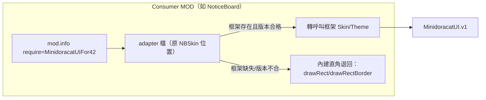

# MinidoracatUI 架構設計契約

> 定稿於 2026-08-25，基於 Claude × Codex × Grok 三方對 NeatUI Framework（Workshop 3508537032，
> modversion 1.0.8）的原始碼分析與家族 MOD（NoticeBoard／MiniMap）現況盤點。
> 本文件是實作的**權威依據**；與本文件衝突的實作即是 bug。引擎行為主張的出處以
> AGENTS.md「API 出處對照」為準（快照 42.20.3-20260817）。

## 0. 設計目標與非目標

**目標**
1. 消滅家族三類重複實作：Skin（NBSkin ↔ MiniMap_Skin 已分岔）、浮動按鈕（NBFloatButton ↔ MiniMap_FloatIcon 兩份獨立實作）、Toast（即將出現第二份）。
2. 讓未來家族 MOD 的 UI 起點是「掛依賴＋建 theme」，不是「複製貼上 300 行再改」。
3. 框架更新**永不**無聲破壞下游（版本化 API＋下游聯測閘門）。

**非目標**
- 不做通用 widget 大全（NeatUI 的 scope 滑坡教訓）；每個元件都要有 ≥1 個真實 consumer 才收。
- 控制元件的**外觀**不沿用 vanilla（2026-09-26 使用者決定：家族 UI 一律用框架的現代元素，不用官方原生的樣子）：rev 7 起 Button／TextField／Checkbox／Tabs／Window／Dialog 由框架提供現代外觀；vanilla 只作**輸入與事件基底**（`ISButton` 的點擊／搖桿語意、`ISTextEntryBox` 的 IME／游標、`ISLayoutManager` 的存讀），不重寫這些原生行為。
- 不 monkeypatch vanilla class。
- v1 不做 grid／變動列高清單／貼圖數字字型。

## 1. 依賴與解耦模型（使用者要求：盡量模組化解耦）

三層防線，任何一層失效都不得讓 consumer 的 UI 開不了：


```mermaid
graph LR
    subgraph consumer["Consumer MOD（如 NoticeBoard）"]
        A[mod.info require=MinidoracatUIFor42] --> B["adapter 檔（原 NBSkin 位置）"]
        B -->|框架存在且版本合格| C[轉呼叫框架 Skin/Theme]
        B -->|框架缺失/版本不合| D[內建直角退回：drawRect/drawRectBorder]
    end
    C --> E[MinidoracatUI.v1]
```

1. **引擎層（硬依賴）**：consumer 的 mod.info 掛 `require=MinidoracatUIFor42`——引擎保證框架先載入（`ZomboidFileSystem.java:807-833`），**框架 MOD 未安裝／PZ build 落在框架 versionMin 之外時，consumer 整個 MOD 會被引擎拒載**（`ChooseGameInfo.java:647-666`）。「玩家漏裝框架」由這一層以「缺少必要 MOD」明確擋下（Steam 訂閱會自動拉 Required Items），**不是**由退回層吸收。
2. **API 層**：consumer 檢查 `API_MAJOR`／`API_REVISION`；不合格＝**當框架不存在處理**，不得帶半套狀態運行。
3. **繪製層（退回紅線）**：consumer 的 adapter 保留最小直角退回路徑（`drawRect`／`drawRectBorder`）。它保護的情境是：**框架版本不合（API 檢查不過）、框架 Lua 初始化失敗（半初始化＝facade 未發布）、離線測試 harness**——這些情境下 UI 照開、只失去圓角。

> 解耦的代價聲明：adapter 模式意味著每個 consumer 保留 ~30 行退回碼。這是刻意的
> ——它讓 consumer 可以獨立測試、且框架壞版時不帶病運行；但注意這**不是**「不裝
> 框架也能玩」的軟依賴（引擎層是硬依賴），文件早期版本的「軟依賴」措辭以本節為準。

## 2. API 契約（v1）

唯一全域 `MinidoracatUI`。facade 形狀：

```lua
MinidoracatUI.v1 = {
    VERSION      = "0.5.0",   -- 發布字串，僅供顯示（定版 commit 時才與 modversion 同步）
    API_MAJOR    = 1,          -- 不相容變更 → 開新 MOD ID，此值永不 +1
    API_REVISION = 9,          -- additive 變更單調遞增；consumer 宣告最低需求
                               -- rev 1：首發｜rev 2：Icons｜rev 3：painters/assets｜rev 4：art icons｜rev 5：Toast maxLines｜rev 6：導覽圖示｜rev 7：現代控制元件｜rev 8：車輛／標記圖示＋ColorPicker｜rev 9：Slider（ColorPicker 的 R/G/B 改滑桿）
    CAPABILITIES = {           -- 功能探測（分期發布的相容手段）
        theme        = true,
        skin         = true,
        icons        = true,   -- rev 2
        floatButton  = false,  -- 對應 widget 載入成功後才翻 true
        toast        = false,
        virtualList  = false,
        controls     = false,  -- rev 7：Button／TextField／Checkbox／Tabs（Widgets/Controls.lua）
        window       = false,  -- rev 7：Window（Widgets/Window.lua）
        dialog       = false,  -- rev 7：Dialog（Widgets/Window.lua，另需 controls 載入成功）
        colorPicker  = false,  -- rev 8：ColorPicker（Widgets/Controls.lua，與 controls 同檔）
        slider       = false,  -- rev 9：Slider（Widgets/Controls.lua，與 controls 同檔）
    },
    Theme = <module>,
    Skin  = <module>,          -- 正式繪製 API（fill/border/dot/fits/toggle/slider），adapter 直接取用（§3.3）
    Icons = <module>,          -- 共用單色圖示（get/draw），rev 2 起新增（§3.6）
    -- 以下由 widget 檔在載入成功後掛上（對應 CAPABILITIES 旗標同時翻 true）：
    -- FloatButton／Toast／VirtualList（v0.2／v0.3）
    -- Button／TextField／Checkbox／Tabs（rev 7，controls）、Window（rev 7，window）、Dialog（rev 7，dialog）、
    -- ColorPicker（rev 8，colorPicker）、Slider（rev 9，slider）
}
```

**規則**
- `MinidoracatUI.v1` 在**全部模組初始化成功後最後賦值**（Kahlua 半初始化風險，AGENTS.md 鐵則）。
- 同 major 只 additive；刪除／改簽章／改語意＝breaking＝開 `MinidoracatUIV2For42` 新 MOD ID。新增模組／新增 `CAPABILITIES` 旗標屬 additive：`API_REVISION` +1，既有呼叫面一字不動（rev 2 的 Icons 即是此形狀）。
- consumer 樣板：

```lua
-- PZ 的 require 不保證回傳值（原版 Lua 全樹零取值用例）——一律走全域取用：
if not (MinidoracatUI and MinidoracatUI.v1) then
    pcall(require, "MinidoracatUI/V1")  -- 防禦：正式環境靠 mod.info require= 已先載
end
local UI = MinidoracatUI and MinidoracatUI.v1
local ok = UI ~= nil and UI.API_MAJOR == 1 and UI.API_REVISION >= 1
-- 要用 rev 2 才有的能力就把門檻寫成該能力的 revision，並一併探 CAPABILITIES：
--   local canIcon = ok and UI.API_REVISION >= 2 and UI.CAPABILITIES.icons and UI.Icons ~= nil
-- rev 3 painter 沿用 skin capability，逐函式探測：
--   local canPainters = ok and UI.API_REVISION >= 3
--       and type(UI.Skin.toggle) == "function" and type(UI.Skin.slider) == "function"
-- rev 7 控制元件逐旗標探測（Dialog 需要 dialog，不只 window）：
--   local canControls = ok and UI.API_REVISION >= 7 and UI.CAPABILITIES.controls
--   local canDialog = ok and UI.API_REVISION >= 7 and UI.CAPABILITIES.dialog
-- rev 8 車輛／標記圖示與取色器：
--   local canVehicleIcons = ok and UI.API_REVISION >= 8 and UI.CAPABILITIES.icons
--   local canColorPicker = ok and UI.API_REVISION >= 8 and UI.CAPABILITIES.colorPicker
-- rev 9 滑桿：
--   local canSlider = ok and UI.API_REVISION >= 9 and UI.CAPABILITIES.slider
-- ok == false → 走 adapter 的直角退回，不帶半套狀態運行
```

## 3. 模組設計

### 3.1 檔案佈局（`42/media/lua/client/MinidoracatUI/`）

| 檔案 | 期 | 職責 |
|---|---|---|
| `V1.lua` | v0.1（rev 2／3 擴充） | **單檔**：Theme＋Skin＋Icons＋facade 四個 section（詳見檔頭「單檔設計」註解——PZ require 不保證回傳值、跨檔共享只能靠全域，分檔會重演 NeatUI 的隱藏載入順序依賴；單檔讓「中段 error＝facade 從未發布」自然成立） |
| `Widgets/FloatButton.lua` | v0.2 | 常駐浮鈕：拖曳、位移門檻點擊判定、位置持久化回調、clamp 回螢幕；獨立檔、單向依賴 V1 全域，載入失敗只影響 `CAPABILITIES.floatButton` |
| `Widgets/Toast.lua` | v0.2 | 通知堆疊：佇列、淡入淡出、alwaysOnTop；同上 |
| `VirtualList.lua` | v0.3 | 垂直固定列高虛擬清單（§3.5） |
| `Widgets/Controls.lua` | rev 7（rev 8／9 擴充） | Button／TextField／Checkbox／Tabs（§3.7）＋ColorPicker（§3.8）＋Slider（§3.9）；載入失敗只影響 `CAPABILITIES.controls`／`colorPicker`／`slider` |
| `Widgets/Window.lua` | rev 7 | Window／Dialog（§3.7）；開頭自行 `pcall(require, "MinidoracatUI/Widgets/Controls")`，Controls 缺席時只提供 Window、`dialog` 維持 false |

載入順序防雷：v0.1 核心單檔（無內部順序問題）；v0.2 起的 Widget 檔開頭自行檢查
`MinidoracatUI.v1` 存在、缺席時不掛能力——不重演 NeatUI「scrollview 用
`NIScrollBar` 卻不 require」的隱藏順序依賴。

### 3.2 Theme（含深/淺雙色系，v0.1 內建）

```lua
local theme = UI.Theme.create({
    variant = "dark",              -- "dark"（預設）| "light"
    colors  = {                    -- 只寫要覆蓋的 token
        accent = { r=1, g=0.85, b=0.4, a=1 },
    },
})
```

- **token 分層**：框架 default 只放跨 MOD token，**v1 共 12 個**（`surface`／`surfaceTitle`／`well`／`border`／`text`／`textMuted`／`textFaint`／`accent`／`hover`／`selected`／`errorSurface`／`errorText`——與 `V1.lua` 的 `DARK`/`LIGHT` 表逐字一致，該表是唯一權威）；MOD 自有 token（如 NoticeBoard 的 `unread`、MiniMap 的 `rowHover`）由 create 時自帶，框架不認識也不管。**未知 token 的 theme 便捷方法呼叫是靜默不畫**（fail-soft），拼錯 token＝元素消失無診斷——寫 consumer 時以 V1.lua 的表為準，勿憑記憶。
- **雙色系**：`variant` 選 default palette 起點；兩套數值都在 `V1.lua` 的 Theme section（`DARK`／`LIGHT` 表）內維護。繪製邏輯與資產完全 variant 無關（白圖×頂點染色）。深色為預設（PZ 本體與家族現有 UI 全深色）；淺色首發標 experimental。variant 由 MOD 開發者決定；玩家層級即時切換是未來項目（牽涉全 consumer token 完整性）。
- **隔離**：`create()` 深拷貝，禁止 mutate 共享 default——現有 NBSkin↔MiniMap drift 的根源就是「共用色票、各自複製」。
- **已知取捨（色票三份現況）**：兩個既有 adapter 刻意保留字面 `COLORS`（框架缺席時色票也要在、退回路徑不依賴框架），因此共通數值目前存在三份（NBSkin／MiniMap Skin／框架 DARK）。v0.1 接受此取捨——「消滅重複」在繪製碼與 PNG 已達成，色票的單一權威化留待既有 consumer 改用 `Theme.create`（自然時機：某 MOD 需要 light variant 或玩家換色時）。

### 3.3 Skin（NinePatch 生命週期全封裝）

`Skin` 的無狀態繪製函式是**正式公開 API**（受同 major additive 承諾保護），
thin adapter 直接取用；theme 實例方法是其上的便捷薄層（token 字串解析）：

```lua
-- 正式 API（adapter 用法；color 是 {r,g,b,a} table）：
UI.Skin.fill(element, x, y, w, h, color, shape, alphaScale)
UI.Skin.border(element, x, y, w, h, color, shape, alphaScale)
UI.Skin.dot(element, x, y, size, color, outline)
UI.Skin.fits(w, h, shape)
UI.Skin.toggle(element, x, y, width, rowHeight, on, colors, alphaScale)
UI.Skin.slider(element, x, y, width, rowHeight, ratio, colors, alphaScale)
-- theme 便捷層（新 MOD 用法；color 可為 token 字串或 table）：
theme:fill(element, x, y, w, h, colorOrToken, shape, alphaScale)
-- shape: nil/false="round"（四角圓）| true/"roundTop"（上圓下直）|
--        "pill"（10px cap）| "rect"（強制直角）
--        boolean 形式與家族既有 topOnly 呼叫慣例逐位相容
```

**內建規則（caller 不必知道的事）**
- 首呼叫連呼兩次＋pcall；兩次 nil → cache `false` 永不重試 → 直角退回（`NinePatchTexture.java:42-63`）。
- `fits` 檢查內建於 shape：`round` 最小 12×12、`roundTop` 最小 12×6、`pill` 最小 20×20；不足自動退直角（角落重疊會疊 alpha，寧可誠實直角）。pill 使用獨立 10/4/10 cap 資產；高度恰好 20px 才是精確膠囊，高於 20px 是半徑 10px 的圓角矩形。
- `toggle` 不建立 widget：它是每幀可直接呼叫的無狀態 painter。track 固定高 20px、在 `rowHeight` 內垂直置中；knob 固定 16px、左右各留 2px。`colors={off,on,knob,border}` 可省略或缺項，缺色使用框架常數；貼圖缺失沿用 Skin 的直角／方點退回。幾何契約要求 `width >= 20`、`rowHeight >= 20`；較小輸入直接回 `false` 且不繪製，由 consumer 保留原文字／狀態退回。
- `slider` 同樣不建立 widget：只畫 4px track、比例填色與 12px 圓形 knob；`ratio` 夾在 0..1，`colors={track,fill,knob,border}`。拖曳、步進、上下限由呼叫端負責——要現成的可拖曳元件用 rev 9 的 `UI.Slider`（§3.9，內部即呼叫本 painter）。
- 座標：`getAbsoluteX/Y` ＋（在 scrolling 容器內）自身 scroll offset，再 `math.floor`——MiniMap 實戰教訓直接內建，consumer 不再各自修。
- pcall 用具名頂層函式傳參，**零 per-frame closure 配置**（MiniMap 的 GC 改良收編為標準）。
- 貼圖目錄：`42/media/ui/MinidoracatUI/`，程序化生成（§6），全主題共用同一套白圖。

### 3.4 Widgets（v0.2）

從兩份既有實作（NBFloatButton 260 行級、MiniMap_FloatIcon 260 行）提煉**行為契約**重新實作，不搬碼：

- `FloatButton`：拖曳位移門檻（≦4px＝點擊）、位置持久化（回調由 consumer 接 ModOptions／ini，框架不綁存檔機制——解耦）、每幀 clamp 回螢幕、hover 提示回調。
- `Toast`：所有 MOD 共用佇列＋堆疊上限、淡入淡出（`getTimestampMs` 計時）、alwaysOnTop；逾時自動移除，也可呼叫 `Toast.dismiss(instance)`，沒有點擊消失功能。位置累加前面每則實際高度與間距，讓單行／多行通知混用時不重疊；移除與 pending 遞補後重新計算。Toast 不操作 stencil，巢狀裁切的成對性由 VirtualList 驗證。

**置頂契約**：`FloatButton` 的 `alwaysOnTop` 預設仍為 true；框架在 `addToUIManager()` 完成實例化後呼叫原生 setter，Toast 同樣如此。只寫 Lua 欄位不會改變引擎排序（`ISUIElement.lua:993-1008,1319-1322`；`UIManager.java:545-556`）。一般入口要明確傳 `false`，讓後開視窗能蓋在入口上；MiniMap、NoticeBoard、Economy、DevProfiler 已採此設定，不改各自原有 bringToTop 與生命週期。發布置頂修正前，先交付已上線 consumer 的這項相容設定，避免仍使用舊 consumer 的玩家突然改變浮鈕層級。

### 3.5 VirtualList（v0.3）——對 NeatUI 的修正表

| NeatUI 實證問題 | 本框架設計 |
|---|---|
| `setDataSource(data, forceRefresh)` 靠 caller 記得 force（`nivirtualscrollview.lua:69-79`） | `setItems(items)` 內建 revision，可見綁定自動失效 |
| 同範圍原地變更不重繪（`:220-245`） | cell 記 bound revision＋index，任一變即重綁 |
| 回收 cell 殘留 hover/pressed | `bindCell` 全量重設投影；`unbindCell` 清除 consumer 持有的狀態與外部資源，框架清綁定標記並隱藏 |
| 內容高度從已移動 child 量測（`niscrollview.lua:103-117`） | `contentHeight = count × stride + padding`，純計算 |
| stencil 只 set→clear（`:354-362`） | set→draw→clear→repaint 成對 |
| selection 散在 cell | selection/focus 存 list，cell 是投影 |
| grid 塞同 class＋熱路徑 print（`nigridvirtualscrollview.lua:316`） | 不做 grid；框架預設零 log |

**解除綁定時機**：已綁定 cell 因資料縮水而隱藏，或在 `rebuildPool`（包含 resize）移除前，呼叫一次 `unbindCell(list, cell)`；回呼執行時仍可讀取舊綁定。未綁定的空 cell 不呼叫。可見 cell 捲動／revision 更新仍直接呼叫 `bindCell` 覆蓋，不新增 unbind 通知；consumer 必須在 bind 中重設舊投影，以維持既有呼叫語意。tooltip 等獨立於 cell 的資源須由 consumer 清除，不能只依賴 child 被移除。

**綁定失敗**：`boundIndex` 在回呼前可讀，`boundRevision` 在綁定期間失效、成功後才確認。回呼錯誤原樣傳出，後續 `refreshCells()` 可以重試，不把半完成列當成最新內容；不新增背景重試或捲動時的 unbind。

### 3.6 Icons（API rev 2／3）——共用單色圖示

家族 MOD 各自畫 ASCII 符號（`+`／`-`／`>`）當展開箭頭與工具列標記，同一顆按鈕在兩個 MOD
長不一樣、也無法隨主題染色。Icons 收編這一層：一套白圖、運行時染色、缺資產就退回原本的
文字表示。**只收已同意的 reusable key**（rev 2 首批 8 個由 NoticeBoard 文件樹與工具列消費；
rev 3 additive 新增 12 個），不做圖示大全——這是 §0 非目標「不做通用 widget 大全」
的同一條線。

| key | 檔名（`42/media/ui/MinidoracatUI/`） | 首個用途 |
|---|---|---|
| `sidebar` | `mui_icon_sidebar.png` | 切換側邊文件樹 |
| `folder` | `mui_icon_folder.png` | 文件樹的目錄節點 |
| `document` | `mui_icon_document.png` | 文件樹的文件節點 |
| `chevronRight` | `mui_icon_chevron_right.png` | 目錄收合狀態 |
| `chevronDown` | `mui_icon_chevron_down.png` | 目錄展開狀態 |
| `language` | `mui_icon_language.png` | 切換語言 |
| `reload` | `mui_icon_reload.png` | 重新載入內容 |
| `resetSize` | `mui_icon_reset_size.png` | 重設視窗大小 |
| `search` | `mui_icon_search.png` | 搜尋 |
| `chevronLeft` | `mui_icon_chevron_left.png` | 返回／向左導覽 |
| `layers` | `mui_icon_layers.png` | 圖層 |
| `pin` | `mui_icon_pin.png` | 釘選位置 |
| `globe` | `mui_icon_globe.png` | 世界／全域範圍 |
| `sliders` | `mui_icon_sliders.png` | 篩選／調整 |
| `gauge` | `mui_icon_gauge.png` | 儀表／效能 |
| `lock` | `mui_icon_lock.png` | 視窗鎖定狀態 |
| `unlock` | `mui_icon_unlock.png` | 視窗解除鎖定狀態 |
| `close` | `mui_icon_close.png` | 視窗關閉 |
| `locate` | `mui_icon_locate.png` | 定位／回到玩家 |
| `copy` | `mui_icon_copy.png` | 複製座標 |

```lua
UI.Icons.get(name)                                     -- Texture 或 nil
UI.Icons.draw(element, name, x, y, size, color, alpha) -- boolean：true＝已畫
-- color 省略＝純白；alpha 省略＝color.a，再省略＝1；size 同時是寬與高
```

**規則**
- 資產規格：32×32 純白 RGBA、alpha 即形狀、外圍 1px 透明邊；幾何圖示由程序生成，art 圖示由 AI 原圖匯入（§6）。
  **32px 原稿供 14–20px 顯示**：16px 是乾淨的 2:1 縮小；rev 3 標題列狀態圖示可放大
  到 20px，仍由原始 32px 抗鋸齒圖縮放，不使用放大的 16px 點陣。
- 染色同皮膚：白圖 ×`drawTextureScaled` 頂點色，一套資產服務深／淺兩色系（AGENTS.md API 表）。
- **fail-soft 紅線**：未知 key／`getTexture` 不存在（dedicated）／貼圖缺失／繪製拋錯，
  `get` 回 `nil`、`draw` 回 `false` 且不拋錯——consumer 依回傳值退回自己的 ASCII 或純文字，
  絕不因為少一張 PNG 就讓按鈕消失或視窗開不了。
- 快取與 Skin 共用（同一份檔名表）：每張只探測一次，失敗記 `false` 不重試；
  測試用 `Skin._resetForTests()` 一併清除。
- 繪製拋錯**不**把貼圖標壞：`drawTextureScaled` 失敗也可能是 element 契約破損，
  element 壞不是貼圖的錯（同 §3.3 的 E3 準則）。
- 新增 key ＝ additive：加檔名對應＋資產（幾何或 art）＋`verify_mod.py` 探針＋`API_REVISION` +1；
  **既有 key 的語意與檔名永不更動**（consumer 只認 key）。

**rev 6 導覽圖示**：新增 `wallet`／`gift`／`shop`／`market`／`auction`／`mail`／`users`／`chart`／`coins`／`plug`／`shieldCheck`／`tag`／`transactions`／`clipboardCheck`／`server`／`settings`，對應 `mui_art_<key>.png`。沿用 art 的 32×32 純白 alpha 規格，導覽顯示尺寸為 20–24px；未知 key、缺圖與繪製失敗的回傳契約不變。

**rev 8 車輛／標記圖示**：新增 `carSedan`／`carHatchback`／`carSports`／`carSuv`／`carPickup`／`carVan`／`carStepVan`／`carTruck`／`carAmbulance`／`carPolice`／`carFiretruck`／`carTrailer`（側視、車頭朝右）與 `markerStar`／`markerHeart`／`markerFlag`／`markerCrown`，對應 `mui_art_<key>.png`。用途是地圖上的車輛／自訂標記，顯示尺寸 16–24px，搭配 `UI.ColorPicker` 選色以頂點染色；回傳契約同上。

### 3.7 現代控制元件（API rev 7）

使用者決定家族 UI 不再用 vanilla 的 `ISCollapsableWindow`／`ISButton`／`ISModalDialog`／`ISTickBox`／`ISScrollingListBox` 外觀（§0）。rev 7 提供六個元件：外觀全由 theme token＋Skin 自繪（貼圖缺失退直角、icon 缺失退文字），vanilla 只負責輸入與事件。首個 consumer：VehicleManager 車隊視窗。

**共通**：`.new(opts)` 回傳**已 `initialise()`** 的元素，consumer 以 `parent:addChild(el)`（Window 用 `el:addToUIManager()`）加入；`opts.theme` 省略＝`UI.Theme.create()`、`opts.font` 省略＝`UIFont.Small`；元素上的 `internal` 欄位留給 consumer；所有 setter 對相同值是 no-op；prerender/render 零 table／closure 配置，並自行守 `isCollapsed`。額外顏色只從 12 個既有 token 推導，不改 `DARK`／`LIGHT` 表（唯一例外：primary 按鈕的深色字是元件內常數）。

| 元件 | 建構 | 公開方法 | 回呼 |
|---|---|---|---|
| `UI.Button` | `{ x, y, width?, height?, title, icon?, style?, theme?, font?, target?, onClick?, tooltip? }` | `setTitle(s)`、`fitWidth()`、`setEnabled(b)`、`isEnabled()`、`setTooltip(s)`、`setStyle(style)` | `onClick(target, button)`；disabled 不觸發 |
| `UI.TextField` | `{ x, y, width, height?, text?, placeholder?, theme?, font?, onlyNumbers?, maxLength?, onChange? }` | `getText()`、`setText(s)`、`focus()`、`isFocused()`、`setEnabled(b)`、`setTooltip(s)` | `onChange(field, text)`；`setText` 不觸發 |
| `UI.Checkbox` | `{ x, y, width, height?, label, checked?, theme?, font?, target?, onChange? }` | `getChecked()`、`setChecked(b, silent)`、`setEnabled(b)`、`setLabel(s)` | `onChange(target, checked, box)` |
| `UI.Tabs` | `{ x, y, width?, height?, items = { {id, label}, ... }, selected?, theme?, font?, target?, onSelect? }` | `setSelected(id, silent)`、`getSelected()`、`setItemVisible(id, visible)`、`setItemLabel(id, s)` | `onSelect(target, id, tabs)`；點已選中不觸發 |
| `UI.Window` | `{ x, y, width, height, title, icon?, theme?, font?, resizable?, minWidth?, minHeight?, closable?, onClose?, onResize? }` | `close()`、`titleBarHeight()`、`contentTop()`、`setTitle(s)`、`SaveLayout(name, layout)`、`RestoreLayout(name, layout)` | `onClose(win)`、`onResize(win, w, h)` |
| `UI.Dialog` | `UI.Dialog.show{ title, text, confirmText, cancelText?, danger?, input?, width?, theme?, font?, onResult? }` → dialog（Window 實例） | `UI.Dialog.close(dialog, ok)` | `onResult(ok, inputText)` 只呼叫一次 |

**行為契約**
- **Button**：`ISButton:derive` 為基底，保留原生 pressed／enable／tooltip／搖桿語意（`ISButton.lua:33-64,316-346`），prerender/render 全自繪：圓角 fill＋border、hover／pressed／disabled 三態。style：`normal`（well 底＋border）、`primary`（accent 底、深色字）、`danger`（errorSurface 底、errorText 字／框）、`ghost`（無底，hover 才有底）；未知 style 退 `normal`。寬度省略＝標題寬＋左右各 10px（有 icon 再加 16＋6），高度省略＝字高＋10；明示寬度不被原生 `ISButton:new` 撐寬（`:493-495`）。`setTitle` 只在自動寬度時重算。`icon` 是 `UI.Icons` key、畫在文字左側，Icons 失敗只畫文字。
- **TextField**：ISPanel 容器畫圓角 well＋border（focus 時 accent），內含透明、無邊框的原生 `ISTextEntryBox`（IME／游標／選取原生）；`setEditable` 會重設原生 borderColor（`ISTextEntryBox.lua:64-71`），元件每次改回透明。空字串且未 focus 時畫 textFaint placeholder。文字變化**每幀比對**（IME 組字送出不觸發原生 onTextChange），一次變化觸發一次。`setEnabled(false)`＝不可編輯＋失焦＋淡化。tooltip 交給原生 entry 顯示。
- **Checkbox**：`Skin.toggle` 畫 36px 開關（高度省略＝max(20, 字高＋4)；toggle 幾何不足時退回方框），右側 label，整列可點；disabled 不切換。
- **Tabs**：分段式頁籤列，選中為 selected 底＋accent 下緣；寬度省略＝各頁籤（標籤寬＋24）加總。`setItemVisible` 重排並在自動寬度時更新 width；隱藏的是選中項時**不自動切換**；未知 id 的 `setSelected` 忽略。
- **Window**：surface 圓角本體＋roundTop 標題列（surfaceTitle）＋可選 icon＋標題；右上關閉鈕（Icons `close`，失敗退 `x` 文字；`closable` 預設 true，按下與放開都在鈕上才關閉）。標題列拖曳走 setCapture（同 FloatButton），每幀 clamp 回螢幕；`resizable=true` 時右下角把手縮放，夾在 `minWidth`／`minHeight`（預設 240×160），尺寸有變才呼叫 `onResize`。`close()`＝`setVisible(false)` 後呼叫 `onClose(win)`，不從 UIManager 移除。標題列高＝max(24, 字高＋10)，`contentTop()` 等於它。
- **Window × ISLayoutManager**：`ISLayoutManager.RegisterWindow(name, UI.Window, win)`——存讀回呼取自第二參數、以 `funcs.RestoreLayout(target, name, layout)` 呼叫（`ISLayoutManager.lua:6-13,99-113`），故直接傳 `UI.Window`。存 x／y，`resizable` 時另存寬高；讀回後夾最小值、尺寸有變時呼叫 `onResize`，最後 clamp；不讀寫 `visible`。
- **Dialog**：先加全螢幕 guard（吃掉所有滑鼠事件、半透明黑底）再加置中視窗，兩者都在 `addToUIManager()` 後設原生 alwaysOnTop（加入順序決定視窗在 guard 之上，`UIManager.java:544-556`）。內文依寬度換行（支援 `\n`），高度自動；`input={text?,placeholder?,onlyNumbers?}` 時在內文下放 TextField 並自動 focus。按鈕靠右：confirm（`danger` 則 danger，否則 primary）＋cancel（normal；省略 `cancelText`＝單鈕提示框）。按鈕、關閉鈕、Enter／Esc、`UI.Dialog.close` 全走同一收尾：只回呼一次、移除 guard 與視窗（`removeFromUIManager`）。同時只允許一個，新開先以 cancel 關舊的。
- **Enter／Esc（不 monkeypatch）**：視窗 `setWantKeyEvents(true)`，以 `onKeyPress`／`onKeyRelease`／`isKeyConsumed` 接原生 key 派送（`UIElement.java:2174-2217`，同原版 `ISBuildWindow.lua:16-21,355`）。放開必須配對到同一 dialog 收過的按下，避免「按 Enter 開窗、放開就確認」；關閉後 `isKeyConsumed` 仍回 true，同一個 Esc 不漏給後面的視窗。輸入框有焦點時 key 事件不進 UIManager（`GameKeyboard.java:32-43`），Enter 改由原生 `onCommandEntered`（`UITextBox2.java:841-845`）確認；此時 Esc 由原生輸入框處理、不經 dialog（實機行為待下游聯測確認），輸入框失焦後 Esc 才取消。

**載入與能力**：`Widgets/Controls.lua` 與 `Widgets/Window.lua` 各自檔頭自檢 facade（缺席即 return）；Controls 另需原生 `ISButton`／`ISTextEntryBox`。Window.lua 自行 `pcall(require, "MinidoracatUI/Widgets/Controls")`，Controls 仍缺時只掛 Window（`window=true`、`dialog=false`），不依賴檔名排序。

### 3.8 ColorPicker（API rev 8；rev 9 起 R/G/B 為滑桿）

色卡格＋R/G/B 滑桿＋hex 輸入的取色元件，與 rev 7 控制元件同檔（`Widgets/Controls.lua`）、同共通契約（§3.7「共通」段）。

| 建構 | 公開方法 | 回呼 |
|---|---|---|
| `UI.ColorPicker.new{ x, y, width, color?={r,g,b}, swatches?, theme?, font?, target?, onChange? }` | `getColor()`、`setColor(c, silent)`、`setEnabled(b)`、`getHeight()` | `onChange(target, color, picker)` |

- **色值**：`{r,g,b}` 各 0–1，內部量化成 0–255 整數（滑桿與 hex 看到的就是實際值）；`getColor()` 與回呼的 `color` 都是新 table。`color` 省略＝白。`setColor` 相同（量化後）值是 no-op；`silent=true` 不回呼。
- **上半部色卡**：`swatches` 省略＝`UI.ColorPicker.DEFAULT_SWATCHES`（24 色：鮮色／深色／淡色＋黑白灰金銀，每項 `{r,g,b}`）。20px 圓角色塊、依 `width` 自動換行；與目前顏色相同的色塊畫 2px accent 外框（輸入的值剛好等於色卡也會選中），hover 畫 text 色外框。點色卡＝以非 silent 改色。建構時複製色卡，consumer 事後改表不影響已建立的元件。
- **下半部**：三列 `UI.Slider`（左側 `R`／`G`／`B` 標籤；min 0、max 255、step 1、右側顯示整數值；fill 分別為紅／綠／藍通道色），最後一列 `#` hex 欄（最多 7 字，`#` 可省、大小寫皆可）＋右側長方形預覽（寬＝兩倍欄高）。hex 須恰為 6 位十六進位才改色；空白、非法字串不變更顏色、不回呼。
- **同步不重複回呼**：點色卡、拖滑桿、輸入合法 hex 都即時同步其他控制項——滑桿以 `setValue(v, true)`、hex 以 `TextField:setText`（皆不觸發回呼）寫回；正在輸入的 hex 欄不被覆寫。一次實際改色只呼叫一次 `onChange`（拖曳中每次變色各一次）。
- **版面**：高度＝色卡列數 ×20＋列間距 6＋外框預留 4＋區隔 8（無色卡則為 0）＋三列滑桿（各 `max(20, 字高＋4)`＋間距 4）＋hex 欄高（字高＋10）；`getHeight()` 即此值。
- `setEnabled(false)`：色卡不可點、三條滑桿與 hex 欄一併停用、整體淡化。prerender 零配置（色卡、預覽色、標籤位置建構時算好）。

### 3.9 Slider（API rev 9）

可拖曳的數值滑桿，與 rev 7 控制元件同檔（`Widgets/Controls.lua`）、同共通契約（§3.7「共通」段）。首個 consumer：VehicleManager 地圖外觀視窗的圖示大小。

| 建構 | 公開方法 | 回呼 |
|---|---|---|
| `UI.Slider.new{ x, y, width, height?, min, max, step?, value?, theme?, font?, target?, onChange?, format? }` | `getValue()`、`setValue(v, silent)`、`setEnabled(b)`、`isEnabled()` | `onChange(target, value, slider)` |

- **繪製**：`UI.Skin.slider` painter（4px track、比例填色、12px knob）；track 左右內縮半顆 knob，knob 在兩端不出界。colors 取 theme token：track＝`well`（hover 或拖曳中＝`hover`）、fill＝`accent`、knob＝`text`、border＝`border`。高度省略＝max(20, 字高＋4)；`width` 省略＝160。disabled 整體淡化。
- **format**：`function(value) → string`，有給就在 track 右側畫值文字（例如 `"175%"`）；文字寬以 `format(max)` 在建構時量一次，從 track 寬扣掉，prerender 不量測也不呼叫 format（只在值變時格式化一次）。
- **值**：`setValue` 先夾在 `min..max`，再以 `min` 為基準依 `step` 四捨五入；step 除不盡範圍或浮點誤差時最多到 `max`。`step` 省略（或 ≤0）＝`(max-min)/20`；`max < min` 時視為 `max = min`。非數字忽略。量化後相同值 no-op；`silent=true` 不回呼。
- **互動**：按在 track（含兩端半顆 knob）＝跳到該值並開始拖曳，`setCapture(true)` 讓拖出元件外仍收 move／up（原生派送見 `UIElement.java:1077,1240-1242,1300`），放開 `setCapture(false)`；按在值文字區不反應。滾輪往上（`del < 0`，同 `ISScrollingListBox.lua:353`）＋step、往下 −step。`onChange` 只在值實際改變時呼叫（拖曳中每次變化一次）。
- **disabled**：`setEnabled(false)` 後按下與滾輪都不回應（滾輪回 false 讓父層捲動）；拖曳中停用立即解除 capture。

## 4. NeatUI 教訓總表（設計依據，證據見 AGENTS.md 與三方報告）

| # | NeatUI 事實 | 本框架對應決策 |
|---|---|---|
| 1 | 6 個裸全域、零版本化 | 唯一全域＋`API_MAJOR/REVISION/CAPABILITIES` |
| 2 | `_NUI_hasNinePatchTextures` 死碼，缺圖直接 crash | 所有繪製 fail-soft＋直角退回紅線 |
| 3 | scrollbar 壞貼圖 `nil:render()` 永久 crash；versionMin 42.0.2 與 B42.9 才有的 NinePatch 矛盾 | versionMin 只寫**查證過**的下限（42.20.1：API 存在性與首呼叫語意已對 42.20.1-20260805 快照逐項核對，見 AGENTS.md API 表）；能力探測不假裝相容 |
| 4 | 手拼 9-slice（B42.9 前遺產） | 一律引擎原生 NinePatchTexture |
| 5 | monkeypatch `ISUIElement` | 禁止；墊片走自有 util |
| 6 | 「別直接用」的成員公開在 API | 公開面全部可依賴；測試鉤子 `_resetForTests` |
| 7 | 隱藏載入順序依賴 | v0.1 核心單檔（無內部順序）；v0.2 起 Widget 檔開頭自檢 `MinidoracatUI.v1`，缺席不掛能力 |
| 8 | 熱路徑殘留 print | 預設零 log，debug 旗標才輸出 |

## 5. 分期與完成定義

| 期 | 內容 | 完成定義（可驗證） |
|---|---|---|
| v0.1 Core | V1＋Theme（雙色系）＋Skin＋貼圖資產＋harness | NoticeBoard 與 MiniMap 皮膚改 thin adapter，刪除重複繪製碼與重複 PNG；兩 repo verify 全綠；遊戲內實測無視覺回歸 |
| v0.2 Widgets（**已完成**） | FloatButton＋Toast | 家族三份浮鈕/Toast 實作全部改用框架版 ✅（NBFloatButton／NBToast／MiniMap _FloatIcon 皆為 thin wrapper） |
| v0.3 VirtualList（**已完成**） | 垂直固定列高 | Cleaner Picker 與 Economy 表列已接用；資料重綁、回收與 resize 的行為由 harness 驗證，原生操作仍屬下游聯測閘門 |
| API rev 2 Icons（**已完成**） | 8 個共用單色圖示（§3.6） | 資產由生成器確定性重生、`verify_mod.py` 第 12 項逐張把關；NoticeBoard 文件樹與工具列改用圖示且缺資產時仍走 ASCII 退回 |
| API rev 3 Painters/Assets（**已完成**） | pill、無狀態 toggle／slider、12 個新增 icon key | toggle 20px、slider 4px track 幾何固定；缺色／缺資產 fail-soft；既有 shape、icon key 與公開簽章不變 |
| API rev 7 Modern Controls（**開發中**） | Button／TextField／Checkbox／Tabs／Window／Dialog（§3.7） | harness 情境九～十五驗證載入自檢、disabled／silent／單次回呼等邊界；VehicleManager 車隊視窗接用並遊戲內實測後定版 |
| API rev 8 車輛圖示＋ColorPicker（**開發中**） | 16 個車輛／標記 art key（§3.6）、ColorPicker（§3.8） | 圖示由 AI 原圖匯入、`verify_mod.py` 逐張把關並由 `test_icon_import.py` 重現出貨檔；harness 情境十六驗證色卡／滑桿／hex 單次回呼、互相同步不重複回呼、非法 hex 不變與 silent；VehicleManager 地圖車輛標記接用並遊戲內實測後定版 |
| API rev 9 Slider（**開發中**） | `UI.Slider`（§3.9）；ColorPicker 的 R/G/B 改用滑桿（公開面不變） | harness 情境十七驗證量化夾限、點擊跳值單次回呼、拖曳 setCapture 成對、同值不觸發、silent、滾輪步進、disabled 不回應與 format 寬度只量一次；VehicleManager 地圖外觀視窗圖示大小接用並遊戲內實測後定版 |

首發 Workshop 在 v0.1 完成即可（照 AGENTS.md 發布流程）；每期 `API_REVISION` +1 並更新 `CAPABILITIES`。

## 6. 資產管線

- **幾何 UI 貼圖（9-slice 圓角、圓點、`mui_icon_*` 圖示）**：`scripts/gen_ui_textures.py` 程序化生成（移植 NoticeBoard 現有做法）——9-slice 切線像素要求位元級精確，幾何圖示要求重跑逐位元組相同，不走 AI 生圖；生成器不用 `ImageDraw`（跨 Pillow 版本柵格化會變），純浮點謂詞＋8×8 超取樣自算覆蓋率。`verify_mod.py` 第 12 項比對尺寸／IHDR／純白／切線（皮膚）與透明邊／對稱／探針像素／著墨比例（圖示）當閘門。
- **美術資產（poster.png、preview.png、Workshop 圖）**：AI 生成（codex／grok imagegen）到 `scripts/poster/` 再由 `finish_poster.py` 部署——首發前才做，沿用家族貓娘 mascot 流程。
- 貼圖一律純白可染色；新增貼圖＝同步新增生成器幾何與 `verify_mod.py` 檢查項（`OUTPUT_NAMES` 是唯一權威，目錄多一張少一張都會 assert）。
- **art 圖示（rev 4 起，`mui_art_*.png`）**：幾何線條畫不出可辨識的動物剪影，這批改走 AI 生成——`scripts/icons/sheet.png`（codex `image_generation`，黑底純白實心剪影、4×4 等分格、無文字）→ `scripts/import_icon_sheet.py`（亮度→alpha、去雜訊、bbox 裁切、縮 28px 置中、四邊透明）→ commit PNG。`ART_ICON_NAMES` 在 `OUTPUT_NAMES` 內但生成器不產不覆寫；verify 只驗尺寸／純白／1px 透明邊／有 AA／著墨 0.10-0.70。重生單格：`import_icon_sheet.py <cell.png> --grid 1x1 --keys cow`。
- **rev 6 導覽 art**：原圖 `scripts/icons/navigation-sheet.png`，生成來源與列序記在 `scripts/icons/navigation-source.json`；4×4 依序為 `wallet,gift,shop,market,auction,mail,users,chart,coins,plug,shieldCheck,tag,transactions,clipboardCheck,server,settings`。以既有 `import_icon_sheet.py` 指定這組 keys 匯入；不得用程序化幾何冒充 AI 原圖。新增 16 張與既有 art 同受 `verify_image` 檢查。
- **圖表排列與合法 key 分開**：`import_icon_sheet.py` 的預設排列固定服務原始 `sheet.png`，不隨全部 `ART_ICON_NAMES` 成長；其他圖表明確傳 `--keys`。`scripts/test_icon_import.py` 在暫存目錄驗證舊表預設／明示排列相同、導覽與車輛圖表可重建為出貨檔，防止新增 key 破壞舊匯入方式。
- **rev 8 車輛／標記 art**：原圖 `scripts/icons/vehicle-sheet.png`，生成來源（實際 prompt、codex thread id、匯入指令）記在 `scripts/icons/vehicle-source.json`；4×4 依序為 `carSedan,carHatchback,carSports,carSuv,carPickup,carVan,carStepVan,carTruck,carAmbulance,carPolice,carFiretruck,carTrailer,markerStar,markerHeart,markerFlag,markerCrown`。同樣不得用程序化幾何冒充 AI 原圖。

## 7. 測試策略

- `scripts/smoke_harness.lua`（標準 Lua，假 PZ 全域；由 `verify_mod.py` 第 13 項自動執行）情境：
  1. facade 半初始化（模擬中途 error → `MinidoracatUI.v1` 必須不存在）
  2. NinePatch 三態＋element 契約破損（無全域／正常／壞路徑／缺存取器）× fill/border/dot 不拋錯、退回旗標正確、element 壞不標壞貼圖
  3. theme 隔離（兩實例互不污染、default 不被 mutate、light variant、token 解析）
  4. fits 邊界與 shape 相容（boolean topOnly ≡ "roundTop"、"rect" 強制退回）
  5. rev 3 painters/assets（revision/function 探測、pill fits 與舊 shape 相容、toggle on/off
     與 slider 比例／色彩／alpha／缺資產退回；Icons 舊三十三 key、rev 6 十六個導覽 key 與 rev 8 十六個車輛／標記 key 對到約定貼圖、快取
     只探一次、未知／非字串 key、無 `getTexture`／貼圖缺失回 nil/false、錯誤不外洩）
  - 條數守門 `EXPECTED_ASSERTIONS`（家族慣例：防整段被註解仍全綠）
  - VirtualList 的 stencil 計數器成對＋repaint、資料縮水與 resize 解除綁定；FloatButton 拖曳門檻／clamp；Toast 佇列上限、混合高度與遞補間距。
  - rev 7 控制元件：facade 缺席／原生基底缺席／缺 Controls 時旗標維持 false；Button 自動寬度、disabled 不觸發與四種樣式；TextField 每幀變化只觸發一次、setText 靜默、placeholder；Checkbox silent；Tabs 點選中項不觸發與隱藏重排；Window 拖曳、clamp、縮放下限、關閉鈕與 ISLayoutManager 存讀；Dialog 單次回呼、移除 guard、Enter／Esc 配對與同時只有一個。原生 ISButton／ISTextEntryBox 以忠於原版語意的最小 stub 驅動。
  - rev 8／9 ColorPicker：原生基底缺席時 `colorPicker` 維持 false；點色卡、拖滑桿、合法 hex 各只回呼一次且互相同步不重複回呼、非法 hex／空白不變、`setColor` silent 同步滑桿／相同值 no-op、disabled 色卡與滑桿不回應、getColor 回拷貝。
  - rev 9 Slider：原生基底缺席時 `slider` 維持 false；step 以 min 為基準量化與夾限、點擊跳值只回呼一次、拖曳 setCapture 成對（出界仍收 move、放開後不再跟隨）、同值不觸發、silent、滾輪步進與預設 step、disabled 不回應且拖曳中停用解除 capture、format 文字寬度只量一次。
- `scripts/verify_mod.py`：涵蓋靜態掃描、皮膚與圖示驗證、圖表匯入相容性及 Lua 煙霧測試。後者另守住原生置頂選項、通知遞補置頂，以及首次／捲動綁定失敗後可刷新恢復。本機缺 Pillow 時用 `uv run --with pillow scripts/verify_mod.py`，SKIP 不算完成；原生 GPU 視覺仍須實機確認。
- 下游 consumer 的測試以同層 repo 相對路徑（或 `MUI_LUA`）載入本框架 V1.lua；缺框架時一律 SKIP-not-PASS。
- 實機：每期完成定義都含遊戲內實測；MP 路徑在 dedicated（`getTexture` 回 null 環境）至少驗一次退回。
